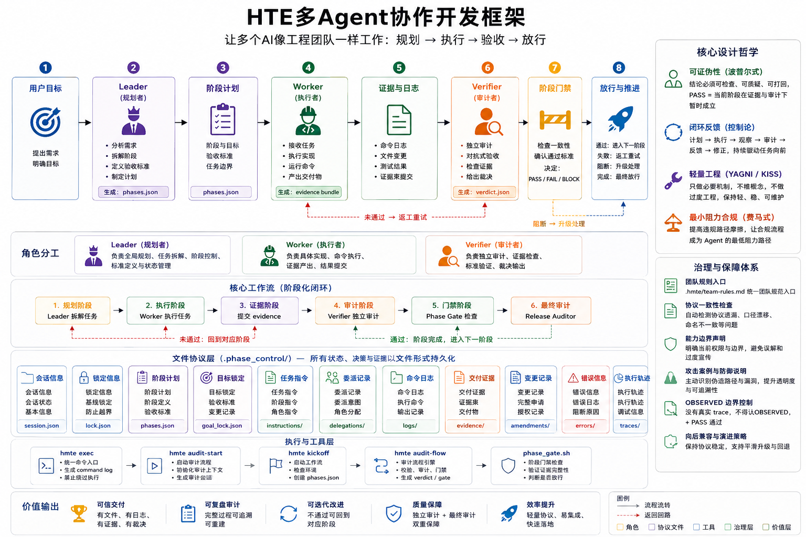

# TriAgentFlow / TAF

> 三角色智能体开发工作流

TriAgentFlow / TAF 是一个三角色智能体开发工作流，通过 Leader / Worker / Verifier 分工，让 AI 在复杂开发任务中按计划执行、提交证据、接受验收并可靠交付。

**三类 Agent**:
- **Leader**：拆解目标、规划阶段、维护流程状态、控制阶段流转。
- **Worker**：执行明确范围内的实现任务，并产出证据材料。
- **Verifier**：基于证据进行独立审计，输出 PASS / FAIL / BLOCK 裁决。


> 当前状态：v2.0 (Plan-Grounded Audit Governance)
> 当前重点：External Audit Preparation — Phase 16，eval 62/62。
>
> **v2.0 核心能力**：
> - **Plan-Grounded Audit Governance**：9 个 P0 能力（Plan Contract / Lock / Fidelity / Mandate / Coverage / Anomaly / Disposition / PASS Contradiction / Zero-Finding）
> - **Eval Harness**：62/62 eval cases (v1.9 baseline 16 + v2.0 46)
> - 向后兼容：v1.9 所有功能完全保留
>
> *Formerly HTE / Hermes Team Engine — see [CHANGELOG.md](CHANGELOG.md) for rename history.*

## 核心理念

TriAgentFlow 的核心思想：复杂任务不应由单个模型同时承担规划、实现、验证和放行，而应由三角色分工协作。

Leader 负责组织，Worker 负责执行，Verifier 负责审查，phase_gate 负责放行。通过这种方式，AI 协作过程可以被检查、复盘、打回和持续改进。

## 设计哲学

TriAgentFlow 基于一个简单判断：复杂 AI 开发不适合由单个模型同时承担规划、实现、验证和放行。

更合理的方式是让不同 Agent 承担不同职责：

- 规划者专注目标拆解和阶段控制；
- 执行者专注具体实现；
- 审计者专注证据检查和质量判断；
- 门禁机制负责阶段是否可以继续。

TriAgentFlow 将这些角色连接成一个阶段化工作流，使 AI 协作不只停留在提示词层面，而是沉淀为可运行、可检查、可复盘的工程流程。

## 架构概览



```text
用户目标
  ↓
Leader
  - 分析需求
  - 创建 .phase_control/phases.json
  - 拆分阶段
  - 管理流程状态
  ↓
Instruction Files
  - .phase_control/instructions/
  - 为 Worker / Verifier 提供明确任务说明
  ↓
Worker
  - 执行阶段任务
  - 通过 hmte exec 运行命令
  - 产出 command log 和 evidence bundle
  ↓
Verifier
  - 独立审计 evidence
  - 输出 JSON verdict
  ↓
phase_gate
  - 检查证据、日志、裁决和阶段一致性
  - 决定当前阶段是否放行
  ↓
orchestrator
  - 管理文件协议工作流
  - 根据 phase_gate 结果继续、打回或阻断
```

## 核心角色

### 三 Agent 角色

| 角色 | 主要职责 | 产物 |
|------|---------|------|
| Leader | 阶段规划、任务拆分、状态管理、阶段流转 | phases.json、instruction files、state |
| Worker | 执行阶段任务、运行命令、提交实现和证据 | command logs、evidence bundle |
| Verifier | 独立审计证据、检查验收标准、输出裁决 | verdict JSON |

### 门禁与辅助组件

| 组件 | 类型 | 作用 |
|------|------|------|
| phase_gate | 门禁脚本 | 检查阶段是否满足放行条件（PASS / FAIL / BLOCK）|
| final-check | 封版门禁 | 检查全流程完整性和 P0 机制 |
| orchestrator | 辅助脚本 | 自动化 Leader 循环调度（可选，fallback 到 manual delegation）|

## 工作流保障机制

TriAgentFlow 使用项目本地的 `.phase_control/` 目录记录阶段化协作过程。

每个阶段都围绕一组可检查文件推进：

- instruction files：阶段任务说明；
- command logs：Worker 执行命令的记录；
- evidence bundles：阶段交付证据；
- verdicts：Verifier 审计裁决；
- phase gate results：阶段放行结果。

这些文件共同构成阶段交付记录，使 Leader、Verifier 和用户能够检查：

- 当前阶段做了什么；
- 由谁执行；
- 执行了哪些命令；
- 产生了哪些证据；
- 为什么 PASS、FAIL 或 BLOCK；
- 下一步应该继续、返工还是升级处理。

## 文件协议

TriAgentFlow 使用项目本地 `.phase_control/` 目录保存工作流状态和阶段产物。

```text
.phase_control/
├── phases.json
├── state.json
├── instructions/
├── delegations/
├── evidence/
├── verdicts/
├── logs/
├── errors/
├── pids/
└── traces/
```

| 路径 | 作用 |
|------|------|
| `.phase_control/phases.json` | Leader 创建的阶段计划 |
| `.phase_control/state.json` | 当前工作流状态 |
| `.phase_control/instructions/` | Worker / Verifier 的任务说明 |
| `.phase_control/delegations/` | 委派意图记录 |
| `.phase_control/logs/{phase}_attempt_{n}.commands.jsonl` | hmte exec 生成的命令日志 |
| `.phase_control/evidence/{phase}_attempt_{n}.json` | Worker 提交的阶段证据 |
| `.phase_control/verdicts/{phase}_attempt_{n}.json` | Verifier 输出的阶段裁决 |
| `.phase_control/errors/` | 阶段错误与阻断信息 |

## 命令日志

Worker 应通过 `hmte exec` 执行阶段命令。

```bash
bash scripts/hmte-exec.sh phase_a --attempt 1 -- npm test
```

命令执行后会生成：

```text
.phase_control/logs/phase_a_attempt_1.commands.jsonl
```

每一行都是一条 JSON 记录：

```json
{
  "phase_id": "phase_a",
  "attempt": 1,
  "command": "npm test",
  "exit_code": 0,
  "runner": "hmte exec",
  "started_at": "2026-05-28T13:00:00Z",
  "ended_at": "2026-05-28T13:00:02Z",
  "output_tail": "..."
}
```

这些日志用于阶段审计、错误排查和 phase_gate 判断。

## Evidence Bundle

Worker 在每个阶段结束时提交 evidence bundle 到 `.phase_control/evidence/{phase_id}_attempt_{n}.json`。

Evidence 包含阶段目标、执行命令、变更文件、测试结果等关键信息。

**详细格式**: 参见 [Protocol - Evidence Bundle Format](docs/HTE_PROTOCOL.md#1-evidence-bundle-format)

## Verdict Format

Verifier 输出 JSON verdict 到 `.phase_control/verdicts/{phase_id}_attempt_{n}.json`。

Verdict 包含 PASS/FAIL/BLOCK 状态、adversarial_scorecard 和 P0 强制验证字段。

**详细格式**: 参见 [Protocol - Verdict Format](docs/HTE_PROTOCOL.md#2-verdict-format)

| 状态 | 含义 |
|------|------|
| PASS | 当前阶段满足放行条件 |
| FAIL | 当前阶段需要返工 |
| BLOCK | 当前阶段缺少必要条件，需要升级处理 |

## Phase Gate

`phase_gate` 负责判断当前阶段是否可以继续。

```bash
bash scripts/phase_gate.sh phase_a --attempt 1
```

它会检查：

- phase ID 和 attempt 是否一致；
- command log 是否存在并可解析；
- evidence bundle 是否存在；
- verdict JSON 是否存在；
- verdict status 是否有效；
- 当前阶段是否满足放行条件。

只有 phase_gate 通过后，orchestrator 才能继续推进后续阶段。

## Quick Start

### 1. 获取项目

```bash
git clone https://github.com/mohammedabdalmonim411-afk/hmte.git
cd hmte
```

> Repository name may remain `hmte` during transition. Public project name is **TriAgentFlow / TAF**.
> The `hmte-*` script prefix is a legacy CLI prefix retained for compatibility.

### 2. 安装本地工作流脚本

```bash
mkdir -p /path/to/your/project/scripts
cp -R scripts/. /path/to/your/project/scripts/
```

Hermes is the current primary integration path. To install the optional Hermes skill profile:

```bash
bash install-to-hermes.sh --all
```

### 3. 在目标项目中启动 TAF 工作流

```bash
cd /path/to/your/project
bash scripts/hmte-kickoff.sh "你的任务描述"
```

> `.phase_control/` 是运行时目录，由 `hmte-kickoff.sh` 自动创建，不要手动复制。

### 4. Agent 提示词入口

```text
请使用 TriAgentFlow 工作流处理这个任务。先作为 Leader 创建 phases.json，再按阶段委派 Worker 和 Verifier。
```

### 5. 锁定验收标准

```bash
bash scripts/hmte-goal-lock.sh
```

### 6. 执行阶段命令

```bash
bash scripts/hmte-exec.sh phase_a --attempt 1 -- npm test
```

### 7. 检查阶段门禁

```bash
bash scripts/phase_gate.sh phase_a --attempt 1
```

### 8. 最终验收

```bash
bash scripts/hmte-final-check.sh --mode release
```

## Testing

```bash
bash scripts/e2e-core-workflow-test.sh
bash scripts/e2e-parallel-workflow-test.sh
bash scripts/e2e-anti-fake-test.sh
bash scripts/e2e-p0-hardening-test.sh
```

## 当前限制

- `hmte run` 是基于文件协议的工作流状态机；
- Worker / Verifier 的实际调用依赖 `delegate_task` 或外部集成；
- OBSERVED 级别的委派证明需要 tool-call 日志；
- Shell 脚本面向 Unix / Linux / macOS 环境。

## 最终验收

所有阶段通过 phase_gate 后，必须运行 `hmte-final-check.sh`：

```bash
bash scripts/hmte-final-check.sh
```

该脚本检查：
1. session.json 和 phases.json 存在且合法
2. 每个 phase 的文件链路完整
3. verdict status=PASS
4. phase_gate 通过（含 P0-4 Verifier Minimum Audit）
5. P0-1 Goalpost Lock / P0-2 Instruction Lint / P0-3 Evidence Claim / P0-5 Leader Jail

**未通过 final-check 的完成声明视为无效。**

## Roadmap

### v1.2–v1.8 — Core Protocol ✅
- command log / phase_gate / audit-flow / E2E / 反伪造 / Run Ledger / Controlled Parallelism

### v2.0 — Plan-Grounded Audit Governance ✅
- 9 P0 核心能力：Plan Contract / Lock / Fidelity / Mandate / Coverage / Anomaly / Disposition / PASS Contradiction / Zero-Finding
- 62/62 eval cases

### Future
- Leader Jail 运行时 Hook 集成
- OBSERVED 级别委派证明
- CI/CD 模板

---

*Formerly HTE / Hermes Team Engine. See [CHANGELOG.md](CHANGELOG.md) for rename history.*
