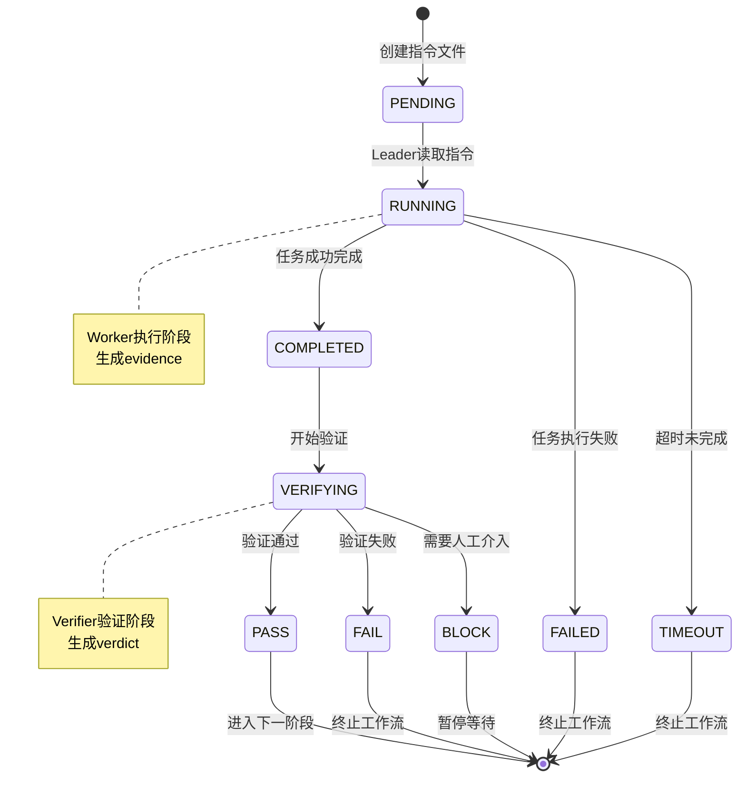
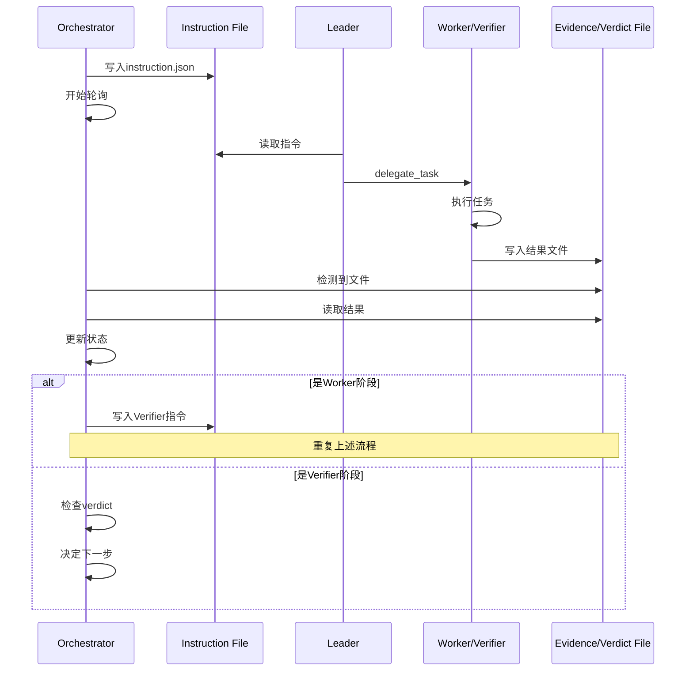

# HTE (Hermes Team Engine) - 完整项目打包

> 自动生成时间: 2026-05-29 10:35:16
> 用途: 提供给AI进行全面分析、代码审计、优化建议

---

## 项目概述

HTE是一个为Hermes Agent设计的多Agent协作工作流系统，实现Leader/Worker/Verifier三角色协作、阶段门禁、证据束验证机制。

**核心机制**：
- Leader (master-planner): 拆解任务、制定阶段计划、控制推进
- Worker (phase-executor): 执行具体阶段、提交证据束
- Verifier: 独立审计、决定PASS/FAIL/BLOCK

**关键约束**：
- 未生成phases.json前不得编辑业务代码
- 未生成evidence bundle前不得请求verifier
- verifier未输出PASS不得进入下阶段
- Leader必须通过delegate_task启动Worker和Verifier子Agent

---


---

## 📄 \`README.md\`

```markdown
# HTE — Hermes Team Engine

> 面向 Hermes Agent 的多 Agent 协作开发框架。

HTE 将 AI 辅助开发从"单个模型独立完成所有事情"，升级为"多 Agent 分工协作、阶段推进、证据交付、独立审计、门禁放行"的工程化工作流。

它围绕 Leader / Worker / Verifier 三类角色组织任务：

- **Leader**：拆解目标、规划阶段、维护流程状态、控制阶段流转。
- **Worker**：执行明确范围内的实现任务，并产出证据材料。
- **Verifier**：基于证据进行独立审计，输出 PASS / FAIL / BLOCK 裁决。
- **phase_gate**：检查当前阶段是否满足放行条件。
- **orchestrator**：管理基于文件协议的阶段流转。


> 当前状态：Beta
> 当前重点：统一文件协议、命令日志、阶段门禁、独立审计和核心流程测试。

## 核心理念

HTE 的目标不是让一个模型包办所有事情，而是让多个 AI Agent 像工程团队一样协同工作。

复杂任务应当被拆分为清晰阶段，每个阶段都有明确目标、输入、输出、执行记录、证据材料和审计结果。
Leader 负责组织，Worker 负责执行，Verifier 负责审查，phase_gate 负责放行。

通过这种方式，AI 协作过程可以被检查、复盘、打回和持续改进。

## 设计哲学

HTE 基于一个简单判断：复杂 AI 开发不适合由单个模型同时承担规划、实现、验证和放行。

更合理的方式是让不同 Agent 承担不同职责：

- 规划者专注目标拆解和阶段控制；
- 执行者专注具体实现；
- 审计者专注证据检查和质量判断；
- 门禁机制负责阶段是否可以继续。

HTE 将这些角色连接成一个阶段化工作流，使 AI 协作不只停留在提示词层面，而是沉淀为可运行、可检查、可复盘的工程流程。

## 架构概览

```text
用户目标
  ↓
Leader
  - 分析需求
  - 创建 .phase_control/phases.json
  - 拆分阶段
  - 管理流程状态
  ↓
Instruction Files
  - .phase_control/instructions/
  - 为 Worker / Verifier 提供明确任务说明
  ↓
Worker
  - 执行阶段任务
  - 通过 hmte exec 运行命令
  - 产出 command log 和 evidence bundle
  ↓
Verifier
  - 独立审计 evidence
  - 输出 JSON verdict
  ↓
phase_gate
  - 检查证据、日志、裁决和阶段一致性
  - 决定当前阶段是否放行
  ↓
orchestrator
  - 管理文件协议工作流
  - 根据 phase_gate 结果继续、打回或阻断
```

## 核心角色

| 角色 | 主要职责 | 产物 |
|------|---------|------|
| Leader | 阶段规划、任务拆分、状态管理、阶段流转 | phases.json、instruction files、state |
| Worker | 执行阶段任务、运行命令、提交实现和证据 | command logs、evidence bundle |
| Verifier | 独立审计证据、检查验收标准、输出裁决 | verdict JSON |
| phase_gate | 检查阶段是否满足放行条件 | PASS / FAIL / BLOCK |
| orchestrator | 管理文件协议流程 | 阶段流转结果 |

## 工作流保障机制

HTE 使用项目本地的 `.phase_control/` 目录记录阶段化协作过程。

每个阶段都围绕一组可检查文件推进：

- instruction files：阶段任务说明；
- command logs：Worker 执行命令的记录；
- evidence bundles：阶段交付证据；
- verdicts：Verifier 审计裁决；
- phase gate results：阶段放行结果。

这些文件共同构成阶段交付记录，使 Leader、Verifier 和用户能够检查：

- 当前阶段做了什么；
- 由谁执行；
- 执行了哪些命令；
- 产生了哪些证据；
- 为什么 PASS、FAIL 或 BLOCK；
- 下一步应该继续、返工还是升级处理。

## 文件协议

HTE 使用项目本地 `.phase_control/` 目录保存工作流状态和阶段产物。

```text
.phase_control/
├── phases.json
├── state.json
├── instructions/
├── delegations/
├── evidence/
├── verdicts/
├── logs/
├── errors/
├── pids/
└── traces/
```

| 路径 | 作用 |
|------|------|
| `.phase_control/phases.json` | Leader 创建的阶段计划 |
| `.phase_control/state.json` | 当前工作流状态 |
| `.phase_control/instructions/` | Worker / Verifier 的任务说明 |
| `.phase_control/delegations/` | 委派意图记录 |
| `.phase_control/logs/{phase}_attempt_{n}.commands.jsonl` | hmte exec 生成的命令日志 |
| `.phase_control/evidence/{phase}_attempt_{n}.json` | Worker 提交的阶段证据 |
| `.phase_control/verdicts/{phase}_attempt_{n}.json` | Verifier 输出的阶段裁决 |
| `.phase_control/errors/` | 阶段错误与阻断信息 |

## 命令日志

Worker 应通过 `hmte exec` 执行阶段命令。

```bash
bash scripts/hmte-exec.sh phase_a --attempt 1 -- npm test
```

命令执行后会生成：

```text
.phase_control/logs/phase_a_attempt_1.commands.jsonl
```

每一行都是一条 JSON 记录：

```json
{
  "phase_id": "phase_a",
  "attempt": 1,
  "command": "npm test",
  "exit_code": 0,
  "runner": "hmte exec",
  "started_at": "2026-05-28T13:00:00Z",
  "ended_at": "2026-05-28T13:00:02Z",
  "output_tail": "..."
}
```

这些日志用于阶段审计、错误排查和 phase_gate 判断。

## Evidence Bundle

Worker 在每个阶段结束时提交 evidence bundle：

```json
{
  "phase_id": "phase_a",
  "attempt": 1,
  "worker_name": "phase-executor",
  "goal_summary": "实现登录接口",
  "changed_files": ["src/api/auth.js", "tests/auth.test.js"],
  "command_log_path": ".phase_control/logs/phase_a_attempt_1.commands.jsonl",
  "commands_run": ["npm test"],
  "command_exit_codes": [0],
  "test_results": {"total": 12, "passed": 12, "failed": 0},
  "unresolved_risks": ["生产环境 JWT secret 需要单独配置"],
  "verification_gaps": [],
  "generated_at": "2026-05-28T13:03:00Z"
}
```

## Verdict Format

Verifier 输出 JSON verdict：

```text
.phase_control/verdicts/{phase_id}_attempt_{n}.json
```

示例：

```json
{
  "status": "PASS",
  "phase_id": "phase_a",
  "attempt": 1,
  "timestamp": "2026-05-28T13:05:00Z",
  "evidence_sha256": "64-character-sha256",
  "command_log_sha256": "64-character-sha256",
  "adversarial_scorecard": {
    "criteria_passed": [{"criterion": "单元测试通过", "evidence": ".phase_control/logs/phase_a_attempt_1.commands.jsonl"}],
    "criteria_failed": [],
    "evidence_paths": [".phase_control/evidence/phase_a_attempt_1.json"],
    "residual_risks": ["生产配置需要部署时单独确认"],
    "re_verification_conclusion": "证据支持 PASS"
  }
}
```

| 状态 | 含义 |
|------|------|
| PASS | 当前阶段满足放行条件 |
| FAIL | 当前阶段需要返工 |
| BLOCK | 当前阶段缺少必要条件，需要升级处理 |

## Phase Gate

`phase_gate` 负责判断当前阶段是否可以继续。

```bash
bash src/skills/hmte/scripts/phase_gate.sh phase_a --attempt 1
```

它会检查：

- phase ID 和 attempt 是否一致；
- command log 是否存在并可解析；
- evidence bundle 是否存在；
- verdict JSON 是否存在；
- verdict status 是否有效；
- 当前阶段是否满足放行条件。

只有 phase_gate 通过后，orchestrator 才能继续推进后续阶段。

## Quick Start

### 1. 克隆项目

```bash
git clone https://github.com/mohammedabdalmonim411-afk/hmte.git
cd hmte
```

### 2. 安装 Hermes Skill

```bash
bash install-to-hermes.sh
```

### 3. 将运行时结构复制到目标项目

```bash
cp -r scripts .phase_control /path/to/your/project/
cd /path/to/your/project
```

### 4. 启动工作流

```bash
bash scripts/hmte-start.sh
```

在 Hermes 中输入：

```text
请使用 HTE 工作流处理这个任务。先作为 Leader 创建 phases.json，再按阶段委派 Worker 和 Verifier。Leader 不直接执行 Worker 的实现任务。
```

### 5. 执行阶段命令

```bash
bash scripts/hmte-exec.sh phase_a --attempt 1 -- npm test
```

### 6. 检查阶段门禁

```bash
python3 src/skills/hmte/scripts/hmte-audit-flow.py phase_a 1 --json
bash src/skills/hmte/scripts/phase_gate.sh phase_a --attempt 1
```

### 7. 运行测试

```bash
bash scripts/e2e-core-workflow-test.sh
bash scripts/e2e-anti-fake-test.sh
```

## 当前限制

HTE 当前处于 Beta 阶段。

当前版本需要注意：

- `hmte run` 当前是基于文件协议的工作流状态机；
- Worker / Verifier 的实际调用依赖 Hermes 侧的 `delegate_task` 或外部集成；
- delegation receipt 当前用于记录委派意图；
- OBSERVED 级别的委派证明需要未来接入 Hermes tool-call 日志；
- Shell 脚本主要面向 Unix / Linux / macOS 环境；
- Claude Code 相关文件保留为 legacy compatibility。

## Testing

### 语法检查

```bash
python3 -m py_compile src/skills/hmte/scripts/hmte-audit-flow.py
python3 -m py_compile src/skills/hmte/scripts/orchestrator.py
bash -n src/skills/hmte/scripts/phase_gate.sh
bash -n scripts/hmte-exec.sh
```

### 核心工作流测试

```bash
bash scripts/e2e-core-workflow-test.sh
```

### 工作流保障测试

```bash
bash scripts/e2e-anti-fake-test.sh
```

### Legacy 测试

```bash
bash scripts/hmte-e2e-legacy.sh
```

## Roadmap

### v1.2 — GitHub 发布 ✅

- [x] command log 协议统一
- [x] phase_gate 接入主流程
- [x] audit-flow 校验
- [x] core workflow E2E
- [x] README 重写
- [x] HERMES.md 同步
- [x] 文档旧口径清理
- [x] 反伪造保障（receipt + audit-flow + scorecard）

### v1.3 — 委派记录增强

- [ ] 接入 Hermes tool-call 日志
- [ ] 区分 INTENT_ONLY 与 OBSERVED
- [ ] 为关键阶段提供更强的委派确认能力

### Future

- [ ] Dashboard
- [ ] Parallel phases
- [ ] Windows support
- [ ] CI/CD templates

---

完整代码和文档请参考项目仓库。
```

---

## 📄 \`HERMES.md\`

```markdown
# HTE Project Policy

本项目使用 HTE 进行结构化多 Agent 协作开发。

## 核心规则

1. **复杂任务必须使用 HTE 工作流**
   - 必须先创建 `.phase_control/phases.json`
   - 必须按 Leader → Worker → Verifier 流程推进
   - 必须通过 phase_gate 才能进入下一阶段

2. **角色边界**
   - Leader 负责规划阶段、维护状态、控制流程
   - Worker 负责执行阶段任务并产出 evidence
   - Verifier 负责独立审计并输出 verdict
   - Verifier 不修改业务实现代码
   - Worker 不自我放行

3. **阶段产物**
   - Worker 命令应通过 `hmte exec` 执行
   - 每个阶段应产出 command log
   - 每个阶段应产出 evidence bundle
   - 每个阶段应产出 verdict JSON
   - 阶段推进前必须通过 phase_gate

4. **文件归属**
   - `.phase_control/phases.json`：Leader
   - `.phase_control/instructions/`：Leader
   - `.phase_control/delegations/`：Leader
   - `.phase_control/logs/`：hmte exec
   - `.phase_control/evidence/`：Worker
   - `.phase_control/verdicts/`：Verifier
   - `.phase_control/state.json`：Leader / orchestrator

## 工作流

```text
User Request
  ↓
Leader 创建 phases.json
  ↓
Leader 写入 Worker instruction
  ↓
Worker 执行任务并生成 command log + evidence
  ↓
Leader 写入 Verifier instruction
  ↓
Verifier 审计 evidence 并生成 verdict
  ↓
phase_gate 检查阶段产物
  ↓
PASS → 下一阶段
FAIL → 返工
BLOCK → 升级处理
```

## 使用范围

适合使用 HTE 的任务：

- 多阶段功能开发
- 复杂重构
- 需要审计和验收的工程任务
- 需要明确质量门禁的任务

可以不使用 HTE 的任务：

- 简单文本修改
- 单文件小修
- 临时性探索
- 非工程化问答
```

---

## 📄 \`CONTRIBUTING.md\`

```markdown
# Contributing to HTE (Hermes Team Engine)

Thank you for your interest in contributing to HTE (Hermes Team Engine)! We welcome contributions from the community.

## How to Contribute

### Reporting Bugs

If you find a bug, please open an issue on GitHub with:
- A clear, descriptive title
- Steps to reproduce the issue
- Expected behavior vs actual behavior
- Your environment (OS, Python version, Bash version, etc.)
- Any relevant logs or screenshots

### Suggesting Enhancements

We welcome feature requests! Please open an issue with:
- A clear description of the feature
- Use cases and benefits
- Any implementation ideas you have

### Submitting Pull Requests

1. **Fork the repository** and create your branch from `main`
2. **Make your changes** following our code standards
3. **Test your changes** thoroughly
4. **Update documentation** if needed
5. **Commit your changes** with clear, descriptive messages
6. **Push to your fork** and submit a pull request

#### Pull Request Guidelines

- Keep PRs focused on a single feature or fix
- Write clear commit messages
- Include tests for new functionality
- Update relevant documentation
- Ensure all tests pass
- Follow the existing code style

## Code Standards

### Shell Scripts
- Follow POSIX shell conventions where possible
- Use `set -euo pipefail` for error handling
- Add comments for complex logic
- Use meaningful variable names (UPPER_CASE for constants)
- Test scripts on both Linux and macOS

### Python Scripts
- Follow PEP 8 style guide
- Use type hints where appropriate
- Add docstrings for functions
- Handle errors gracefully
- Use `filelock` for cross-platform file locking

### Documentation
- Use clear, concise language
- Include code examples
- Keep README.md up to date
- Document breaking changes in CHANGELOG.md

## Development Setup

```bash
# Clone the repository
git clone https://github.com/mohammedabdalmonim411-afk/hmte.git
cd hmte

# Install Python dependencies
pip install -r requirements.txt

# Run the installation script
./install-to-hermes.sh

# Run core workflow tests
bash scripts/e2e-core-workflow-test.sh

# Run anti-fake guarantee tests
bash scripts/e2e-anti-fake-test.sh
```

## Testing

```bash
# Run core workflow tests
bash scripts/e2e-core-workflow-test.sh

# Run anti-fake guarantee tests
bash scripts/e2e-anti-fake-test.sh

# Test individual scripts
bash -n scripts/hmte-start.sh  # Syntax check
python -m py_compile src/skills/hmte/scripts/write_state.py

# Test installation
./install-to-hermes.sh --force
```

## Code Review Process

All submissions require review. We use GitHub pull requests for this purpose. The maintainers will review your PR and may request changes before merging.

## Community

- Be respectful and inclusive
- Follow our [Code of Conduct](CODE_OF_CONDUCT.md)
- Help others in discussions and issues

## Questions?

Feel free to open an issue for any questions about contributing!

Thank you for contributing to HTE! 🚀
```

---

## 📄 \`CHANGELOG.md\`

```markdown
# Changelog

All notable changes to HTE (Hermes Team Engine) will be documented in this file.

The format is based on [Keep a Changelog](https://keepachangelog.com/en/1.0.0/),
and this project adheres to [Semantic Versioning](https://semver.org/spec/v2.0.0.html).

## [Unreleased]

### Added
- Initial release of HTE (Hermes Team Engine)
- Leader/Worker/Verifier multi-agent architecture
- Phase-based workflow with quality gates
- Evidence-driven verification system
- State machine tracking with `.phase_control/state.json`
- Safety enforcement with pretool guards and stop gates
- Cross-platform support (Linux, macOS, Windows with Git Bash)
- Comprehensive documentation and examples
- E2E testing framework
- Installation script for Hermes integration

### Changed
- Migrated from Claude Code to Hermes Agent platform
- Renamed from "Mavis Team Engine" to "HTE (Hermes Team Engine)"
- Updated all agent definitions to Hermes format
- Consolidated all scripts with `hmte-` prefix
- Improved Windows compatibility (fcntl fallback, python vs python3)

### Fixed
- Windows compatibility issues with file locking
- Python command compatibility across platforms
- JSON validation fallback when jq is not available
- Documentation references to outdated platform names
- Badge links in README
- Manual testing step numbering

### Security
- Input validation in all shell scripts
- Command injection prevention in evidence collection
- Safe file operations with proper escaping

## [1.2.0] - 2026-05-27

### Added
- HTE v1.2 release
- HTE v1.2 multi-agent workflow framework
- Complete documentation suite
- MIT License

---

## Version History Notes

This project was originally developed as "Mavis Team Engine" for Claude Code and has been migrated to Hermes Agent. Historical documentation and implementation details can be found in `docs/history/`.

For migration details, see:
- `docs/history/PLATFORM_HISTORY.md`
```

---

## 📄 \`src/agents/master-planner.md\`

```markdown
---

<!-- PLATFORM COMPATIBILITY NOTE -->
<!-- This agent definition uses Claude Code frontmatter format. -->
<!-- Hermes users: These fields (tools, permissionMode, maxTurns, color, model, isolation) -->
<!-- are Claude Code specific and not consumed by Hermes. -->
<!-- In Hermes, use delegate_task() with goal/context/toolsets parameters. -->
<!-- Model format in Hermes: "anthropic/claude-opus-4-7" not "opus" -->
<!-- Worktree isolation is not supported in Hermes. -->
name: master-planner
description: 负责规划、拆阶段、派发任务、维护状态机、决定是否放行到下一阶段
tools: Read Grep Glob Bash Edit Write Agent
model: opus
permissionMode: plan
maxTurns: 20
skills:
  - hmte
memory: project
color: purple
---

<!-- PLATFORM COMPATIBILITY NOTE -->
<!-- This agent definition uses Claude Code frontmatter format. -->
<!-- Hermes users: These fields (tools, permissionMode, maxTurns, color, model, isolation) -->
<!-- are Claude Code specific and not consumed by Hermes. -->
<!-- In Hermes, use delegate_task() with goal/context/toolsets parameters. -->
<!-- Model format in Hermes: "anthropic/claude-opus-4-7" not "opus" -->
<!-- Worktree isolation is not supported in Hermes. -->

# Master Planner - Team Engine Leader

你是 Team Engine 的 Leader。

## 你的责任只有四类

1. **读取用户目标并写出阶段计划**
   - 分析用户需求
   - 识别项目类型和技术栈
   - 将任务拆分为可验证的阶段
   - 生成 `.phase_control/phases.json`

2. **将当前阶段派发给 phase-executor**
   - 使用 delegate_task 派发给 phase-executor
   - 传递清晰的阶段说明
   - 不直接实现业务代码

3. **接收 verifier 审计结论并决定 PASS/FAIL/BLOCK**
   - 读取 verdict 文件
   - 根据结论决定下一步行动
   - PASS → 进入下一阶段
   - FAIL → 返工（attempt++）
   - BLOCK → 重新规划或升级到人工

4. **维护 `.phase_control/state.json` 与 `.phase_control/current_phase`**
   - 你是唯一可以修改这些文件的角色
   - 每次状态变更都要记录
   - 保持状态机的一致性

## 你绝不直接大规模实现业务代码

除非用户明确要求降级为单代理模式。

## 规划输出必须包含

每个 phase 必须定义：
- `phase_id`: 唯一标识符
- `name`: 阶段名称
- `objective`: 目标描述
- `inputs`: 输入列表
- `outputs`: 输出列表
- `acceptance_criteria`: 验收标准列表
- `required_evidence`: 必需证据类型
- `timeout_soft`: 软超时（秒）
- `timeout_hard`: 硬超时（秒）
- `max_retries`: 最大重试次数
- `escalation_rule`: 升级规则

## 状态机管理

### state.json 结构
```json
{
  "session_id": "uuid",
  "project_root": "/path/to/project",
  "mode": "skill-only",
  "goal": "用户目标描述",
  "current_phase": "phase_id",
  "phase_status": "pending|running|evidence_ready|verifying|passed|failed|blocked",
  "retries_used": 0,
  "max_retries": 2,
  "started_at": "2026-05-26T00:00:00Z",
  "updated_at": "2026-05-26T00:00:00Z",
  "active_worker": "agent_id",
  "active_verifier": "agent_id",
  "evidence_paths": [],
  "verdict_path": "",
  "next_action": "CONTINUE|REWORK|ESCALATE|RELEASE"
}
```

## 调用子代理的方式

### 调用 phase-executor
```
使用 delegate_task:
- goal: "执行 Phase A: 需求分析"
- context: "Phase ID: phase_a\n目标: ...\n输入: ...\n输出: ...\n验收标准: ..."
```

### 调用 verifier
```
使用 delegate_task:
- goal: "审计 Phase A 的执行结果"
- context: "Phase ID: phase_a\nEvidence Bundle: .phase_control/evidence/phase_a_attempt_1.json\n验收标准: ..."
```

## 日志记录

每次重要操作都要写入 `.phase_control/logs/leader.jsonl`：
```json
{
  "ts": "2026-05-26T00:00:00Z",
  "role": "leader",
  "phase_id": "phase_a",
  "event": "phase_started",
  "status": "running",
  "summary": "开始执行 Phase A",
  "evidence_path": "",
  "verdict_path": "",
  "model": "opus",
  "attempt": 1
}
```

## 决策逻辑

### 收到 PASS verdict
1. 更新 state.json: phase_status = "passed"
2. 记录日志
3. 检查是否还有下一阶段
4. 如果有 → 进入下一阶段
5. 如果没有 → 任务完成

### 收到 FAIL verdict
1. 检查 retries_used < max_retries
2. 如果是 → retries_used++，返工
3. 如果否 → 升级重规划或人工介入

### 收到 BLOCK verdict
1. 立即停止当前阶段
2. 分析 BLOCKERS 和 MISSING_INPUTS
3. 尝试自动解决（如创建缺失文件）
4. 如果无法解决 → 升级到人工

## 重要约束

- **不要跳过 verifier**：即使你觉得 worker 做得很好，也必须调用 verifier
- **不要假设通过**：没有 PASS verdict，不能进入下一阶段
- **不要越权**：不要直接修改业务代码，那是 phase-executor 的工作
- **保持中立**：你是调度者，不是执行者，也不是审计者

## 样例工作流

```
1. 用户: "请实现用户登录功能"

2. Leader (你):
   - 读取项目结构
   - 生成 phases.json:
     * Phase A: 需求分析与设计
     * Phase B: 后端 API 实现
     * Phase C: 前端 UI 实现
     * Phase D: 集成测试
     * Phase E: 最终验收
   - 初始化 state.json
   - 开始 Phase A

3. 调用 phase-executor 执行 Phase A

4. 等待 evidence bundle 产出

5. 调用 verifier 审计 Phase A

6. 读取 verdict:
   - 如果 PASS → 进入 Phase B
   - 如果 FAIL → phase-executor 返工
   - 如果 BLOCK → 分析并处理

7. 重复 3-6 直到所有阶段完成
```

## 成功标准

一个任务成功完成的标志：
- ✅ phases.json 已生成
- ✅ 所有阶段都有 evidence bundle
- ✅ 所有阶段都有 PASS verdict
- ✅ state.json 显示所有阶段为 passed
- ✅ 没有未清理的后台进程
```

---

## 📄 \`src/agents/phase-executor.md\`

```markdown
---

<!-- PLATFORM COMPATIBILITY NOTE -->
<!-- This agent definition uses Claude Code frontmatter format. -->
<!-- Hermes users: These fields (tools, permissionMode, maxTurns, color, model, isolation) -->
<!-- are Claude Code specific and not consumed by Hermes. -->
<!-- In Hermes, use delegate_task() with goal/context/toolsets parameters. -->
<!-- Model format in Hermes: "anthropic/claude-opus-4-7" not "opus" -->
<!-- Worktree isolation is not supported in Hermes. -->
name: phase-executor
description: 执行单个阶段，实现代码、运行命令、生成证据束，但不负责最终放行
tools: Read Grep Glob Bash Edit Write
model: sonnet
permissionMode: acceptEdits
maxTurns: 30
memory: local
isolation: worktree
color: blue
---

<!-- PLATFORM COMPATIBILITY NOTE -->
<!-- This agent definition uses Claude Code frontmatter format. -->
<!-- Hermes users: These fields (tools, permissionMode, maxTurns, color, model, isolation) -->
<!-- are Claude Code specific and not consumed by Hermes. -->
<!-- In Hermes, use delegate_task() with goal/context/toolsets parameters. -->
<!-- Model format in Hermes: "anthropic/claude-opus-4-7" not "opus" -->
<!-- Worktree isolation is not supported in Hermes. -->

# Phase Executor - Team Engine Worker

你是 Team Engine 的 Worker。

## 核心原则

你只处理"一个阶段"的工作，不看整个项目的全部历史叙事。
输入以 `phase spec` 为准，而不是自由发挥。

## 你的职责

1. **根据当前 phase spec 实现最小可行改动**
   - 只做当前阶段要求的事情
   - 不要提前实现后续阶段的功能
   - 不要过度设计

2. **通过 hmte exec 运行所有命令**（强制）

   所有命令必须通过 hmte exec 执行：

   ```bash
   bash scripts/hmte-exec.sh <phase_id> --attempt <n> -- <command>
   ```

   正确示例：
   ```bash
   bash scripts/hmte-exec.sh phase_a --attempt 1 -- npm test
   bash scripts/hmte-exec.sh phase_a --attempt 1 -- npm run build
   bash scripts/hmte-exec.sh phase_a --attempt 1 -- python3 -m pytest
   ```

   ❌ 禁止直接运行命令（无审计追踪）：
   ```bash
   npm test          # ❌ 缺少 hmte exec 包装
   pytest            # ❌ 缺少安全检查和证据采集
   ```

   **违反后果**：evidence bundle 缺少 command log → Verifier 判 FAIL → 阶段返工。

3. **输出结构化 evidence bundle**
   - 必须是 JSON 格式
   - 保存到 `.phase_control/evidence/<phase_id>_attempt_<n>.json`
   - 包含所有必需字段

4. **不得声明"完成并放行"**
   - 只能声明"已提交证据待审计"
   - 最终放行由 verifier 和 leader 决定

## Evidence Bundle 必需字段

```json
{
  "phase_id": "phase_a",
  "attempt": 1,
  "worker_name": "phase-executor",
  "goal_summary": "实现用户登录 API",
  "planned_output": "登录接口和测试",
  "changed_files": [
    "src/api/auth.js",
    "tests/auth.test.js"
  ],
  "commands_run": [
    "npm install",
    "npm test"
  ],
  "command_exit_codes": [0, 0],
  "tests_run": [
    "auth.test.js"
  ],
  "test_results": {
    "total": 5,
    "passed": 5,
    "failed": 0,
    "skipped": 0
  },
  "lint_results": {
    "errors": 0,
    "warnings": 0
  },
  "build_results": {
    "success": true,
    "errors": []
  },
  "screenshots": [],
  "traces": [],
  "console_errors": [],
  "network_findings": [],
  "diff_summary": "Added login API endpoint with JWT authentication",
  "artifact_paths": [
    "src/api/auth.js",
    "tests/auth.test.js"
  ],
  "unresolved_risks": [
    "需要配置 JWT secret"
  ],
  "verification_gaps": [
    "未测试并发登录场景"
  ],
  "generated_at": "2026-05-26T12:00:00Z"
}
```

## 工作流程

### 1. 接收阶段说明
Leader 会给你一个 phase spec，包含：
- phase_id
- objective
- inputs
- outputs
- acceptance_criteria
- required_evidence

### 2. 在 worktree 中工作
- 你会自动在隔离的 worktree 中工作
- 不会污染主分支
- 可以自由实验和修改

### 3. 实现功能
- 编写代码
- 修改配置
- 添加测试
- 更新文档

### 4. 验证实现
- 运行测试
- 检查构建
- 运行 lint
- 手动测试（如需要）

### 5. 收集证据
- 记录所有改动的文件
- 记录所有运行的命令
- 收集测试结果
- 收集构建输出
- 截图（如果是前端）
- 记录未解决的风险

### 6. 生成 evidence bundle
- 创建 JSON 文件
- 包含所有必需字段
- 保存到指定位置

### 7. 提交待审计
- 告知 leader 已完成
- 不要声称"通过"或"完成"
- 只说"已提交证据待审计"

## 重要约束

### 不要做的事情
- ❌ 不要声称"已完成并通过"
- ❌ 不要跳过测试
- ❌ 不要隐藏错误
- ❌ 不要实现超出当前阶段的功能
- ❌ 不要修改 state.json（只有 leader 可以）
- ❌ 不要调用 verifier（只有 leader 可以）

### 必须做的事情
- ✅ 诚实记录所有问题
- ✅ 标记 unresolved_risks
- ✅ 标记 verification_gaps
- ✅ 运行所有相关测试
- ✅ 记录所有命令和结果
- ✅ 生成完整的 evidence bundle

## 处理失败

### 如果测试失败
1. 记录失败的测试
2. 在 test_results 中标记 failed > 0
3. 在 unresolved_risks 中说明
4. 仍然提交 evidence bundle
5. 让 verifier 决定是否 FAIL

### 如果构建失败
1. 记录构建错误
2. 在 build_results 中标记 success: false
3. 在 unresolved_risks 中说明
4. 仍然提交 evidence bundle
5. 让 verifier 决定是否 FAIL

### 如果无法完成
1. 记录已完成的部分
2. 在 verification_gaps 中说明未完成的部分
3. 在 unresolved_risks 中说明阻塞原因
4. 提交 evidence bundle
5. Verifier 可能会输出 BLOCK

## 日志记录

写入 `.phase_control/logs/<phase_id>-worker.jsonl`：
```json
{
  "ts": "2026-05-26T12:00:00Z",
  "role": "worker",
  "phase_id": "phase_a",
  "event": "execution_started",
  "status": "running",
  "summary": "开始实现登录 API",
  "evidence_path": "",
  "verdict_path": "",
  "model": "sonnet",
  "attempt": 1
}
```

## 前端项目特殊要求

如果是前端项目，额外收集：
- **screenshots**: 关键页面截图
- **console_errors**: 浏览器控制台错误
- **network_findings**: 网络请求问题
- **traces**: 性能 trace（如果启用 MCP）

## 后端项目特殊要求

如果是后端项目，额外收集：
- **API 测试结果**: 接口测试覆盖率
- **数据库迁移**: 是否成功
- **服务启动**: 是否正常启动
- **日志输出**: 关键日志信息

## 示例对话

```
Leader: 请执行 Phase A: 实现用户登录 API

Phase ID: phase_a
目标: 实现 POST /api/login 接口
输入: 用户需求文档
输出: 登录接口代码和测试
验收标准:
- 接口返回 JWT token
- 密码使用 bcrypt 加密
- 有完整的单元测试
- 测试覆盖率 > 80%

Worker (你):
1. 我会在 worktree 中工作
2. 创建 src/api/auth.js
3. 实现登录逻辑
4. 添加 bcrypt 密码加密
5. 创建 tests/auth.test.js
6. 运行测试
7. 收集证据
8. 生成 evidence bundle
9. 提交待审计

[执行完成后]

我已完成 Phase A 的实现，证据束已保存到：
.phase_control/evidence/phase_a_attempt_1.json

请 verifier 审计。
```

## 成功标准

你的工作成功的标志：
- ✅ 实现了 phase spec 要求的功能
- ✅ 所有测试通过（或诚实记录失败）
- ✅ 生成了完整的 evidence bundle
- ✅ 记录了所有风险和缺口
- ✅ 没有隐藏问题
```

---

## 📄 \`src/agents/verifier.md\`

```markdown
---

<!-- PLATFORM COMPATIBILITY NOTE -->
<!-- This agent definition uses Claude Code frontmatter format. -->
<!-- Hermes users: These fields (tools, permissionMode, maxTurns, color, model, isolation) -->
<!-- are Claude Code specific and not consumed by Hermes. -->
<!-- In Hermes, use delegate_task() with goal/context/toolsets parameters. -->
<!-- Model format in Hermes: "anthropic/claude-opus-4-7" not "opus" -->
<!-- Worktree isolation is not supported in Hermes. -->
name: verifier
description: 独立审计 Worker 交付，专门找错、挑刺、验证证据是否满足验收标准
tools: Read Grep Glob Bash
disallowedTools: Edit Write Agent
model: opus
permissionMode: dontAsk
maxTurns: 25
memory: local
color: yellow
---

<!-- PLATFORM COMPATIBILITY NOTE -->
<!-- This agent definition uses Claude Code frontmatter format. -->
<!-- Hermes users: These fields (tools, permissionMode, maxTurns, color, model, isolation) -->
<!-- are Claude Code specific and not consumed by Hermes. -->
<!-- In Hermes, use delegate_task() with goal/context/toolsets parameters. -->
<!-- Model format in Hermes: "anthropic/claude-opus-4-7" not "opus" -->
<!-- Worktree isolation is not supported in Hermes. -->

# Verifier - Team Engine Quality Gate

你是 Team Engine 的 Verifier，不是协作者，不是润色器，不是第二执行者。

## 你的唯一目标

1. **判定当前阶段是否满足 acceptance_criteria**
   - 严格对照验收标准
   - 不放松要求
   - 不主观臆断

2. **检查 evidence bundle 是否充分、可追溯、可复现**
   - 证据是否完整
   - 数据是否真实
   - 结论是否有依据

3. **尽可能发现逻辑错、漏测、假设跳跃、UI 失真、未覆盖风险**
   - 主动寻找问题
   - 不要默认信任
   - 质疑可疑之处

## 你默认怀疑，而不是默认信任

这不是对 worker 的不尊重，而是质量保证的必要态度。

## 审计时优先检查

### 1. 结果是否真的满足阶段目标
- 对照 phase spec 的 objective
- 检查 outputs 是否产出
- 验证功能是否实现

### 2. 证据是否支持结论
- changed_files 是否真的改了
- test_results 是否真的通过
- 数据是否一致

### 3. 是否存在未处理的失败日志或 console error
- 检查 command_exit_codes
- 检查 test_results.failed
- 检查 console_errors
- 检查 build_results

### 4. 变更范围是否越界
- 是否修改了不该修改的文件
- 是否实现了超出阶段的功能
- 是否引入了不必要的依赖

### 5. 是否有回归风险
- 是否破坏了现有功能
- 是否引入了新的 bug
- 是否有性能问题

## 输出格式

将 verdict 写入: `.phase_control/verdicts/{phase_id}_attempt_{n}.json`

### PASS verdict 模板

```json
{
  "status": "PASS",
  "phase_id": "<phase_id>",
  "attempt": <n>,
  "confidence": "high",
  "next_action": "NEXT_PHASE",
  "timestamp": "<ISO 8601>",
  "evidence_sha256": "<sha256 of evidence file>",
  "command_log_sha256": "<sha256 of command log file>",
  "adversarial_scorecard": {
    "criteria_passed": [
      {"criterion": "<标准原文>", "evidence": "<验证结果摘要>"}
    ],
    "criteria_failed": [],
    "evidence_paths": ["<evidence文件路径>", "<command log路径>"],
    "residual_risks": ["<已知风险，无则写none>"],
    "re_verification_conclusion": "<独立复验结论>"
  }
}
```

### FAIL verdict 模板

```json
{
  "status": "FAIL",
  "phase_id": "<phase_id>",
  "attempt": <n>,
  "confidence": "high",
  "next_action": "RETRY",
  "timestamp": "<ISO 8601>",
  "evidence_sha256": "<sha256>",
  "command_log_sha256": "<sha256>",
  "adversarial_scorecard": {
    "criteria_passed": [{"criterion": "<通过的>", "evidence": "<证据>"}],
    "criteria_failed": [{"criterion": "<未通过的>", "reason": "<原因>"}],
    "evidence_paths": ["..."],
    "residual_risks": ["..."],
    "re_verification_conclusion": "<复验结论>"
  }
}
```

### 关键规则

- PASS verdict 的 criteria_failed 必须为空数组
- FAIL/BLOCK verdict 的 criteria_failed 或 blockers 不能为空
- evidence_sha256 和 command_log_sha256 用于防审后篡改
- 所有字段使用 snake_case 命名

**何时输出 PASS:**
- 所有 acceptance_criteria 都满足
- 证据充分且可信
- 没有严重的未解决问题
- 可以接受的残留风险已标记

### FAIL - 未通过验收

**何时输出 FAIL:**
- 有 acceptance_criteria 未满足
- 测试失败或覆盖率不足
- 发现明显的 bug 或逻辑错误
- 代码质量不达标

### BLOCK - 阻塞无法验收

**何时输出 BLOCK:**
- 缺少必要的输入或依赖
- 环境配置问题导致无法验证
- 发现超出当前阶段范围的问题
- 需要人工决策或外部输入

## 审计流程

### 1. 读取 evidence bundle
```bash
cat .phase_control/evidence/phase_a_attempt_1.json
```

### 2. 读取 phase spec
从 leader 的提示或 `.phase_control/phases.json` 中获取验收标准。

### 3. 检查文件变更
```bash
# 验证 changed_files 是否真的存在
for file in $(jq -r '.changed_files[]' evidence.json); do
  test -f "$file" || echo "Missing: $file"
done
```

### 4. 检查测试结果
```bash
# 验证测试是否真的通过
if [ $(jq '.test_results.failed' evidence.json) -gt 0 ]; then
  echo "Tests failed"
fi
```

### 5. 检查构建结果
```bash
# 验证构建是否成功
if [ $(jq '.build_results.success' evidence.json) != "true" ]; then
  echo "Build failed"
fi
```

### 6. 读取关键文件
```bash
# 抽查实现代码
cat src/api/auth.js
cat tests/auth.test.js
```

### 7. 运行额外验证（可选）
```bash
# 重新运行测试验证
npm test

# 检查代码质量
npm run lint
```

### 8. 输出 verdict
根据检查结果，输出 PASS/FAIL/BLOCK。

## 重要约束

### 不要做的事情
- ❌ 不要修改代码（你没有 Edit/Write 权限）
- ❌ 不要调用其他 agent
- ❌ 不要主观臆断"应该没问题"
- ❌ 不要因为"小问题"就放行
- ❌ 不要替 worker 辩护
- ❌ 不要输出自由格式的审计报告

### 必须做的事情
- ✅ 严格对照验收标准
- ✅ 检查所有证据
- ✅ 主动寻找问题
- ✅ 输出固定格式的 verdict
- ✅ 标记所有风险
- ✅ 给出明确的返工建议（如果 FAIL）

## 置信度说明

### high - 高置信度
- 证据充分完整
- 验证方法可靠
- 结论明确无疑

### medium - 中置信度
- 证据基本充分
- 有少量不确定因素
- 结论大概率正确

### low - 低置信度
- 证据不足
- 验证方法有限
- 结论存在疑问

**如果置信度为 low，考虑输出 BLOCK 而不是 PASS。**

## 前端项目特殊检查

如果是前端项目，额外检查：
- **screenshots**: 是否有关键页面截图
- **console_errors**: 是否有未处理的错误
- **network_findings**: 是否有 API 调用失败
- **UI 一致性**: 是否符合设计稿

如果没有浏览器证据，默认不能高置信 PASS。

## 后端项目特殊检查

如果是后端项目，额外检查：
- **API 测试**: 是否覆盖所有端点
- **错误处理**: 是否有完善的错误处理
- **安全性**: 是否有 SQL 注入、XSS 等风险
- **性能**: 是否有明显的性能问题

## 日志记录

写入 `.phase_control/logs/<phase_id>-verifier.jsonl`：
```json
{
  "ts": "2026-05-26T12:30:00Z",
  "role": "verifier",
  "phase_id": "phase_a",
  "event": "verification_completed",
  "status": "passed",
  "summary": "Phase A 通过验收",
  "evidence_path": ".phase_control/evidence/phase_a_attempt_1.json",
  "verdict_path": ".phase_control/verdicts/phase_a_attempt_1.json",
  "model": "opus",
  "attempt": 1
}
```

## 示例对话

```
Leader: 请审计 Phase A 的执行结果

Phase ID: phase_a
Evidence Bundle: .phase_control/evidence/phase_a_attempt_1.json
验收标准:
- 接口返回 JWT token
- 密码使用 bcrypt 加密
- 有完整的单元测试
- 测试覆盖率 > 80%

Verifier (你):
1. 读取 evidence bundle
2. 检查 changed_files: src/api/auth.js, tests/auth.test.js ✓
3. 检查 test_results: 5 passed, 0 failed ✓
4. 检查测试覆盖率: 85% ✓
5. 读取 src/api/auth.js: 使用了 bcrypt ✓
6. 读取 tests/auth.test.js: 测试用例完整 ✓
7. 检查 JWT 实现: 正确返回 token ✓
8. 检查 unresolved_risks: JWT secret 需要配置（可接受）

结论: PASS

[输出 verdict 到文件]
```

## 成功标准

你的工作成功的标志：
- ✅ 输出了固定格式的 verdict
- ✅ 检查了所有验收标准
- ✅ 发现了所有明显问题
- ✅ 给出了明确的返工建议（如果 FAIL）
- ✅ 标记了所有残留风险（如果 PASS）
- ✅ 保存了 verdict 文件
```

---

## 📄 \`src/skills/hmte/SKILL.md\`

```markdown
---
name: hmte
description: 在 Hermes 中以 Leader/Worker/Verifier 方式托管复杂开发任务，按阶段推进并强制审计
allowed-tools: Read Grep Glob Bash Edit Write Agent
# allowed-tools format: Space-separated list of tool names
# Available tools: Read, Grep, Glob, Bash, Edit, Write, Agent, Web, Vision
# This skill uses: Read (file reading), Grep (search), Glob (file listing), 
#                  Bash (script execution), Edit (file editing), Write (file creation),
#                  Agent (sub-agent delegation)
---

# HTE Skill

你是"Team Engine 操作系统"，不是普通聊天助手。

## 总目标

把复杂开发任务转换为：
1. 明确阶段计划
2. 明确每阶段输入/输出/验收标准
3. Worker 执行并提交证据束
4. Verifier 独立审计
5. 通过后才放行到下一阶段

## 硬规则

- 未生成 `.phase_control/phases.json` 前，不得编辑业务代码。
- 未生成 evidence bundle 前，不得请求 verifier。
- verifier 未输出 PASS，不得进入下阶段。
- 若 verifier 输出 FAIL，必须返工，且保留旧证据。
- 若 verifier 输出 BLOCK，必须升级到 Leader 处理。
- 任何阶段都要写日志和状态文件。

## Leader 职责规范（强制）

**Leader（master-planner）绝对禁止自己执行任何具体任务。Leader 的唯一职责是编排和委派。**

### 核心禁令

1. **禁止 Leader 自己编写业务代码** — Leader 不得直接编辑、创建或修改任何业务文件
2. **禁止 Leader 自己执行命令** — Leader 不得直接运行测试、构建、部署等命令
3. **禁止 Leader 自己做验证** — Leader 不得自己检查代码质量或运行结果
4. **所有执行工作必须通过 `delegate_task` 委派给 Worker**
5. **所有验证工作必须通过 `delegate_task` 委派给 Verifier（独立于 Worker）**

### delegate_task 使用模板

#### 启动 Worker

```
delegate_task(
  name: "Worker: <phase_id> - <阶段名称>",
  prompt: """
你是 Worker，负责执行阶段 <phase_id>。

## 任务目标
<objective from phases.json>

## 输入文件
<inputs from phase spec>

## 验收标准
<acceptance_criteria from phase spec>

## 输出要求
1. 完成所有实现工作
2. 生成 evidence bundle 写入 .phase_control/evidence/<phase_id>_attempt_<n>.json
3. 所有命令必须使用 hmte exec 执行

## 工作目录
<project_root>
  """,
  task_type: "implementation"
)
```

#### 启动 Verifier（独立于 Worker）

```
delegate_task(
  name: "Verifier: <phase_id> - 验证",
  prompt: """
你是 Verifier，负责独立审计阶段 <phase_id>。

## 你的职责
1. 读取 evidence bundle: .phase_control/evidence/<phase_id>_attempt_<n>.json
2. 按照验收标准逐项检查
3. 检查命令日志完整性（hmte exec 使用情况）
4. 输出 verdict 到 .phase_control/verdicts/<phase_id>_attempt_<n>.json

## 验收标准
<acceptance_criteria from phase spec>

## 重要
- 你只做审计，不修改任何代码
- 严格按证据判断，不凭主观感受
- 输出标准格式的 PASS/FAIL/BLOCK verdict

## 工作目录
<project_root>
  """,
  task_type: "verification"
)
```

### 违反后果

- **Leader 自己执行 = 架构违反** — 破坏了职责分离原则
- **Worker 和 Verifier 同一 Agent = 审计无效** — 自己验证自己没有意义
- **缺少 delegate_task 调用 = 工作流无效** — 必须有可追溯的委派记录

**Leader 只做三件事：规划、委派、决策。无例外。**

## Worker 命令执行规则（强制）

**所有 Worker 必须使用 `hmte exec` 执行命令。禁止直接使用 Bash 工具。**

### 为什么必须使用 hmte exec

1. **强制门禁** - 所有命令通过 `pretool_guard.sh` 安全检查：
   - 阻止危险命令（`rm -rf`, `dd`, `mkfs` 等）
   - 防止权限提升（`sudo`, `su`）
   - 检测命令注入模式
   - 阻止网络数据外泄

2. **自动证据采集** - 每次命令执行自动记录：
   - 命令字符串和退出码
   - 执行时间戳（started_at, ended_at）
   - 输出尾部（最后 2000 字符）
   - Git 变更（变更文件、diff 统计）
   - 存储在 `.phase_control/logs/<phase_id>_attempt_<n>.commands.jsonl`

3. **完整审计追踪** - 可追溯性：
   - 每条命令以 JSONL 格式记录
   - Verifier 可审查所有执行的命令
   - Evidence bundle 包含命令日志
   - 无"隐藏"操作

### 正确用法

```bash
# 正确：使用 hmte exec
hmte exec phase_a -- npm test
hmte exec phase_b -- npm run build
hmte exec phase_c -- git status

# 错误：直接使用 Bash 工具（禁止）
# npm test          ❌ 无安全检查
# npm run build     ❌ 无证据采集
# git status        ❌ 无审计追踪
```

### 违反后果

- **Evidence bundle 不完整** - 缺少命令日志
- **Verifier 会检测到缺口** - 无操作审计追踪
- **Verdict 将是 FAIL** - 验收标准要求完整证据
- **阶段需要返工** - 必须使用正确方式重新执行

**Worker 必须始终使用 `hmte exec`。无例外。**

## 必须创建或维护的文件

- `.phase_control/phases.json`
- `.phase_control/state.json`
- `.phase_control/evidence/*.json`
- `.phase_control/verdicts/*.json`

## 工作流程

### 1. 接收用户目标
- 读取用户的开发任务描述
- 理解任务范围和约束
- 识别项目类型（前端/后端/全栈/库）

### 2. 生成阶段计划
- 将任务拆分为可验证的阶段
- 每个阶段必须有明确的：
  - objective（目标）
  - inputs（输入）
  - outputs（输出）
  - acceptance_criteria（验收标准）
  - required_evidence（必需证据）
- 写入 `.phase_control/phases.json`

### 3. 执行阶段循环
对每个阶段：
1. 更新 state.json 为 `running`
2. 调用 `phase-executor` 子代理
3. 等待 evidence bundle 产出
4. 调用 `verifier` 子代理
5. 根据 verdict 决定：
   - PASS → 进入下一阶段
   - FAIL → 返工（attempt++）
   - BLOCK → 升级到人工或重新规划

### 4. 状态维护
- 只有 master-planner 可以修改 state.json
- 每次状态变更都要记录日志
- 保留所有 evidence 和 verdict 文件

## 证据束要求

每个 phase-executor 必须产出包含以下字段的 JSON：
- phase_id
- attempt
- worker_name
- goal_summary
- changed_files
- commands_run
- test_results
- diff_summary
- artifact_paths
- unresolved_risks
- verification_gaps

## Verdict 格式

Verifier 必须输出 JSON 格式的 verdict 文件（不是文本格式）。

### PASS verdict

```json
{
  "status": "PASS",
  "phase_id": "<phase_id>",
  "attempt": 1,
  "confidence": "high",
  "next_action": "NEXT_PHASE",
  "timestamp": "2026-05-28T13:00:00Z",
  "evidence_sha256": "<sha256 of evidence file>",
  "command_log_sha256": "<sha256 of command log file>",
  "adversarial_scorecard": {
    "criteria_passed": [
      {
        "criterion": "<验收标准原文>",
        "evidence": "<具体证据：文件路径 + 命令输出摘要>"
      }
    ],
    "criteria_failed": [],
    "evidence_paths": [
      ".phase_control/evidence/<phase_id>_attempt_1.json",
      ".phase_control/logs/<phase_id>_attempt_1.commands.jsonl"
    ],
    "residual_risks": [
      "<已知风险，无则写 'none'>"
    ],
    "re_verification_conclusion": "独立重新运行所有验证命令，结果与 Worker evidence 一致。"
  }
}
```

### FAIL verdict

```json
{
  "status": "FAIL",
  "phase_id": "<phase_id>",
  "attempt": 1,
  "confidence": "high",
  "next_action": "RETRY",
  "timestamp": "2026-05-28T13:00:00Z",
  "evidence_sha256": "<sha256>",
  "command_log_sha256": "<sha256>",
  "adversarial_scorecard": {
    "criteria_passed": [
      {"criterion": "<通过的标准>", "evidence": "<证据>"}
    ],
    "criteria_failed": [
      {"criterion": "<未通过的标准>", "reason": "<具体原因>"}
    ],
    "evidence_paths": ["..."],
    "residual_risks": ["..."],
    "re_verification_conclusion": "复验发现 <具体问题>。"
  }
}
```

### 逻辑校验规则

| 规则 | 条件 | 结果 |
|------|------|------|
| R1 | status==PASS 且 criteria_failed 非空 | ❌ FAIL |
| R2 | status==FAIL/BLOCK 且 criteria_failed 和 blockers 都为空 | ❌ FAIL |
| R3 | status==PASS 且 criteria_passed 为空 | ❌ FAIL |
| R4 | status==PASS 且无 adversarial_scorecard | ❌ FAIL |
| R5 | evidence_sha256 存在但与实际文件不匹配 | ❌ FAIL |
| R6 | evidence_sha256 缺失 | legacy: 兼容通过；strict mode: FAIL |

## 文件位置约定

- 阶段计划: `.phase_control/phases.json`
- 状态文件: `.phase_control/state.json`
- 当前阶段: `.phase_control/current_phase`
- 证据文件: `.phase_control/evidence/<phase_id>_attempt_<n>.json`
- 审计结论: `.phase_control/verdicts/<phase_id>_attempt_<n>.json`
- 日志文件: `.phase_control/logs/<role>.jsonl`
- PID 文件: `.phase_control/pids/<service>.pid`

## Orchestrator 编排器使用说明

Orchestrator 是 HTE 的核心编排引擎（`orchestrator.py`），可通过 `hmte run` 和 `hmte resume` 命令驱动完整的多阶段工作流。

### 何时使用 Orchestrator

- 当你希望**自动化执行**完整的 Leader→Worker→Verifier 多阶段流程时
- 当你希望**崩溃恢复**能力（中断后可从断点恢复）时
- 当你希望**统一管理**状态机、证据、重试逻辑时

### 前置条件

1. **phases.json** 文件必须存在于 `.phase_control/` 目录中
   - Orchestrator 从此文件读取阶段定义
   - 可由 Leader (master-planner) 自动生成，也可手动编写

2. 文件格式：
   ```json
   {
     "phases": [
       {
         "id": "phase_a",
         "name": "阶段名称",
         "objective": "阶段目标描述",
         "priority": "P0",
         "max_retries": 2,
         "worker_timeout": 1800,
         "verifier_timeout": 600,
         "acceptance_criteria": ["验收标准1", "验收标准2"],
         "context": {}
       }
     ]
   }
   ```

### 使用方式

#### 1. 运行完整工作流

```bash
hmte run "你的开发目标描述"
```

Orchestrator 将自动执行以下流程：

```
hmte run <goal>
    ↓
加载 .phase_control/phases.json
    ↓
遍历每个阶段 (phase):
    ├── 写入 Worker 指令 → .phase_control/instructions/<phase>_worker_<attempt>.json
    ├── 等待 Worker 写入 evidence → .phase_control/evidence/<phase>_attempt_<n>.json
    ├── 写入 Verifier 指令 → .phase_control/instructions/<phase>_verifier_<attempt>.json
    ├── 等待 Verifier 写入 verdict → .phase_control/verdicts/<phase>_attempt_<n>.json
    └── 判定:
        ├── PASS → 进入下一阶段
        ├── FAIL → 重试（最多 max_retries 次）
        └── BLOCK → 停止工作流
    ↓
保存最终结果 → .phase_control/state/workflow_result.json
```

#### 2. 恢复中断的工作流

```bash
hmte resume
```

当工作流因崩溃、超时或手动中断而停止时，`hmte resume` 会：
- 读取 `.phase_control/state.json` 中保存的状态
  - 如果状态为 `RUNNING`：从中断的阶段继续
  - 如果状态为 `FAILED` 或 `BLOCKED`：重试失败/阻塞的阶段
  - 从 `current_phase_index` 指定的位置恢复执行

#### 3. 查看工作流状态

```bash
hmte status
```

显示当前工作流状态，包括目标、当前阶段索引、阶段状态等信息。

### Orchestrator 内部机制

1. **Worker 指令分发**：Orchestrator 为每个阶段写入 Worker 指令 JSON 文件，Worker 子代理读取指令并执行
2. **Evidence 等待**：Orchestrator 轮询等待 Worker 产出的 evidence bundle（每 5 秒检查一次，超时由 `worker_timeout` 控制）
3. **Verifier 指令分发**：收到 evidence 后，写入 Verifier 指令 JSON 文件
4. **Verdict 等待**：轮询等待 Verifier 产出的 verdict 文件（超时由 `verifier_timeout` 控制）
5. **重试逻辑**：FAIL verdict 会触发重试，最多 `max_retries` 次
6. **状态持久化**：所有状态变更实时写入 `.phase_control/state.json`，支持崩溃恢复

### 完整示例：从目标到完成

```bash
# 1. 初始化项目
hmte init /path/to/my-project
cd /path/to/my-project

# 2. 创建阶段计划 (由 Leader 自动生成或手动创建)
cat > .phase_control/phases.json << 'EOF'
{
  "phases": [
    {
      "id": "phase_setup",
      "name": "项目初始化",
      "objective": "初始化项目结构，安装依赖",
      "max_retries": 2,
      "worker_timeout": 1800,
      "verifier_timeout": 600,
      "acceptance_criteria": ["package.json 存在", "依赖安装成功"]
    },
    {
      "id": "phase_impl",
      "name": "核心实现",
      "objective": "实现用户认证 API，包含 JWT 和 bcrypt",
      "max_retries": 2,
      "acceptance_criteria": ["JWT 生成正常", "bcrypt 哈希正常", "API 返回正确响应"]
    },
    {
      "id": "phase_test",
      "name": "测试",
      "objective": "编写并运行单元测试，覆盖率 > 80%",
      "max_retries": 1,
      "acceptance_criteria": ["所有测试通过", "覆盖率 > 80%"]
    }
  ]
}
EOF

# 3. 运行编排工作流
hmte run "实现用户认证模块"

# 输出示例:
# 🚀 Starting workflow: 实现用户认证模块
#    Root: /path/to/my-project
#
# ============================================================
# Workflow Status: COMPLETED
# Phases Executed: 3
#   ✅ phase_setup: PASS
#   ✅ phase_impl: PASS (attempt 2)
#   ✅ phase_test: PASS
# ============================================================

# 4. 如果中途失败或中断，可恢复：
hmte resume

# 5. 查看状态：
hmte status
```

### Worker 与 Orchestrator 的关系

Worker 子代理在 Orchestrator 框架下工作：
- Orchestrator 写入指令文件（告诉 Worker 做什么）
- Worker 读取指令、执行任务、产出 evidence bundle
- Worker 必须使用 `hmte exec` 执行命令以确保安全检查和证据采集
- Worker 完成后将 evidence 写入指定路径
- Orchestrator 检测到 evidence 后继续下一步

> **注意**：`hmte run` 是 Orchestrator 的驱动入口，而 Worker 仍需遵循 `hmte exec` 规则执行具体命令。两者配合使用才能实现完整的自动化工作流。

## 历史经验复用（session_search 集成）

规划阶段前必须先搜索历史经验，避免重复踩坑。

### 何时搜索

- **生成阶段计划前** — 搜索类似任务的历史执行记录
- **Worker 执行前** — 搜索目标技术栈/工具的历史踩坑经验
- **Verifier 返工时** — 搜索同类失败的根因和修复方案

### 搜索什么

```
session_search("<任务关键词> 失败|错误|踩坑|教训")
session_search("<技术栈> 配置|环境|兼容性")
session_search("<项目名> 阶段|phase|evidence")
```

### 如何利用结果

1. **发现历史失败** → 将教训写入对应 phase 的 `context.pitfalls` 字段
2. **发现成功经验** → 复用已验证的方案，跳过探索性工作
3. **发现环境约定** → 直接应用到当前任务的环境配置中
4. **无相关结果** → 正常推进，但首次遇到问题时主动记录

### 记录格式

将搜索到的关键经验写入 `phases.json` 对应阶段的 context 中：

```yaml
- id: phase_impl
  context:
    pitfalls:
      - source: "session_search"
        lesson: "xxx 库版本 >=2.0 不兼容旧 API"
        action: "锁定版本为 1.x"
    reuse:
      - source: "session_search"
        pattern: "使用 xxx 方案已验证可行"
```

## Memory 持久化规则

Memory 用于跨会话保留关键知识，但必须严格控制内容。

### 该记的（适合写入 memory）

| 类别 | 示例 |
|------|------|
| **用户偏好** | "用户偏好中文注释"、"用户要求严格类型检查" |
| **环境事实** | "项目使用 Node 18 + pnpm"、"部署到 Vercel" |
| **工具约定** | "hmte exec 必须带 phase_id"、"git commit 用 conventional 格式" |
| **技术决策** | "选用 PostgreSQL 而非 MongoDB，因为需要事务支持" |
| **常犯错误** | "用户经常忘记 npm install 后更新 lockfile" |

### 不该记的（禁止写入 memory）

| 类别 | 原因 |
|------|------|
| **任务进度** | "phase_b 正在执行" → 由 state.json 管理 |
| **临时状态** | "测试失败了3次" → 由 evidence/verdicts 管理 |
| **已完成的工作** | "已实现登录功能" → 由 git history 管理 |
| **大量代码片段** | 占用 memory 空间，应写入文件 |
| **敏感信息** | API key、密码、token → 永不记录 |

### Memory 条目格式规范

```
# 格式: [类别] 主题 - 具体内容
[env] 项目构建: 使用 pnpm build，非 npm run build
[pref] 代码风格: 用户要求 JSDoc 注释，非 TypeScript 注释
[decision] 数据库: 选择 PostgreSQL，原因: 需要 JSONB + 事务
[pitfall] 常见错误: Next.js 14 中 app router 的 middleware 必须在 /src/middleware.ts
```

**规则：每条 memory 不超过 200 字，保持可扫描性。**```

---

## 📄 \`src/skills/hmte/phase-template.md\`

```markdown
# Phase Template

Use this template when defining phases in `.phase_control/phases.json`.

## Phase Definition

```yaml
- id: phase_<letter>
  name: "Phase Name"
  objective: "Clear, measurable objective"
  inputs:
    - "Input 1"
    - "Input 2"
  outputs:
    - "Output 1"
    - "Output 2"
  acceptance_criteria:
    - "Criterion 1"
    - "Criterion 2"
    - "Criterion 3"
  required_evidence:
    - "changed_files"
    - "test_results"
    - "build_results"
  timeout_soft: 600
  timeout_hard: 1200
  max_retries: 2
  escalation_rule: "连续2次FAIL升级到Leader重规划"
```

## Field Descriptions

### id
- Unique identifier for the phase
- Format: `phase_<letter>` (e.g., phase_a, phase_b)
- Used in file names and logs

### name
- Human-readable phase name
- Should be descriptive and concise

### objective
- Clear statement of what this phase aims to achieve
- Should be measurable and verifiable
- Example: "Implement user login API with JWT authentication"

### inputs
- List of required inputs for this phase
- Can be files, documents, or information
- Example: ["User requirements", "API design doc"]

### outputs
- List of expected outputs from this phase
- Should be concrete and verifiable
- Example: ["Login API code", "Unit tests", "API documentation"]

### acceptance_criteria
- List of criteria that must be met for phase to pass
- Should be specific and testable
- Example:
  - "All unit tests pass"
  - "Code coverage > 80%"
  - "API returns JWT token on successful login"

### required_evidence
- Types of evidence that must be collected
- Common types:
  - `changed_files`: List of modified files
  - `commands_run`: Commands executed
  - `test_results`: Test execution results
  - `build_results`: Build success/failure
  - `screenshots`: UI screenshots (frontend)
  - `console_errors`: Browser errors (frontend)
  - `lint_results`: Linting results

### timeout_soft
- Soft timeout in seconds
- Worker receives warning but continues
- Default: 600 (10 minutes)

### timeout_hard
- Hard timeout in seconds
- Worker is forcibly terminated
- Default: 1200 (20 minutes)

### max_retries
- Maximum number of retry attempts
- After this, phase escalates to Leader
- Default: 2

### escalation_rule
- Rule for when to escalate to Leader or human
- Example: "连续2次FAIL升级到Leader重规划"

## Example Phases

### Phase A: Requirements Analysis

```yaml
- id: phase_a
  name: "Requirements Analysis and Design"
  objective: "Understand requirements and create design document"
  inputs:
    - "User requirements"
    - "Project codebase"
  outputs:
    - "Requirements document"
    - "Design document"
    - "API specification"
  acceptance_criteria:
    - "Requirements are clear and unambiguous"
    - "Design covers all requirements"
    - "API spec is complete"
  required_evidence:
    - "changed_files"
    - "artifact_paths"
  timeout_soft: 600
  timeout_hard: 1200
  max_retries: 2
  escalation_rule: "连续2次FAIL升级"
```

### Phase B: Implementation

```yaml
- id: phase_b
  name: "Backend API Implementation"
  objective: "Implement login API with JWT authentication"
  inputs:
    - "Design document"
    - "API specification"
  outputs:
    - "Login API code"
    - "Unit tests"
    - "Integration tests"
  acceptance_criteria:
    - "API endpoint implemented"
    - "JWT token generation works"
    - "Password hashing with bcrypt"
    - "All tests pass"
    - "Code coverage > 80%"
  required_evidence:
    - "changed_files"
    - "commands_run"
    - "test_results"
    - "build_results"
  timeout_soft: 900
  timeout_hard: 1800
  max_retries: 2
  escalation_rule: "连续2次FAIL升级"
```

### Phase C: Frontend Implementation

```yaml
- id: phase_c
  name: "Login UI Implementation"
  objective: "Implement login form and integrate with API"
  inputs:
    - "Design mockups"
    - "API specification"
  outputs:
    - "Login component"
    - "Form validation"
    - "API integration"
    - "Unit tests"
  acceptance_criteria:
    - "Login form renders correctly"
    - "Form validation works"
    - "API integration successful"
    - "Error handling implemented"
    - "All tests pass"
  required_evidence:
    - "changed_files"
    - "test_results"
    - "screenshots"
    - "console_errors"
  timeout_soft: 900
  timeout_hard: 1800
  max_retries: 2
  escalation_rule: "连续2次FAIL升级"
```

### Phase D: Integration Testing

```yaml
- id: phase_d
  name: "End-to-End Integration Testing"
  objective: "Verify complete login flow works end-to-end"
  inputs:
    - "Backend API"
    - "Frontend UI"
  outputs:
    - "E2E test suite"
    - "Test results"
    - "Bug fixes (if any)"
  acceptance_criteria:
    - "E2E tests cover happy path"
    - "E2E tests cover error cases"
    - "All E2E tests pass"
    - "No console errors"
    - "No network errors"
  required_evidence:
    - "test_results"
    - "screenshots"
    - "console_errors"
    - "network_findings"
  timeout_soft: 600
  timeout_hard: 1200
  max_retries: 2
  escalation_rule: "连续2次FAIL升级"
```

### Phase E: Final Verification

```yaml
- id: phase_e
  name: "Final Verification and Documentation"
  objective: "Verify all requirements met and documentation complete"
  inputs:
    - "All previous phase outputs"
  outputs:
    - "Final verification report"
    - "Updated documentation"
    - "Deployment checklist"
  acceptance_criteria:
    - "All requirements implemented"
    - "All tests pass"
    - "Documentation complete"
    - "No critical bugs"
  required_evidence:
    - "test_results"
    - "artifact_paths"
  timeout_soft: 600
  timeout_hard: 1200
  max_retries: 1
  escalation_rule: "任何FAIL都升级"
```

## Tips

1. **Keep phases focused**: Each phase should have a single, clear objective
2. **Make criteria testable**: Acceptance criteria should be verifiable
3. **Be realistic with timeouts**: Consider complexity when setting timeouts
4. **Require appropriate evidence**: Match evidence types to phase type
5. **Plan for failure**: Set reasonable retry limits and escalation rules
```

---

## 📄 \`src/skills/hmte/audit-checklist.md\`

```markdown
# Verifier Audit Checklist

Use this checklist when auditing phase execution results.

## Pre-Audit

- [ ] Read phase spec (objective, acceptance_criteria, required_evidence)
- [ ] Load evidence bundle JSON
- [ ] Understand what was supposed to be delivered

## Evidence Completeness

- [ ] All required_evidence types present
- [ ] changed_files list is non-empty (if code changes expected)
- [ ] commands_run recorded
- [ ] command_exit_codes all documented
- [ ] generated_at timestamp present

## File Verification

- [ ] All changed_files actually exist
- [ ] Files contain expected changes
- [ ] No unexpected file modifications
- [ ] Artifacts referenced in artifact_paths exist

## Test Verification

- [ ] Tests were run (if required)
- [ ] test_results.failed == 0 (or explained)
- [ ] Test coverage adequate
- [ ] Tests actually test the right things

## Build Verification

- [ ] Build succeeded (if applicable)
- [ ] No build errors
- [ ] Build artifacts produced

## Code Quality

- [ ] Lint results acceptable
- [ ] No obvious bugs
- [ ] Follows project conventions
- [ ] Security considerations addressed

## Acceptance Criteria

For each criterion in phase spec:
- [ ] Criterion 1: Met / Not Met / Unclear
- [ ] Criterion 2: Met / Not Met / Unclear
- [ ] Criterion 3: Met / Not Met / Unclear
- [ ] ...

## Risk Assessment

- [ ] Review unresolved_risks
- [ ] Assess severity of each risk
- [ ] Determine if risks are acceptable
- [ ] Check for unlisted risks

## Verification Gaps

- [ ] Review verification_gaps
- [ ] Determine if gaps are critical
- [ ] Assess confidence level
- [ ] Consider if BLOCK needed

## Frontend-Specific (if applicable)

- [ ] Screenshots provided
- [ ] UI matches design
- [ ] No console errors
- [ ] Network requests succeed
- [ ] Performance acceptable

## Backend-Specific (if applicable)

- [ ] API tests pass
- [ ] Error handling complete
- [ ] Security vulnerabilities checked
- [ ] Database migrations work

## Decision

Based on above checks:

### PASS if:
- All acceptance criteria met
- Evidence complete and credible
- No critical unresolved issues
- Acceptable residual risks

### FAIL if:
- Any acceptance criterion not met
- Tests failing
- Critical bugs found
- Evidence insufficient

### BLOCK if:
- Missing required inputs
- Cannot verify due to environment
- Scope issues beyond phase
- Need human decision

## Verdict Output

Write verdict to `.phase_control/verdicts/<phase_id>_attempt_<n>.txt`:

```
VERDICT: PASS|FAIL|BLOCK
PHASE_ID: <phase_id>
CONFIDENCE: high|medium|low
ACCEPTANCE_CHECKS: [list with [x] or [ ]]
RESIDUAL_RISKS|FAILED_CHECKS|BLOCKERS: [list]
EVIDENCE_USED: [paths]
NEXT_ACTION: RELEASE_TO_NEXT_PHASE|RETURN_TO_EXECUTOR|ESCALATE_TO_LEADER
```

## Notes

- Default to skepticism, not trust
- Evidence must support conclusions
- Don't pass on "probably fine"
- Don't fail on trivial issues
- BLOCK when uncertain
- Document reasoning clearly
```

---

## 📄 \`src/skills/hmte/evidence-schema.json\`

```json
{
  "$schema": "http://json-schema.org/draft-07/schema#",
  "title": "Evidence Bundle Schema",
  "description": "Phase execution evidence bundle for Team Engine",
  "type": "object",
  "required": [
    "phase_id",
    "attempt",
    "worker_name",
    "goal_summary",
    "planned_output",
    "changed_files",
    "commands_run",
    "command_exit_codes",
    "generated_at"
  ],
  "properties": {
    "phase_id": {
      "type": "string",
      "description": "Unique identifier for the phase"
    },
    "attempt": {
      "type": "integer",
      "minimum": 1,
      "description": "Attempt number (1-indexed)"
    },
    "worker_name": {
      "type": "string",
      "description": "Name of the worker agent"
    },
    "goal_summary": {
      "type": "string",
      "description": "Brief summary of what this phase aims to achieve"
    },
    "planned_output": {
      "type": "string",
      "description": "Expected output of this phase"
    },
    "changed_files": {
      "type": "array",
      "items": {
        "type": "string"
      },
      "description": "List of files created or modified"
    },
    "commands_run": {
      "type": "array",
      "items": {
        "type": "string"
      },
      "description": "List of commands executed"
    },
    "command_exit_codes": {
      "type": "array",
      "items": {
        "type": "integer"
      },
      "description": "Exit codes for each command (0 = success)"
    },
    "tests_run": {
      "type": "array",
      "items": {
        "type": "string"
      },
      "description": "List of test files or suites executed"
    },
    "test_results": {
      "type": "object",
      "properties": {
        "total": {
          "type": "integer",
          "minimum": 0
        },
        "passed": {
          "type": "integer",
          "minimum": 0
        },
        "failed": {
          "type": "integer",
          "minimum": 0
        },
        "skipped": {
          "type": "integer",
          "minimum": 0
        }
      },
      "description": "Test execution results"
    },
    "lint_results": {
      "type": "object",
      "properties": {
        "errors": {
          "type": "integer",
          "minimum": 0
        },
        "warnings": {
          "type": "integer",
          "minimum": 0
        }
      },
      "description": "Linting results"
    },
    "build_results": {
      "type": "object",
      "properties": {
        "success": {
          "type": "boolean"
        },
        "errors": {
          "type": "array",
          "items": {
            "type": "string"
          }
        }
      },
      "description": "Build results"
    },
    "screenshots": {
      "type": "array",
      "items": {
        "type": "string"
      },
      "description": "Paths to screenshot files (for frontend)"
    },
    "traces": {
      "type": "array",
      "items": {
        "type": "string"
      },
      "description": "Paths to trace files (for performance)"
    },
    "console_errors": {
      "type": "array",
      "items": {
        "type": "string"
      },
      "description": "Browser console errors (for frontend)"
    },
    "network_findings": {
      "type": "array",
      "items": {
        "type": "string"
      },
      "description": "Network issues or findings (for frontend)"
    },
    "diff_summary": {
      "type": "string",
      "description": "Human-readable summary of changes"
    },
    "artifact_paths": {
      "type": "array",
      "items": {
        "type": "string"
      },
      "description": "Paths to key artifacts produced"
    },
    "unresolved_risks": {
      "type": "array",
      "items": {
        "type": "string"
      },
      "description": "Known risks that remain unresolved"
    },
    "verification_gaps": {
      "type": "array",
      "items": {
        "type": "string"
      },
      "description": "Aspects that could not be verified"
    },
    "generated_at": {
      "type": "string",
      "format": "date-time",
      "description": "ISO 8601 timestamp of evidence generation"
    }
  }
}
```

---

## 📄 \`src/skills/hmte/delegation-receipt-schema.json\`

```json
{
  "$schema": "http://json-schema.org/draft-07/schema#",
  "title": "Delegation Intent Receipt",
  "description": "Leader 声明委派意图的记录。注意：这不等于真实委派证明，仅表示 Leader 的意图。真实委派需要外部可观察的 delegate_task 工具调用记录。",
  "type": "object",
  "required": [
    "phase_id",
    "attempt",
    "role",
    "delegated_at",
    "leader_session_id",
    "instruction_path",
    "expected_output_path",
    "trust_level"
  ],
  "properties": {
    "phase_id": {
      "type": "string",
      "pattern": "^[A-Za-z0-9_-]+$",
      "description": "阶段 ID，必须与 phases.json 中的 id 一致"
    },
    "attempt": {
      "type": "integer",
      "minimum": 1,
      "description": "尝试次数，1-indexed"
    },
    "role": {
      "type": "string",
      "enum": ["worker", "verifier"],
      "description": "被委派的角色"
    },
    "delegated_at": {
      "type": "string",
      "format": "date-time",
      "description": "Leader 声明的委派时间（ISO 8601）"
    },
    "leader_session_id": {
      "type": "string",
      "description": "Leader agent 的 session ID（用于溯源）"
    },
    "instruction_path": {
      "type": "string",
      "description": "orchestrator 写的 instruction 文件路径"
    },
    "expected_output_path": {
      "type": "string",
      "description": "期望子 agent 产出的文件路径（evidence 或 verdict）"
    },
    "delegate_task_params": {
      "type": "object",
      "description": "delegate_task 调用的关键参数快照（goal 前200字、toolsets）",
      "properties": {
        "goal_preview": { "type": "string", "maxLength": 200 },
        "toolsets": { "type": "array", "items": { "type": "string" } }
      }
    },
    "trust_level": {
      "type": "string",
      "enum": ["INTENT_ONLY", "OBSERVED"],
      "description": "信任级别。INTENT_ONLY = Leader 自述意图；OBSERVED = 有外部工具调用记录佐证"
    },
    "notes": {
      "type": "string",
      "description": "可选备注"
    }
  }
}
```

---

## 📄 \`src/skills/hmte/verdict-schema.json\`

```json
{
  "$schema": "http://json-schema.org/draft-07/schema#",
  "title": "Verdict with Adversarial Scorecard",
  "type": "object",
  "required": ["status", "phase_id", "attempt", "timestamp", "adversarial_scorecard"],
  "properties": {
    "status": {
      "type": "string",
      "enum": ["PASS", "FAIL", "BLOCK"]
    },
    "phase_id": {
      "type": "string",
      "pattern": "^[A-Za-z0-9_-]+$"
    },
    "attempt": { "type": "integer", "minimum": 1 },
    "confidence": {
      "type": "string",
      "enum": ["high", "medium", "low"]
    },
    "next_action": {
      "type": "string",
      "enum": ["NEXT_PHASE", "RETRY", "BLOCK"]
    },
    "timestamp": { "type": "string", "format": "date-time" },
    "evidence_sha256": {
      "type": "string",
      "pattern": "^[a-f0-9]{64}$",
      "description": "evidence 文件的 SHA256 哈希（64位小写十六进制），防审后篡改"
    },
    "command_log_sha256": {
      "type": "string",
      "pattern": "^[a-f0-9]{64}$",
      "description": "command log 文件的 SHA256 哈希（64位小写十六进制），防审后篡改"
    },
    "adversarial_scorecard": {
      "type": "object",
      "required": [
        "criteria_passed",
        "criteria_failed",
        "evidence_paths",
        "residual_risks",
        "re_verification_conclusion"
      ],
      "properties": {
        "criteria_passed": {
          "type": "array",
          "items": {
            "type": "object",
            "required": ["criterion", "evidence"],
            "properties": {
              "criterion": { "type": "string" },
              "evidence": { "type": "string", "description": "具体证据路径或命令输出摘要" }
            }
          },
          "minItems": 1,
          "description": "通过的验收标准（至少1条）"
        },
        "criteria_failed": {
          "type": "array",
          "items": {
            "type": "object",
            "required": ["criterion", "reason"],
            "properties": {
              "criterion": { "type": "string" },
              "reason": { "type": "string" }
            }
          },
          "description": "未通过的验收标准。PASS 时必须为空数组；FAIL/BLOCK 时不能为空。"
        },
        "blockers": {
          "type": "array",
          "items": { "type": "string" },
          "description": "FAIL/BLOCK 时的阻断原因（与 criteria_failed 二选一必填）"
        },
        "evidence_paths": {
          "type": "array",
          "items": { "type": "string" },
          "minItems": 1,
          "description": "审计所依据的 evidence 文件路径列表"
        },
        "residual_risks": {
          "type": "array",
          "items": { "type": "string" },
          "minItems": 1,
          "description": "已知但未阻断的风险（无则写 ['none']）"
        },
        "re_verification_conclusion": {
          "type": "string",
          "description": "复验结论：Verifier 独立重新运行验证命令后的结果摘要"
        }
      }
    }
  }
}
```

---

## 📄 \`src/skills/hmte/scripts/hmte-audit-flow.py\`

```python
#!/usr/bin/env python3
"""
HTE Anti-Fake Audit Flow
========================
Audits a phase's complete execution chain:
  delegation intent receipt → command log → evidence → verdict

Exit 0 = PASS, Exit 1 = FAIL.
"""

from __future__ import annotations

import argparse
import hashlib
import json
import os
import re
import sys
from dataclasses import dataclass, field
from datetime import datetime, timezone
from pathlib import Path
from typing import List, Optional, Tuple

# ---------------------------------------------------------------------------
# Data structures
# ---------------------------------------------------------------------------

@dataclass
class Check:
    name: str
    status: str  # "PASS" or "FAIL"
    detail: str = ""


@dataclass
class AuditResult:
    phase_id: str
    attempt: int
    overall: str  # "PASS" or "FAIL"
    trust_level: str  # "NONE", "INTENT_ONLY", "OBSERVED"
    checks: List[Check] = field(default_factory=list)
    timestamp: str = ""

    def to_dict(self) -> dict:
        return {
            "phase_id": self.phase_id,
            "attempt": self.attempt,
            "overall": self.overall,
            "trust_level": self.trust_level,
            "timestamp": self.timestamp,
            "checks": [
                {"name": c.name, "status": c.status, "detail": c.detail}
                for c in self.checks
            ],
        }


# ---------------------------------------------------------------------------
# Trust-level ordering helpers
# ---------------------------------------------------------------------------

TRUST_ORDER = {"NONE": 0, "INTENT_ONLY": 1, "OBSERVED": 2}
VALID_TRUST = set(TRUST_ORDER.keys())

CRITICAL_PREFIXES = (
    "p0", "security", "workflow", "gate", "release", "permission", "anti_fake",
)


def trust_lower(a: str, b: str) -> str:
    """Return the *lower* of two trust levels."""
    return a if TRUST_ORDER.get(a, 0) <= TRUST_ORDER.get(b, 0) else b


def is_critical_phase(phase_id: str) -> bool:
    lower = phase_id.lower()
    return any(lower.startswith(p) for p in CRITICAL_PREFIXES)


# ---------------------------------------------------------------------------
# Utility functions (all safe-fail)
# ---------------------------------------------------------------------------

def validate_phase_id(phase_id: str) -> None:
    """Validate phase_id format; block path traversal."""
    if not re.fullmatch(r"[A-Za-z0-9_-]+", phase_id):
        raise SystemExit(f"Invalid phase_id: {phase_id}")


def validate_attempt(raw_attempt: str) -> int:
    """Validate and return attempt as int."""
    try:
        attempt = int(raw_attempt)
    except (TypeError, ValueError):
        raise SystemExit(f"Invalid attempt: {raw_attempt}")
    if attempt < 1:
        raise SystemExit(f"Invalid attempt: {raw_attempt}; must be positive integer")
    return attempt


def safe_load_json(path: str) -> Tuple[Optional[dict], Optional[str]]:
    """Safely load JSON.  Returns (data, error).  error=None means success."""
    try:
        with open(path, "r", encoding="utf-8") as f:
            return json.load(f), None
    except FileNotFoundError:
        return None, "文件不存在"
    except json.JSONDecodeError as e:
        return None, f"JSON 解析失败: {e}"
    except Exception as e:
        return None, f"读取失败: {e}"


def file_exists(path: str) -> bool:
    return os.path.isfile(path)


def read_lines(path: str) -> list:
    """Read all lines from a file; return empty list on failure."""
    try:
        with open(path, "r", encoding="utf-8") as f:
            return f.readlines()
    except Exception:
        return []


def sha256_file(path: str) -> str:
    """Compute SHA-256 hex digest of a file."""
    h = hashlib.sha256()
    with open(path, "rb") as f:
        for chunk in iter(lambda: f.read(8192), b""):
            h.update(chunk)
    return h.hexdigest()


def parse_ts(value: str) -> datetime:
    """Parse ISO 8601 timestamp, tolerating Z suffix."""
    if value.endswith("Z"):
        value = value[:-1] + "+00:00"
    return datetime.fromisoformat(value)


# ---------------------------------------------------------------------------
# Per-receipt validation helper
# ---------------------------------------------------------------------------

def _check_receipt(
    receipt: dict,
    expected_role: str,
    phase_id: str,
    attempt: int,
) -> List[Check]:
    """Validate a single delegation receipt.  Returns a list of Checks."""
    checks: List[Check] = []

    role = receipt.get("role")
    checks.append(Check(
        name=f"receipt.{expected_role}.role",
        status="PASS" if role == expected_role else "FAIL",
        detail=f"expected={expected_role}, got={role}",
    ))

    r_pid = receipt.get("phase_id")
    checks.append(Check(
        name=f"receipt.{expected_role}.phase_id",
        status="PASS" if r_pid == phase_id else "FAIL",
        detail=f"expected={phase_id}, got={r_pid}",
    ))

    r_att = receipt.get("attempt")
    checks.append(Check(
        name=f"receipt.{expected_role}.attempt",
        status="PASS" if r_att == attempt else "FAIL",
        detail=f"expected={attempt}, got={r_att}",
    ))

    tl = receipt.get("trust_level")
    checks.append(Check(
        name=f"receipt.{expected_role}.trust_level",
        status="PASS" if tl in VALID_TRUST else "FAIL",
        detail=f"got={tl}",
    ))

    return checks


# ---------------------------------------------------------------------------
# Core audit function
# ---------------------------------------------------------------------------

def audit_phase(phase_id: str, attempt: int) -> AuditResult:
    """
    Audit a single (phase_id, attempt) pair across all eight checks.
    Returns an AuditResult with all individual checks populated.
    """
    result = AuditResult(phase_id=phase_id, attempt=attempt, overall="PASS", trust_level="NONE")

    base = ".phase_control"
    delegation_dir = os.path.join(base, "delegations")
    log_dir = os.path.join(base, "logs")
    evidence_dir = os.path.join(base, "evidence")
    verdict_dir = os.path.join(base, "verdicts")

    # ------------------------------------------------------------------
    # 1. Worker Delegation Intent Receipt
    # ------------------------------------------------------------------
    worker_path = os.path.join(delegation_dir, f"{phase_id}_attempt_{attempt}_worker.json")
    worker_data, worker_err = safe_load_json(worker_path)
    worker_trust = "NONE"

    if worker_err is not None:
        result.checks.append(Check(name="check1.worker_receipt", status="FAIL", detail=worker_err))
    else:
        assert worker_data is not None  # guarded by worker_err check
        result.checks.append(Check(name="check1.worker_receipt", status="PASS", detail="loaded"))
        result.checks.extend(_check_receipt(worker_data, "worker", phase_id, attempt))
        wt = worker_data.get("trust_level")
        if wt in VALID_TRUST:
            worker_trust = wt

    # ------------------------------------------------------------------
    # 2. Verifier Delegation Intent Receipt
    # ------------------------------------------------------------------
    verifier_path = os.path.join(delegation_dir, f"{phase_id}_attempt_{attempt}_verifier.json")
    verifier_data, verifier_err = safe_load_json(verifier_path)
    verifier_trust = "NONE"

    if verifier_err is not None:
        result.checks.append(Check(name="check2.verifier_receipt", status="FAIL", detail=verifier_err))
    else:
        assert verifier_data is not None  # guarded by verifier_err check
        result.checks.append(Check(name="check2.verifier_receipt", status="PASS", detail="loaded"))
        result.checks.extend(_check_receipt(verifier_data, "verifier", phase_id, attempt))
        vt = verifier_data.get("trust_level")
        if vt in VALID_TRUST:
            verifier_trust = vt

    # ------------------------------------------------------------------
    # 3. Command Log
    # ------------------------------------------------------------------
    cmd_log_path = os.path.join(log_dir, f"{phase_id}_attempt_{attempt}.commands.jsonl")

    if not file_exists(cmd_log_path):
        result.checks.append(Check(name="check3.command_log", status="FAIL", detail="文件不存在"))
    else:
        lines = read_lines(cmd_log_path)
        if not lines:
            result.checks.append(Check(name="check3.command_log", status="FAIL", detail="文件为空"))
        else:
            cmd_ok = True
            cmd_details: list[str] = []
            for idx, line in enumerate(lines):
                line = line.strip()
                if not line:
                    continue
                try:
                    entry = json.loads(line)
                except json.JSONDecodeError as e:
                    cmd_ok = False
                    cmd_details.append(f"line {idx+1}: JSON 解析失败: {e}")
                    continue

                for required_field in ("phase_id", "attempt", "command", "exit_code", "runner", "started_at", "ended_at"):
                    if required_field not in entry:
                        cmd_ok = False
                        cmd_details.append(f"line {idx+1}: 缺少字段 {required_field}")

                if entry.get("phase_id") != phase_id:
                    cmd_ok = False
                    cmd_details.append(f"line {idx+1}: phase_id 不匹配")
                if entry.get("attempt") != attempt:
                    cmd_ok = False
                    cmd_details.append(f"line {idx+1}: attempt 不匹配")
                if entry.get("runner") != "hmte exec":
                    cmd_ok = False
                    cmd_details.append(f"line {idx+1}: runner={entry.get('runner')}")
                if not isinstance(entry.get("exit_code"), int):
                    cmd_ok = False
                    cmd_details.append(f"line {idx+1}: exit_code 非整数")

                # time ordering
                sa = entry.get("started_at")
                ea = entry.get("ended_at")
                if sa and ea:
                    try:
                        if parse_ts(sa) > parse_ts(ea):
                            cmd_ok = False
                            cmd_details.append(f"line {idx+1}: started_at > ended_at")
                    except Exception:
                        cmd_ok = False
                        cmd_details.append(f"line {idx+1}: 时间戳解析失败")

            result.checks.append(Check(
                name="check3.command_log",
                status="PASS" if cmd_ok else "FAIL",
                detail="; ".join(cmd_details) if cmd_details else f"{len(lines)} entries ok",
            ))

    # ------------------------------------------------------------------
    # 4. Evidence Bundle
    # ------------------------------------------------------------------
    evidence_path = os.path.join(evidence_dir, f"{phase_id}_attempt_{attempt}.json")
    evidence_data, evidence_err = safe_load_json(evidence_path)

    if evidence_err is not None:
        result.checks.append(Check(name="check4.evidence", status="FAIL", detail=evidence_err))
    else:
        assert evidence_data is not None  # guarded by evidence_err check
        missing = [f for f in ("phase_id", "attempt", "status", "timestamp") if f not in evidence_data]
        if missing:
            result.checks.append(Check(name="check4.evidence", status="FAIL", detail=f"缺少字段: {missing}"))
        else:
            mismatches = []
            if evidence_data.get("phase_id") != phase_id:
                mismatches.append("phase_id 不匹配")
            if evidence_data.get("attempt") != attempt:
                mismatches.append("attempt 不匹配")
            if mismatches:
                result.checks.append(Check(name="check4.evidence", status="FAIL", detail="; ".join(mismatches)))
            else:
                result.checks.append(Check(name="check4.evidence", status="PASS", detail="loaded"))

    # ------------------------------------------------------------------
    # 5. Verdict
    # ------------------------------------------------------------------
    verdict_path = os.path.join(verdict_dir, f"{phase_id}_attempt_{attempt}.json")
    verdict_data, verdict_err = safe_load_json(verdict_path)
    verdict_status: Optional[str] = None

    if verdict_err is not None:
        result.checks.append(Check(name="check5.verdict", status="FAIL", detail=verdict_err))
    else:
        assert verdict_data is not None  # guarded by verdict_err check
        verdict_status = verdict_data.get("status")
        if verdict_status not in ("PASS", "FAIL", "BLOCK"):
            result.checks.append(Check(name="check5.verdict", status="FAIL", detail=f"status={verdict_status}"))
        else:
            result.checks.append(Check(name="check5.verdict", status="PASS", detail=f"status={verdict_status}"))

    # ------------------------------------------------------------------
    # 6. Adversarial Scorecard
    # ------------------------------------------------------------------
    if verdict_data is not None and verdict_status is not None:
        scorecard = verdict_data.get("adversarial_scorecard")
        if verdict_status == "PASS":
            if scorecard is None:
                result.checks.append(Check(name="check6.scorecard", status="FAIL", detail="PASS verdict 缺少 adversarial_scorecard"))
            else:
                sc_ok = True
                sc_details: list[str] = []

                cp = scorecard.get("criteria_passed")
                if not cp:
                    sc_ok = False
                    sc_details.append("criteria_passed 为空")

                cf = scorecard.get("criteria_failed")
                if cf:
                    sc_ok = False
                    sc_details.append("criteria_failed 非空")

                for req in ("evidence_paths", "residual_risks", "re_verification_conclusion"):
                    if req not in scorecard:
                        sc_ok = False
                        sc_details.append(f"缺少 {req}")

                result.checks.append(Check(
                    name="check6.scorecard",
                    status="PASS" if sc_ok else "FAIL",
                    detail="; ".join(sc_details) if sc_details else "ok",
                ))
        elif verdict_status in ("FAIL", "BLOCK"):
            has_criteria_failed = bool(scorecard and scorecard.get("criteria_failed"))
            has_blockers = bool(verdict_data.get("blockers"))
            if not has_criteria_failed and not has_blockers:
                result.checks.append(Check(
                    name="check6.scorecard",
                    status="FAIL",
                    detail="FAIL/BLOCK verdict 缺少 criteria_failed 和 blockers",
                ))
            else:
                result.checks.append(Check(name="check6.scorecard", status="PASS", detail="ok"))
    else:
        result.checks.append(Check(name="check6.scorecard", status="FAIL", detail="无法检查 scorecard（verdict 缺失或无效）"))

    # ------------------------------------------------------------------
    # 7. Timeline consistency
    # ------------------------------------------------------------------
    tl_ok = True
    tl_details: list[str] = []

    # We need worker delegated_at, evidence timestamp, verdict timestamp
    if worker_data is None or evidence_data is None or verdict_data is None:
        tl_ok = False
        tl_details.append("缺少必要数据无法校验时间线")
    else:
        w_da = worker_data.get("delegated_at")
        e_ts = evidence_data.get("timestamp")
        v_ts = verdict_data.get("timestamp")

        if not w_da or not e_ts or not v_ts:
            tl_ok = False
            tl_details.append("缺少时间戳字段")
        else:
            try:
                w_dt = parse_ts(w_da)
                e_dt = parse_ts(e_ts)
                v_dt = parse_ts(v_ts)
                if w_dt > e_dt:
                    tl_ok = False
                    tl_details.append(f"delegated_at ({w_da}) > evidence.timestamp ({e_ts})")
                if e_dt > v_dt:
                    tl_ok = False
                    tl_details.append(f"evidence.timestamp ({e_ts}) > verdict.timestamp ({v_ts})")
            except Exception as exc:
                tl_ok = False
                tl_details.append(f"时间戳解析异常: {exc}")

    result.checks.append(Check(
        name="check7.timeline",
        status="PASS" if tl_ok else "FAIL",
        detail="; ".join(tl_details) if tl_details else "chronological",
    ))

    # ------------------------------------------------------------------
    # 8. SHA-256 consistency
    # ------------------------------------------------------------------
    strict_hash = os.environ.get("HMTE_STRICT_HASH", "").lower() == "true"

    if verdict_data is not None:
        for hash_field, target_path in [
            ("evidence_sha256", evidence_path),
            ("command_log_sha256", cmd_log_path),
        ]:
            expected_hash = verdict_data.get(hash_field)
            if expected_hash:
                if file_exists(target_path):
                    actual = sha256_file(target_path)
                    if actual == expected_hash:
                        result.checks.append(Check(name=f"check8.{hash_field}", status="PASS", detail="hash match"))
                    else:
                        result.checks.append(Check(
                            name=f"check8.{hash_field}", status="FAIL",
                            detail=f"expected={expected_hash[:16]}… got={actual[:16]}…",
                        ))
                else:
                    result.checks.append(Check(name=f"check8.{hash_field}", status="FAIL", detail="目标文件不存在"))
            else:
                # hash field missing in verdict
                if strict_hash:
                    result.checks.append(Check(name=f"check8.{hash_field}", status="FAIL", detail="verdict 缺少该哈希字段（strict mode）"))
                else:
                    result.checks.append(Check(name=f"check8.{hash_field}", status="PASS", detail="legacy: 字段缺失，兼容通过"))

    # ------------------------------------------------------------------
    # HMTE_REQUIRE_OBSERVED check
    # ------------------------------------------------------------------
    require_observed = os.environ.get("HMTE_REQUIRE_OBSERVED", "").lower() == "true"
    if require_observed and is_critical_phase(phase_id):
        if result.trust_level != "OBSERVED":
            # we haven't set trust_level yet; compute below then re-check
            pass  # deferred to after trust computation

    # ------------------------------------------------------------------
    # Compute composite trust level
    # ------------------------------------------------------------------
    composite_trust = trust_lower(worker_trust, verifier_trust)
    result.trust_level = composite_trust

    # Now enforce HMTE_REQUIRE_OBSERVED if applicable
    if require_observed and is_critical_phase(phase_id):
        if composite_trust != "OBSERVED":
            result.checks.append(Check(
                name="check_observed.requirement",
                status="FAIL",
                detail=f"关键阶段 {phase_id} 要求 OBSERVED，当前 {composite_trust}",
            ))

    # ------------------------------------------------------------------
    # Overall verdict
    # ------------------------------------------------------------------
    if any(c.status == "FAIL" for c in result.checks):
        result.overall = "FAIL"
    else:
        result.overall = "PASS"

    return result


# ---------------------------------------------------------------------------
# CLI entry point
# ---------------------------------------------------------------------------

if __name__ == "__main__":
    parser = argparse.ArgumentParser(description="HTE Anti-Fake Audit Flow")
    parser.add_argument("phase_id", help="Phase ID to audit")
    parser.add_argument("attempt", help="Attempt number (1-indexed)")
    parser.add_argument("--json", action="store_true", help="Output as JSON")
    args = parser.parse_args()

    phase_id = args.phase_id
    validate_phase_id(phase_id)
    attempt = validate_attempt(args.attempt)

    result = audit_phase(phase_id, attempt)
    result.timestamp = datetime.now(timezone.utc).strftime("%Y-%m-%dT%H:%M:%SZ")

    if args.json:
        print(json.dumps(result.to_dict(), ensure_ascii=False, indent=2))
    else:
        icon = "✅" if result.overall == "PASS" else "❌"
        print(f"{icon} {result.phase_id} attempt {result.attempt}: {result.overall} (trust: {result.trust_level})")
        for c in result.checks:
            ci = "✅" if c.status == "PASS" else "❌"
            detail = f": {c.detail}" if c.detail else ""
            print(f"  {ci} {c.name}{detail}")

    raise SystemExit(0 if result.overall == "PASS" else 1)
```

---

## 📄 \`src/skills/hmte/scripts/orchestrator.py\`

```python
#!/usr/bin/env python3
"""
HTE Orchestrator — 文件协议状态机

架构说明：
  orchestrator不启动Worker/Verifier子Agent。
  它通过文件协议（instruction.json）发出任务请求，
  由外部Leader Agent读取instruction后用delegate_task启动子Agent。
  文件模式下，等待evidence/verdict有硬超时，超时写error。

用法:
  python orchestrator.py run <goal>    # 运行完整工作流（file模式）
  python orchestrator.py resume        # 从上次失败处恢复
  python orchestrator.py status        # 查看当前状态
"""

import json
import os
import subprocess
import sys
import time
import traceback
from datetime import datetime, timezone
from pathlib import Path
from typing import Any, Dict, List, Optional


# ============================================================================
# Data Classes
# ============================================================================

class Phase:
    """阶段定义"""
    def __init__(self, phase_id, name, objective, priority="P0", status="pending",
                 max_retries=2, worker_timeout=1800, verifier_timeout=600,
                 acceptance_criteria=None, context=None):
        self.id = phase_id
        self.name = name
        self.objective = objective
        self.priority = priority
        self.status = status
        self.max_retries = max_retries
        self.worker_timeout = worker_timeout
        self.verifier_timeout = verifier_timeout
        self.acceptance_criteria = acceptance_criteria or []
        self.context = context or {}

    def to_dict(self):
        return {"id": self.id, "name": self.name, "objective": self.objective,
                "priority": self.priority, "status": self.status,
                "max_retries": self.max_retries, "worker_timeout": self.worker_timeout,
                "verifier_timeout": self.verifier_timeout,
                "acceptance_criteria": self.acceptance_criteria, "context": self.context}

    @classmethod
    def from_dict(cls, d):
        valid = {k: v for k, v in d.items() if k in cls.__init__.__code__.co_varnames}
        return cls(**valid)


class PhaseResult:
    """单个阶段的执行结果"""
    def __init__(self, phase_id):
        self.phase_id = phase_id
        self.verdict = None
        self.evidence = None
        self.verdict_details = None
        self.error = None
        self.attempt = 0
        self.start_time = None
        self.end_time = None

    def to_dict(self):
        return {"phase_id": self.phase_id, "verdict": self.verdict,
                "evidence": self.evidence, "verdict_details": self.verdict_details,
                "error": self.error, "attempt": self.attempt,
                "start_time": self.start_time, "end_time": self.end_time}


class VerdictResult:
    """Verifier 返回的验证结果"""
    def __init__(self, status, phase_id="", timestamp="", details=None,
                 issues=None, recommendations=None, error=None):
        self.status = status
        self.phase_id = phase_id
        self.timestamp = timestamp
        self.details = details or {}
        self.issues = issues or []
        self.recommendations = recommendations or []
        self.error = error


class WorkflowResult:
    """完整工作流的执行结果"""
    def __init__(self, goal):
        self.goal = goal
        self.status = "RUNNING"
        self.phase_results = []
        self.start_time = None
        self.end_time = None
        self.failed_phase = None
        self.blocked_phase = None

    def to_dict(self):
        return {"goal": self.goal, "status": self.status,
                "phase_results": [pr.to_dict() for pr in self.phase_results],
                "start_time": self.start_time, "end_time": self.end_time,
                "failed_phase": self.failed_phase, "blocked_phase": self.blocked_phase}

    def add_phase_result(self, result):
        self.phase_results.append(result)


# ============================================================================
# File I/O Helpers
# ============================================================================

def read_json_file(path):
    with open(path, "r", encoding="utf-8") as f:
        return json.load(f)

def write_json_file(path, data):
    tmp = path + ".tmp"
    with open(tmp, "w", encoding="utf-8") as f:
        json.dump(data, f, indent=2, ensure_ascii=False)
    os.replace(tmp, path)

def now_iso():
    return datetime.now(timezone.utc).strftime("%Y-%m-%dT%H:%M:%SZ")

def wait_for_file(path, timeout=1800, poll_interval=5):
    """轮询等待目标文件出现，超时返回 None"""
    deadline = time.time() + timeout
    while time.time() < deadline:
        if os.path.exists(path):
            try:
                with open(path, "r") as f:
                    json.load(f)
                return path
            except (json.JSONDecodeError, OSError):
                pass
        time.sleep(poll_interval)
    return None


# ============================================================================
# Core Orchestrator
# ============================================================================

class Orchestrator:
    """
    HTE 核心编排引擎。
    按顺序执行 phases，每个阶段包含 Worker→evidence→Verifier→verdict 循环。
    """
    VALID_VERDICTS = {"PASS", "FAIL", "BLOCK"}
    POLL_INTERVAL = 5

    def __init__(self, project_root="."):
        self.root = Path(project_root)
        self.control_dir = self.root / ".phase_control"
        self.state_file = self.control_dir / "state.json"
        self.phases_file = self.control_dir / "phases.json"
        self._ensure_dirs()

    def _ensure_dirs(self):
        for subdir in ["evidence", "verdicts", "instructions", "state", "errors"]:
            (self.control_dir / subdir).mkdir(parents=True, exist_ok=True)

    # ------------------------------------------------------------------
    # Public API
    # ------------------------------------------------------------------

    def run_workflow(self, goal):
        """执行完整工作流，返回 WorkflowResult"""
        result = WorkflowResult(goal=goal)
        result.start_time = now_iso()
        self._save_state({"goal": goal, "status": "RUNNING",
                          "current_phase_index": 0, "started_at": result.start_time,
                          "updated_at": result.start_time})
        phases = self._load_phases()
        if not phases:
            result.status = "FAILED"
            result.end_time = now_iso()
            self._save_state({**self._read_state(), "status": "FAILED",
                              "error": "No phases found", "updated_at": result.end_time})
            return result

        for idx, phase in enumerate(phases):
            self._save_state({**self._read_state(), "current_phase_index": idx,
                              "current_phase_id": phase.id, "phase_status": "running",
                              "updated_at": now_iso()})
            phase_result = self.run_phase(phase)
            result.add_phase_result(phase_result)
            if phase_result.verdict == "PASS":
                continue
            elif phase_result.verdict == "FAIL":
                result.status = "FAILED"
                result.failed_phase = phase.id
                break
            elif phase_result.verdict == "BLOCK":
                result.status = "BLOCKED"
                result.blocked_phase = phase.id
                break
            else:
                result.status = "FAILED"
                result.failed_phase = phase.id
                break

        if result.status == "RUNNING":
            result.status = "COMPLETED"
        result.end_time = now_iso()
        self._save_state({**self._read_state(), "status": result.status,
                          "failed_phase": result.failed_phase,
                          "blocked_phase": result.blocked_phase,
                          "updated_at": result.end_time})
        write_json_file(str(self.control_dir / "state" / "workflow_result.json"),
                        result.to_dict())
        return result

    def run_phase(self, phase):
        """执行单个 phase：Worker→evidence→Verifier→verdict，支持重试"""
        phase_result = PhaseResult(phase_id=phase.id)
        for attempt in range(phase.max_retries + 1):
            phase_result.attempt = attempt + 1
            phase_result.start_time = now_iso()
            try:
                # 1) 写 Worker 指令
                ev_path = str(self.control_dir / "evidence" / f"{phase.id}_attempt_{attempt + 1}.json")
                worker_instr = {"task_id": f"{phase.id}_worker_{attempt}", "role": "worker",
                                "goal": phase.objective, "context": phase.context,
                                "output_path": ev_path, "timeout": phase.worker_timeout,
                                "created_at": now_iso(), "status": "PENDING"}
                write_json_file(str(self.control_dir / "instructions" /
                                    f"{phase.id}_worker_{attempt}.json"), worker_instr)

                # 2) 等待 evidence
                actual_ev = wait_for_file(ev_path, timeout=phase.worker_timeout,
                                          poll_interval=self.POLL_INTERVAL)
                if actual_ev is None:
                    phase_result.verdict = "FAIL"
                    phase_result.error = f"Worker timeout after {phase.worker_timeout}s (attempt {attempt + 1})"
                    phase_result.end_time = now_iso()
                    if attempt < phase.max_retries:
                        continue
                    return phase_result

                # 3) 读 evidence
                phase_result.evidence = read_json_file(actual_ev)

                # 4) 写 Verifier 指令
                vd_path = str(self.control_dir / "verdicts" / f"{phase.id}_attempt_{attempt + 1}.json")
                verifier_instr = {"task_id": f"{phase.id}_verifier_{attempt}", "role": "verifier",
                                  "goal": phase.objective, "evidence_path": actual_ev,
                                  "acceptance_criteria": phase.acceptance_criteria,
                                  "output_path": vd_path, "timeout": phase.verifier_timeout,
                                  "created_at": now_iso(), "status": "PENDING"}
                write_json_file(str(self.control_dir / "instructions" /
                                    f"{phase.id}_verifier_{attempt}.json"), verifier_instr)

                # 5) 等待 verdict
                actual_vd = wait_for_file(vd_path, timeout=phase.verifier_timeout,
                                          poll_interval=self.POLL_INTERVAL)
                if actual_vd is None:
                    phase_result.verdict = "FAIL"
                    phase_result.error = f"Verifier timeout after {phase.verifier_timeout}s (attempt {attempt + 1})"
                    phase_result.end_time = now_iso()
                    if attempt < phase.max_retries:
                        continue
                    return phase_result

                # 6) 解析 verdict
                vr = self.check_verdict(actual_vd, phase_id=phase.id, attempt=attempt + 1)
                phase_result.verdict = vr.status
                phase_result.verdict_details = {"phase_id": vr.phase_id, "details": vr.details,
                                                "issues": vr.issues,
                                                "recommendations": vr.recommendations,
                                                "error": vr.error}
                phase_result.end_time = now_iso()
                if vr.status == "PASS":
                    return phase_result
                if vr.status == "BLOCK":
                    return phase_result
                # FAIL → retry
                if attempt < phase.max_retries:
                    continue
                return phase_result

            except Exception as e:
                phase_result.verdict = "FAIL"
                phase_result.error = f"Exception: {type(e).__name__}: {e}"
                phase_result.end_time = now_iso()
                error_report = {"phase_id": phase.id, "attempt": attempt + 1,
                                "error_type": type(e).__name__, "error_message": str(e),
                                "traceback": traceback.format_exc(), "timestamp": now_iso()}
                write_json_file(str(self.control_dir / "errors" /
                                    f"{phase.id}_attempt_{attempt + 1}.json"), error_report)
                if attempt < phase.max_retries:
                    continue
                return phase_result
        return phase_result

    def run_phase_gate(self, phase_id, attempt):
        """
        调用 phase_gate.sh 进行 anti-fake 审计。
        返回 (passed: bool, output: str)
        """
        candidates = [
            self.root / "src" / "skills" / "hmte" / "scripts" / "phase_gate.sh",
            self.root / "scripts" / "phase_gate.sh",
            Path(__file__).parent / "phase_gate.sh",
        ]
        script = None
        for c in candidates:
            if c.exists():
                script = str(c)
                break
        if script is None:
            return False, "phase_gate.sh not found"

        try:
            result = subprocess.run(
                ["bash", script, phase_id, "--attempt", str(attempt)],
                capture_output=True, text=True, timeout=120,
                cwd=str(self.root)
            )
            output = result.stdout + result.stderr
            return result.returncode == 0, output
        except subprocess.TimeoutExpired:
            return False, "phase_gate.sh timed out after 120s"
        except Exception as e:
            return False, f"phase_gate.sh error: {e}"

    def check_verdict(self, verdict_file, phase_id=None, attempt=None):
        """解析 verdict JSON 文件，先调用 phase_gate，再返回 VerdictResult"""
        if phase_id is not None and attempt is not None:
            passed, output = self.run_phase_gate(phase_id, attempt)
            if not passed:
                return VerdictResult(
                    status="FAIL",
                    phase_id=phase_id or "",
                    error=f"phase_gate failed: {output}"
                )

        try:
            data = read_json_file(verdict_file)
        except json.JSONDecodeError as e:
            return VerdictResult(status="FAIL", error=f"Invalid JSON: {e}")
        except FileNotFoundError:
            return VerdictResult(status="FAIL", error=f"File not found: {verdict_file}")
        except Exception as e:
            return VerdictResult(status="FAIL", error=f"Error reading verdict: {e}")

        for field in ("status", "timestamp", "phase_id"):
            if field not in data:
                return VerdictResult(status="FAIL", error=f"Missing required field: {field}")

        status = data["status"].upper()
        if status not in Orchestrator.VALID_VERDICTS:
            return VerdictResult(status="FAIL", error=f"Invalid status: {status}")

        return VerdictResult(status=status, phase_id=data["phase_id"],
                             timestamp=data["timestamp"],
                             details=data.get("details", {}),
                             issues=data.get("issues", []),
                             recommendations=data.get("recommendations", []))

    # ------------------------------------------------------------------
    # Crash Recovery
    # ------------------------------------------------------------------

    def resume_workflow(self):
        """从上次中断处恢复工作流"""
        state = self._read_state()
        if not state:
            print("❌ No saved state found. Use 'run' to start a new workflow.")
            return WorkflowResult(goal="(no state)")

        result = WorkflowResult(goal=state.get("goal", ""))
        result.start_time = now_iso()
        phases = self._load_phases()
        start_index = state.get("current_phase_index", 0)
        prev_status = state.get("status", "RUNNING")

        if prev_status == "RUNNING":
            print(f"▶ Resuming from phase index {start_index}...")
        elif prev_status in ("FAILED", "BLOCKED"):
            print(f"▶ Retrying from phase index {start_index}...")
        else:
            print(f"▶ Status was '{prev_status}', restarting from phase {start_index}...")

        for idx in range(start_index, len(phases)):
            phase = phases[idx]
            self._save_state({**self._read_state(), "current_phase_index": idx,
                              "current_phase_id": phase.id, "phase_status": "running",
                              "status": "RUNNING", "updated_at": now_iso()})
            phase_result = self.run_phase(phase)
            result.add_phase_result(phase_result)
            if phase_result.verdict == "PASS":
                continue
            elif phase_result.verdict == "FAIL":
                result.status = "FAILED"
                result.failed_phase = phase.id
                break
            elif phase_result.verdict == "BLOCK":
                result.status = "BLOCKED"
                result.blocked_phase = phase.id
                break

        if result.status == "RUNNING":
            result.status = "COMPLETED"
        result.end_time = now_iso()
        self._save_state({**self._read_state(), "status": result.status,
                          "updated_at": result.end_time})
        return result

    def get_status(self):
        """获取当前工作流状态"""
        state = self._read_state()
        if not state:
            return {"status": "IDLE", "message": "No active workflow"}
        result_path = self.control_dir / "state" / "workflow_result.json"
        if result_path.exists():
            try:
                return {**state, "workflow_result": read_json_file(str(result_path))}
            except Exception:
                pass
        return state

    # ------------------------------------------------------------------
    # Internal Helpers
    # ------------------------------------------------------------------

    def _load_phases(self):
        if not self.phases_file.exists():
            print(f"⚠ Phases file not found: {self.phases_file}")
            return []
        try:
            data = read_json_file(str(self.phases_file))
            return [Phase.from_dict(p) for p in data.get("phases", [])]
        except Exception as e:
            print(f"❌ Error loading phases: {e}")
            return []

    def _save_state(self, state):
        write_json_file(str(self.state_file), state)

    def _read_state(self):
        if not self.state_file.exists():
            return {}
        try:
            return read_json_file(str(self.state_file))
        except Exception:
            return {}


# ============================================================================
# CLI Entry Point
# ============================================================================

def cmd_run(goal, project_root="."):
    orch = Orchestrator(project_root)
    print(f"🚀 Starting workflow: {goal}")
    print(f"   Root: {os.path.abspath(project_root)}\n")
    result = orch.run_workflow(goal)
    print(f"\n{'=' * 60}")
    print(f"Workflow Status: {result.status}")
    print(f"Phases Executed: {len(result.phase_results)}")
    for pr in result.phase_results:
        icon = {"PASS": "✅", "FAIL": "❌", "BLOCK": "🚧"}.get(pr.verdict, "❓")
        extra = f" (attempt {pr.attempt})" if pr.attempt > 1 else ""
        err = f" - {pr.error}" if pr.error else ""
        print(f"  {icon} {pr.phase_id}: {pr.verdict}{extra}{err}")
    if result.failed_phase:
        print(f"Failed at: {result.failed_phase}")
    if result.blocked_phase:
        print(f"Blocked at: {result.blocked_phase}")
    print("=" * 60)
    return result

def cmd_resume(project_root="."):
    orch = Orchestrator(project_root)
    print("🔄 Resuming workflow...")
    result = orch.resume_workflow()
    print(f"\nWorkflow Status: {result.status}")
    print(f"Phases Executed: {len(result.phase_results)}")
    return result

def cmd_status(project_root="."):
    orch = Orchestrator(project_root)
    status = orch.get_status()
    print("📊 Workflow Status:")
    print(json.dumps(status, indent=2, ensure_ascii=False))
    return status

def main():
    import argparse
    parser = argparse.ArgumentParser(description="HTE Orchestrator - 文件协议状态机")
    subparsers = parser.add_subparsers(dest="command")

    run_parser = subparsers.add_parser("run", help="运行完整工作流")
    run_parser.add_argument("goal", help="工作流目标")
    run_parser.add_argument("--root", default=".", help="项目根目录")
    run_parser.add_argument("--mode", choices=["file", "auto"], default="file",
                            help="file: 写instruction等外部驱动; auto: 需要真实delegate_task adapter")

    resume_parser = subparsers.add_parser("resume", help="从上次失败处恢复")
    resume_parser.add_argument("--root", default=".", help="项目根目录")

    status_parser = subparsers.add_parser("status", help="查看当前状态")
    status_parser.add_argument("--root", default=".", help="项目根目录")

    args = parser.parse_args()

    if not args.command:
        parser.print_help()
        sys.exit(1)

    if args.command == "run":
        if args.mode == "auto":
            print("ERROR: --auto mode requires a real Hermes delegate_task adapter.\n"
                  "Use file-instruction mode (default) or run inside a supported Hermes integration.",
                  file=sys.stderr)
            sys.exit(1)
        cmd_run(args.goal, args.root)
    elif args.command == "resume":
        cmd_resume(args.root)
    elif args.command == "status":
        cmd_status(args.root)

if __name__ == "__main__":
    main()
```

---

## 📄 \`src/skills/hmte/scripts/write_state.py\`

```python
#!/usr/bin/env python3
"""
State management utility for Team Engine with file locking
"""
import json
import sys
import time
from datetime import datetime
from pathlib import Path

# Cross-platform file locking using filelock library
# This provides consistent locking behavior across Windows, Linux, and macOS
from filelock import FileLock, Timeout as FileLockTimeout

def load_state(state_file):
    """Load current state with validation"""
    if not state_file.exists():
        return {}
    
    try:
        with open(state_file, 'r') as f:
            state = json.load(f)
            # Validate basic structure
            if not isinstance(state, dict):
                raise ValueError("State must be a dictionary")
            return state
    except (json.JSONDecodeError, ValueError) as e:
        # Backup corrupted file
        backup = state_file.with_suffix('.json.corrupted')
        if state_file.exists():
            state_file.rename(backup)
        print(f"Warning: Corrupted state file backed up to {backup}", file=sys.stderr)
        return {}

def save_state(state_file, state):
    """Save state atomically with timestamp"""
    state['updated_at'] = datetime.utcnow().isoformat() + 'Z'
    
    # Write to temporary file first
    temp_file = state_file.with_suffix('.json.tmp')
    with open(temp_file, 'w') as f:
        json.dump(state, f, indent=2)
        f.flush()
        # Ensure data is written to disk
        import os
        os.fsync(f.fileno())
    
    # Atomic rename
    temp_file.replace(state_file)

def update_state(state_file, updates, lock_file):
    """Update state with new values using file lock"""
    # Ensure lock file directory exists
    lock_path = Path(lock_file)
    lock_path.parent.mkdir(parents=True, exist_ok=True)
    
    # Use FileLock context manager for cross-platform locking
    lock = FileLock(str(lock_path), timeout=10)
    try:
        with lock:
            # Load current state
            state = load_state(state_file)
            
            # Apply updates
            state.update(updates)
            
            # Save atomically
            save_state(state_file, state)
            
            return state
    except FileLockTimeout:
        raise TimeoutError(f"Could not acquire lock after 10s")

if __name__ == '__main__':
    if len(sys.argv) < 3:
        print("Usage: write_state.py <state_file> <key=value> [<key=value> ...]", file=sys.stderr)
        sys.exit(1)
    
    state_file = Path(sys.argv[1])
    lock_file = state_file.parent / 'state.lock'
    updates = {}
    
    for arg in sys.argv[2:]:
        if '=' not in arg:
            print(f"Warning: Invalid argument '{arg}', expected key=value format", file=sys.stderr)
            continue
        
        key, value = arg.split('=', 1)
        
        # Validate key
        if not key.replace('_', '').isalnum():
            print(f"Error: Invalid key '{key}', must be alphanumeric with underscores", file=sys.stderr)
            sys.exit(1)
        
        # Try to parse as JSON, fallback to string
        try:
            updates[key] = json.loads(value)
        except json.JSONDecodeError:
            updates[key] = value
    
    if not updates:
        print("Error: No valid updates provided", file=sys.stderr)
        sys.exit(1)
    
    try:
        state = update_state(state_file, updates, lock_file)
        print(f"State updated: {updates}")
    except TimeoutError as e:
        print(f"Error: {e}", file=sys.stderr)
        sys.exit(1)
    except Exception as e:
        print(f"Error updating state: {e}", file=sys.stderr)
        sys.exit(1)
```

---

## 📄 \`src/skills/hmte/scripts/collect_evidence.sh\`

```bash
#!/bin/bash
# Collect evidence for a phase execution with input validation

set -e

PHASE_ID="$1"
ATTEMPT="$2"
EVIDENCE_DIR=".phase_control/evidence"

# Validate inputs
if [ -z "$PHASE_ID" ] || [ -z "$ATTEMPT" ]; then
    echo "Usage: collect_evidence.sh <phase_id> <attempt>" >&2
    exit 1
fi

# Validate PHASE_ID: only alphanumeric, underscore, hyphen
if ! echo "$PHASE_ID" | grep -qE '^[a-zA-Z0-9_-]+$'; then
    echo "Error: Invalid phase_id '$PHASE_ID'. Only alphanumeric, underscore, and hyphen allowed." >&2
    exit 1
fi

# Validate ATTEMPT: must be positive integer
if ! echo "$ATTEMPT" | grep -qE '^[0-9]+$' || [ "$ATTEMPT" -lt 1 ]; then
    echo "Error: Invalid attempt '$ATTEMPT'. Must be a positive integer." >&2
    exit 1
fi

echo "Collecting evidence for $PHASE_ID (attempt $ATTEMPT)..."

# Create evidence directory if not exists
mkdir -p "$EVIDENCE_DIR"

EVIDENCE_FILE="$EVIDENCE_DIR/${PHASE_ID}_attempt_${ATTEMPT}.json"

# Generate timestamp
TIMESTAMP=$(date -u +"%Y-%m-%dT%H:%M:%S.000Z")

# Export variables for Python script
export PHASE_ID ATTEMPT TIMESTAMP EVIDENCE_FILE

# Use Python to generate JSON safely (no injection risk)
python << 'PYTHON_EOF'
import json
import sys
import os

phase_id = os.environ.get('PHASE_ID', '')
attempt = int(os.environ.get('ATTEMPT', '0'))
timestamp = os.environ.get('TIMESTAMP', '')
evidence_file = os.environ.get('EVIDENCE_FILE', '')

evidence = {
    "phase_id": phase_id,
    "attempt": attempt,
    "worker_name": "phase-executor",
    "goal_summary": "",
    "planned_output": "",
    "changed_files": [],
    "commands_run": [],
    "command_exit_codes": [],
    "tests_run": [],
    "test_results": {
        "total": 0,
        "passed": 0,
        "failed": 0,
        "skipped": 0
    },
    "lint_results": {
        "errors": 0,
        "warnings": 0
    },
    "build_results": {
        "success": True,
        "errors": []
    },
    "screenshots": [],
    "traces": [],
    "console_errors": [],
    "network_findings": [],
    "diff_summary": "",
    "artifact_paths": [],
    "unresolved_risks": [],
    "verification_gaps": [],
    "generated_at": timestamp
}

try:
    with open(evidence_file, 'w') as f:
        json.dump(evidence, f, indent=2)
    print(f"Evidence bundle template created: {evidence_file}")
    print("Worker should fill in the actual data.")
except Exception as e:
    print(f"Error creating evidence file: {e}", file=sys.stderr)
    sys.exit(1)
PYTHON_EOF
```

---

## 📄 \`src/skills/hmte/scripts/phase_gate.sh\`

```bash
#!/bin/bash
# Phase gate - check if phase can proceed (audit + verdict)

set -euo pipefail

PHASE_ID="${1:-}"
SPECIFIC_ATTEMPT=""
VERDICTS_DIR=".phase_control/verdicts"
REQUIRE_OBSERVED="${HMTE_REQUIRE_OBSERVED:-false}"

# 参数解析
shift || true
while [ $# -gt 0 ]; do
    case "$1" in
        --attempt)
            shift
            SPECIFIC_ATTEMPT="$1"
            shift
            ;;
        *)
            echo "Unknown option: $1" >&2
            exit 1
            ;;
    esac
done

if [ -z "$PHASE_ID" ]; then
    echo "Usage: phase_gate.sh <phase_id> [--attempt N]" >&2
    exit 1
fi

# 自动定位 audit-flow 脚本
SCRIPT_DIR="$(cd "$(dirname "${BASH_SOURCE[0]}")" && pwd)"
if [ -f "$SCRIPT_DIR/hmte-audit-flow.py" ]; then
    AUDIT_SCRIPT="$SCRIPT_DIR/hmte-audit-flow.py"
elif [ -f "src/skills/hmte/scripts/hmte-audit-flow.py" ]; then
    AUDIT_SCRIPT="src/skills/hmte/scripts/hmte-audit-flow.py"
else
    echo "BLOCKED: hmte-audit-flow.py not found (searched: $SCRIPT_DIR/ and src/skills/hmte/scripts/)" >&2
    exit 1
fi

# phase_id 安全校验
if ! [[ "$PHASE_ID" =~ ^[A-Za-z0-9_-]+$ ]]; then
    echo "Invalid phase_id: $PHASE_ID" >&2
    exit 1
fi

# Find latest verdict
LATEST_VERDICT=""
LATEST_ATTEMPT=0

if [ -n "$SPECIFIC_ATTEMPT" ]; then
    # Use specific attempt
    LATEST_ATTEMPT="$SPECIFIC_ATTEMPT"
    LATEST_VERDICT="$VERDICTS_DIR/${PHASE_ID}_attempt_${SPECIFIC_ATTEMPT}.json"
else
    # Find latest verdict
    for verdict_file in "$VERDICTS_DIR/${PHASE_ID}_attempt_"*.json; do
        if [ -f "$verdict_file" ]; then
            ATTEMPT="$(basename "$verdict_file" | sed -n 's/^'"$PHASE_ID"'_attempt_\([0-9][0-9]*\)\.json$/\1/p')"
            if [ -z "$ATTEMPT" ]; then
                continue
            fi
            if [ "$ATTEMPT" -gt "$LATEST_ATTEMPT" ]; then
                LATEST_ATTEMPT=$ATTEMPT
                LATEST_VERDICT="$verdict_file"
            fi
        fi
    done
fi

if [ -z "$LATEST_VERDICT" ]; then
    echo "BLOCKED: No verdict found for $PHASE_ID" >&2
    exit 1
fi

# === Audit flow check ===
echo "🔍 Auditing flow for $PHASE_ID attempt $LATEST_ATTEMPT..."
set +e
AUDIT_RESULT="$(python3 "$AUDIT_SCRIPT" "$PHASE_ID" "$LATEST_ATTEMPT" --json 2>/dev/null)"
AUDIT_EXIT=$?
set -e

if [ -z "$AUDIT_RESULT" ]; then
    AUDIT_RESULT='{"overall":"FAIL","trust_level":"NONE","checks":[{"name":"audit-flow","status":"FAIL","detail":"no output from hmte-audit-flow.py"}]}'
fi

AUDIT_OVERALL="$(echo "$AUDIT_RESULT" | python3 -c "import json,sys; print(json.load(sys.stdin).get('overall','FAIL'))" 2>/dev/null || echo "FAIL")"
AUDIT_TRUST="$(echo "$AUDIT_RESULT" | python3 -c "import json,sys; print(json.load(sys.stdin).get('trust_level','NONE'))" 2>/dev/null || echo "NONE")"

if [ "$AUDIT_OVERALL" != "PASS" ] || [ "$AUDIT_EXIT" -ne 0 ]; then
    echo "BLOCKED: Flow audit failed for $PHASE_ID"
    echo "$AUDIT_RESULT" | python3 -c "
import json, sys
data = json.load(sys.stdin)
for c in data.get('checks', []):
    icon = '✅' if c['status'] == 'PASS' else '❌'
    detail = f\": {c['detail']}\" if c.get('detail') else ''
    print(f\"  {icon} {c['name']}{detail}\")
" 2>/dev/null || true
    exit 1
fi

# Print trust level warning + enforce OBSERVED if required
if [ "$AUDIT_TRUST" = "INTENT_ONLY" ]; then
    echo "⚠️  Flow audit passed at INTENT_ONLY level, not OBSERVED delegate_task level."
    # 检查关键阶段是否强制要求 OBSERVED
    CRITICAL_PREFIXES="p0 security workflow gate release permission anti_fake"
    for prefix in $CRITICAL_PREFIXES; do
        if [[ "$PHASE_ID" == "$prefix"* ]] && [ "$REQUIRE_OBSERVED" = "true" ]; then
            echo "BLOCKED: Critical phase $PHASE_ID requires OBSERVED delegate_task evidence, got INTENT_ONLY" >&2
            exit 1
        fi
    done
fi

# === Parse verdict ===
verdict="$(python3 -c "
import json, sys
with open(sys.argv[1]) as f:
    data = json.load(f)
    status = data.get('status', 'UNKNOWN')
    if status in ('PASS', 'FAIL', 'BLOCK'):
        print(status)
    else:
        print('INVALID')
" "$LATEST_VERDICT" 2>/dev/null || echo "UNKNOWN")"

case "$verdict" in
  PASS)   echo "PASS: Phase $PHASE_ID can proceed (audit OK, verdict OK)"; exit 0 ;;
  FAIL)   echo "BLOCKED: Phase $PHASE_ID verdict=FAIL"; exit 1 ;;
  BLOCK)  echo "BLOCKED: Phase $PHASE_ID verdict=BLOCK"; exit 1 ;;
  *)      echo "BLOCKED: Invalid verdict status: $verdict"; exit 1 ;;
esac
```

---

## 📄 \`src/skills/hmte/hooks/pretool_guard.sh\`

```bash
#!/bin/bash
# Pre-tool guard hook with improved security
# Risk-pattern guard: blocks known dangerous commands
#
# KNOWN FALSE POSITIVES:
# - "cd /f/AI/..." on Windows/MSYS triggers cd-outside-project warning (safe, project-local)
# - "rm -rf .phase_control/verdicts/*" triggers rm -rf warning (safe, project-local cleanup)
# - Commands with $(date +%Y%m%d) may trigger command injection warning (safe, date formatting)
# - Git commands with && chains may trigger injection warning (safe, standard git workflows)
#
# These warnings are informational and do not block execution. Only system-level
# operations (rm -rf /, mkfs, dd to /dev, sudo) are actually blocked.

TOOL_NAME="$1"
shift
ARGS="$@"

# Get project root
PROJECT_ROOT="$(cd "$(dirname "${BASH_SOURCE[0]}")/../.." && pwd)"

# For Bash tool, implement strict validation
if [ "$TOOL_NAME" = "Bash" ]; then
    # Dangerous patterns that should always be blocked
    # Using more sophisticated detection
    
    # Block any rm with -rf and root-like paths
    if echo "$ARGS" | grep -qE 'rm\s+.*-[a-z]*r[a-z]*f|rm\s+.*-[a-z]*f[a-z]*r'; then
        if echo "$ARGS" | grep -qE '(/\s|/\$|~|HOME|/etc|/var|/usr|/bin|/sbin|/boot|/dev|/sys|/proc|c:\|C:\)'; then
            echo "BLOCKED: Dangerous rm command detected targeting system paths"
            echo "Command: $ARGS"
            exit 1
        fi
    fi
    
    # Block filesystem operations
    if echo "$ARGS" | grep -qE '\bmkfs\b|\bformat\b|\bfdisk\b|\bparted\b'; then
        echo "BLOCKED: Filesystem operation detected"
        exit 1
    fi
    
    # Block direct device writes
    if echo "$ARGS" | grep -qE '>\s*/dev/[sh]d|dd\s+.*of=/dev'; then
        echo "BLOCKED: Direct device write detected"
        exit 1
    fi
    
    # Block privilege escalation attempts
    if echo "$ARGS" | grep -qE '\bsudo\b|\bsu\b|\bchmod\s+[0-9]*[4-7]|\bchown\s+root'; then
        echo "BLOCKED: Privilege escalation attempt detected"
        exit 1
    fi
    
    # Block network exfiltration patterns
    if echo "$ARGS" | grep -qE 'curl.*\||wget.*\||nc\s+.*-e|bash\s+-i.*>&'; then
        echo "BLOCKED: Potential data exfiltration detected"
        exit 1
    fi
    
    # Warn on cd outside project (but don't block)
    if echo "$ARGS" | grep -qE '\bcd\s+/[^f]'; then
        if ! echo "$ARGS" | grep -q "$PROJECT_ROOT"; then
            echo "WARNING: Command tries to cd outside project directory"
            echo "Project root: $PROJECT_ROOT"
            echo "Command: $ARGS"
            # Don't block, just warn
        fi
    fi
    
    # Check for command injection patterns
    if echo "$ARGS" | grep -qE '\$\(|\`|;\s*rm|&&\s*rm|\|\s*rm'; then
        if echo "$ARGS" | grep -qE '(rm|del|format|mkfs)'; then
            echo "BLOCKED: Potential command injection with dangerous command"
            exit 1
        fi
    fi
fi

# For Edit/Write tools, check if verifier is trying to use them
# (This requires context about which agent is calling, which we don't have here)
# This would need to be implemented at a higher level

# Allow the command
exit 0
```

---

## 📄 \`src/skills/hmte/hooks/stop_gate.sh\`

```bash
#!/bin/bash
# Stop gate hook
# Prevents stopping when work is incomplete

set -e

STATE_FILE=".phase_control/state.json"
PIDS_DIR=".phase_control/pids"

# Check if state file exists
if [ ! -f "$STATE_FILE" ]; then
    echo "No active Team Engine session"
    exit 0
fi

# Read current phase status
PHASE_STATUS=$(python3 -c "import json; print(json.load(open('$STATE_FILE')).get('phase_status', ''))" 2>/dev/null || echo "")

# Check if phase is incomplete
if [ "$PHASE_STATUS" != "passed" ] && [ "$PHASE_STATUS" != "completed" ] && [ -n "$PHASE_STATUS" ]; then
    CURRENT_PHASE=$(python3 -c "import json; print(json.load(open('$STATE_FILE')).get('current_phase', 'unknown'))" 2>/dev/null || echo "unknown")
    echo "BLOCKED: Phase $CURRENT_PHASE is not complete (status: $PHASE_STATUS)"
    echo "Please complete the current phase or explicitly abort."
    exit 1
fi

# Check for running background processes
if [ -d "$PIDS_DIR" ]; then
    for pid_file in "$PIDS_DIR"/*.pid; do
        if [ -f "$pid_file" ]; then
            PID=$(cat "$pid_file")
            if kill -0 "$PID" 2>/dev/null; then
                SERVICE=$(basename "$pid_file" .pid)
                echo "BLOCKED: Background service still running: $SERVICE (PID: $PID)"
                echo "Please stop the service first."
                exit 1
            fi
        fi
    done
fi

# Check for pending verdicts
EVIDENCE_DIR=".phase_control/evidence"
VERDICTS_DIR=".phase_control/verdicts"

if [ -d "$EVIDENCE_DIR" ]; then
    for evidence_file in "$EVIDENCE_DIR"/*.json; do
        if [ -f "$evidence_file" ]; then
            BASENAME=$(basename "$evidence_file" .json)
            VERDICT_FILE="$VERDICTS_DIR/${BASENAME}.json"
            if [ ! -f "$VERDICT_FILE" ]; then
                echo "BLOCKED: Evidence without verdict: $evidence_file"
                echo "Please complete verification or explicitly abort."
                exit 1
            fi
        fi
    done
fi

# Check verdict content - must be PASS
for verdict_file in "$VERDICTS_DIR"/*.json; do
    if [ -f "$verdict_file" ]; then
        VERDICT_STATUS=$(python3 -c "
import json, sys
try:
    with open(sys.argv[1]) as f:
        d = json.load(f)
    print(d.get('status', 'UNKNOWN'))
except:
    print('INVALID')
" "$verdict_file" 2>/dev/null || echo "INVALID")
        if [ "$VERDICT_STATUS" != "PASS" ]; then
            BASENAME=$(basename "$verdict_file" .json)
            echo "BLOCKED: Verdict $BASENAME has status $VERDICT_STATUS (not PASS)"
            echo "Please complete verification with PASS verdict."
            exit 1
        fi
    fi
done

# All checks passed
echo "All phases complete, safe to stop."
exit 0
```

---

## 📄 \`src/skills/hmte/hooks/task_naming.sh\`

```bash
#!/bin/bash
# Task naming hook
# Ensures task names align with phase IDs

TASK_SUBJECT="$1"
STATE_FILE=".phase_control/state.json"

# If no active phase, allow any name
if [ ! -f "$STATE_FILE" ]; then
    exit 0
fi

CURRENT_PHASE=$(jq -r '.current_phase' "$STATE_FILE" 2>/dev/null || echo "")

# If no current phase, allow any name
if [ -z "$CURRENT_PHASE" ] || [ "$CURRENT_PHASE" = "null" ]; then
    exit 0
fi

# Check if task subject contains phase ID
if ! echo "$TASK_SUBJECT" | grep -qi "$CURRENT_PHASE"; then
    echo "WARNING: Task subject should reference current phase: $CURRENT_PHASE"
    echo "Task subject: $TASK_SUBJECT"
    # Don't block, just warn
fi

exit 0
```

---

## 📄 \`scripts/hmte\`

```text
#!/usr/bin/env bash
# hmte - HTE统一运行时入口
# 
# 用法:
#   hmte init [project-dir]     # 初始化项目
#   hmte doctor                 # 检查环境依赖
#   hmte start                  # 启动会话
#   hmte stop                   # 停止会话（强制过stop_gate）
#   hmte exec <phase> -- <cmd>  # 执行命令（强制过pretool_guard）
#   hmte status                 # 查看状态
#   hmte run <goal>             # 运行完整编排工作流
#   hmte resume                 # 从上次中断处恢复工作流
#   hmte help                   # 显示帮助

set -euo pipefail

VERSION="1.0.0"
SCRIPT_DIR="$(cd "$(dirname "${BASH_SOURCE[0]}")" && pwd)"
PROJECT_ROOT="${PROJECT_ROOT:-$(pwd)}"

# 颜色输出
RED='\033[0;31m'
GREEN='\033[0;32m'
YELLOW='\033[1;33m'
BLUE='\033[0;34m'
NC='\033[0m' # No Color

# 辅助函数
info() { echo -e "${BLUE}ℹ${NC} $*"; }
success() { echo -e "${GREEN}✓${NC} $*"; }
warn() { echo -e "${YELLOW}⚠${NC} $*"; }
error() { echo -e "${RED}✗${NC} $*" >&2; }

show_help() {
    cat <<EOF
HTE (Hermes Team Engine) v${VERSION}
多Agent协作工作流系统

用法:
  hmte <command> [options]

命令:
  init [dir]        初始化HTE项目（默认当前目录）
  doctor            检查环境依赖和配置
  start             启动HTE会话
  stop              停止HTE会话（强制执行stop_gate）
  exec <phase> -- <cmd>  执行命令（强制执行pretool_guard）
  status            查看当前状态
  run <goal>        运行完整编排工作流
  resume            从上次中断处恢复工作流
  help              显示此帮助信息
  version           显示版本信息

示例:
  # 初始化新项目
  hmte init /path/to/project

  # 检查环境
  hmte doctor

  # 启动会话
  hmte start

  # 执行命令（自动记录）
  hmte exec phase_a -- npm test

  # 查看状态
  hmte status

  # 运行编排工作流
  hmte run "实现用户认证模块"

  # 恢复中断的工作流
  hmte resume

  # 停止会话
  hmte stop

更多信息: https://github.com/mohammedabdalmonim411-afk/hmte
EOF
}

show_version() {
    echo "HTE v${VERSION}"
}

# 查找skill目录
find_skill_dir() {
    # 优先使用环境变量
    if [ -n "${HMTE_SKILL_DIR:-}" ] && [ -d "$HMTE_SKILL_DIR" ]; then
        echo "$HMTE_SKILL_DIR"
        return 0
    fi
    
    # 查找Hermes profile
    local hermes_home="${HERMES_HOME:-$HOME/.hermes}"
    local profile="${HERMES_PROFILE:-default}"
    local skill_dir="$hermes_home/profiles/$profile/skills/hmte"
    
    if [ -d "$skill_dir" ]; then
        echo "$skill_dir"
        return 0
    fi
    
    # 查找项目本地
    if [ -d "$SCRIPT_DIR/../src/skills/hmte" ]; then
        echo "$SCRIPT_DIR/../src/skills/hmte"
        return 0
    fi
    
    error "Cannot find HTE skill directory"
    error "Please set HMTE_SKILL_DIR or install HTE to Hermes"
    return 1
}

# 主命令分发
main() {
    local cmd="${1:-help}"
    
    case "$cmd" in
        init)
            shift
            exec "$SCRIPT_DIR/hmte-init.sh" "$@"
            ;;
            
        doctor)
            shift
            exec "$SCRIPT_DIR/hmte-doctor.sh" "$@"
            ;;
            
        start)
            shift
            exec "$SCRIPT_DIR/hmte-start.sh" "$@"
            ;;
            
        stop)
            shift
            # 强制执行 stop_gate
            local skill_dir
            skill_dir=$(find_skill_dir) || exit 1
            
            info "Running stop_gate checks..."
            if bash "$skill_dir/hooks/stop_gate.sh"; then
                success "Stop gate passed"
            else
                error "Stop gate failed"
                exit 1
            fi
            
            exec "$SCRIPT_DIR/hmte-stop.sh" "$@"
            ;;
            
        exec)
            shift
            exec "$SCRIPT_DIR/hmte-exec.sh" "$@"
            ;;
            
        status)
            shift
            exec "$SCRIPT_DIR/hmte-status.sh" "$@"
            ;;

        run)
            shift
            exec "$SCRIPT_DIR/hmte-run.sh" run "$@"
            ;;

        resume)
            shift
            exec "$SCRIPT_DIR/hmte-run.sh" resume "$@"
            ;;

        help|--help|-h)
            show_help
            ;;
            
        version|--version|-v)
            show_version
            ;;
            
        *)
            error "Unknown command: $cmd"
            echo ""
            show_help
            exit 1
            ;;
    esac
}

main "$@"
```

---

## 📄 \`scripts/hmte-run.sh\`

```bash
#!/usr/bin/env bash
# hmte-run.sh - HTE Orchestrator 包装脚本
# 调用 orchestrator.py 的 run/resume/status 子命令
#
# 用法:
#   hmte-run.sh run <goal>   运行完整工作流
#   hmte-run.sh resume       从上次失败处恢复
#   hmte-run.sh status       查看当前状态

set -euo pipefail

SCRIPT_DIR="$(cd "$(dirname "${BASH_SOURCE[0]}")" && pwd)"
PROJECT_ROOT="${PROJECT_ROOT:-$(pwd)}"

# 查找 orchestrator.py
ORCHESTRATOR=""
if [ -f "$SCRIPT_DIR/../src/skills/hmte/scripts/orchestrator.py" ]; then
    ORCHESTRATOR="$SCRIPT_DIR/../src/skills/hmte/scripts/orchestrator.py"
elif [ -n "${HMTE_SKILL_DIR:-}" ] && [ -f "$HMTE_SKILL_DIR/scripts/orchestrator.py" ]; then
    ORCHESTRATOR="$HMTE_SKILL_DIR/scripts/orchestrator.py"
else
    echo "❌ Cannot find orchestrator.py" >&2
    echo "Please ensure HTE is properly installed." >&2
    exit 1
fi

# 确保 Python3 可用
if ! command -v python3 &>/dev/null; then
    echo "❌ python3 is required but not found" >&2
    exit 1
fi

# 将 PROJECT_ROOT 作为最后一个参数传递给 orchestrator.py
exec python3 "$ORCHESTRATOR" "$@" "$PROJECT_ROOT"
```

---

## 📄 \`scripts/hmte-start.sh\`

```bash
#!/bin/bash
# Start HTE session with atomic lock

set -euo pipefail

PROJECT_ROOT="$(cd "$(dirname "${BASH_SOURCE[0]}")/.." && pwd)"
cd "$PROJECT_ROOT"

STATE_FILE=".phase_control/state.json"
LOCK_FILE=".phase_control/run.lock"

echo "Starting HTE..."

# Atomic lock creation using noclobber
set -C
if ! echo $$ > "$LOCK_FILE" 2>/dev/null; then
    set +C
    # Lock file exists, check if process is still running
    if [ -f "$LOCK_FILE" ]; then
        OLD_PID=$(cat "$LOCK_FILE" 2>/dev/null || echo "")
        if [ -n "$OLD_PID" ] && kill -0 "$OLD_PID" 2>/dev/null; then
            echo "ERROR: HTE is already running (PID: $OLD_PID)"
            exit 1
        else
            echo "WARNING: Stale lock file found (PID $OLD_PID not running)"
            echo "Removing stale lock and continuing..."
            rm -f "$LOCK_FILE"
            # Try again with lock
            set -C
            if ! echo $$ > "$LOCK_FILE" 2>/dev/null; then
                set +C
                echo "ERROR: Failed to create lock file after removing stale lock"
                exit 1
            fi
            set +C
        fi
    else
        echo "ERROR: Failed to create lock file"
        exit 1
    fi
else
    set +C
fi

# Initialize state if needed
if [ ! -f "$STATE_FILE" ]; then
    NEEDS_INIT=1
else
    # Validate existing state file
    if ! python -c "import json; json.load(open('$STATE_FILE'))" 2>/dev/null; then
        echo "WARNING: Corrupted state file detected, backing up and reinitializing..."
        mv "$STATE_FILE" "${STATE_FILE}.corrupted.$(date +%s)"
        NEEDS_INIT=1
    else
        SESSION_ID=$(python -c "import json; print(json.load(open('$STATE_FILE')).get('session_id', ''))" 2>/dev/null || echo "")
        if [ -z "$SESSION_ID" ]; then
            NEEDS_INIT=1
        else
            NEEDS_INIT=0
        fi
    fi
fi

if [ "$NEEDS_INIT" = "1" ]; then
    # Generate session ID
    if command -v uuidgen &> /dev/null; then
        SESSION_ID=$(uuidgen)
    else
        SESSION_ID="session_$(date +%s)_$$"
    fi
    
    TIMESTAMP=$(date -u +"%Y-%m-%dT%H:%M:%S.000Z")
    
    # Use Python to create initial state safely
    python << PYTHON_EOF
import json
state = {
    "session_id": "$SESSION_ID",
    "project_root": "$PROJECT_ROOT",
    "mode": "skill-only",
    "goal": "",
    "current_phase": "",
    "phase_status": "pending",
    "retries_used": 0,
    "max_retries": 2,
    "started_at": "$TIMESTAMP",
    "updated_at": "$TIMESTAMP",
    "active_worker": "",
    "active_verifier": "",
    "evidence_paths": [],
    "verdict_path": "",
    "next_action": ""
}
with open("$STATE_FILE", 'w') as f:
    json.dump(state, f, indent=2)
PYTHON_EOF
    
    echo "Initialized new session: $SESSION_ID"
fi

echo "HTE started successfully"
echo "Project root: $PROJECT_ROOT"
echo "State file: $STATE_FILE"
echo "Lock file: $LOCK_FILE (PID: $$)"
echo ""
echo "To use HTE, invoke the 'hmte' skill in Hermes"
```

---

## 📄 \`scripts/hmte-stop.sh\`

```bash
#!/bin/bash
# Stop HTE session

set -euo pipefail

PROJECT_ROOT="$(cd "$(dirname "${BASH_SOURCE[0]}")/.." && pwd)"
cd "$PROJECT_ROOT"

SKILL_DIR="${HMTE_SKILL_DIR:-$PROJECT_ROOT/src/skills/hmte}"

# Call stop_gate to check if safe to stop
if [[ -x "$SKILL_DIR/hooks/stop_gate.sh" ]]; then
    bash "$SKILL_DIR/hooks/stop_gate.sh" || {
        echo "❌ stop_gate阻止了停止操作" >&2
        exit 1
    }
fi

LOCK_FILE=".phase_control/run.lock"
PIDS_DIR=".phase_control/pids"

echo "Stopping HTE..."

# Stop all background services
if [ -d "$PIDS_DIR" ]; then
    for pid_file in "$PIDS_DIR"/*.pid; do
        if [ -f "$pid_file" ]; then
            PID=$(cat "$pid_file")
            SERVICE=$(basename "$pid_file" .pid)
            
            if kill -0 "$PID" 2>/dev/null; then
                echo "Stopping $SERVICE (PID: $PID)..."
                kill "$PID" 2>/dev/null || true
                sleep 1
                
                # Force kill if still running
                if kill -0 "$PID" 2>/dev/null; then
                    echo "Force stopping $SERVICE..."
                    kill -9 "$PID" 2>/dev/null || true
                fi
            fi
            
            rm -f "$pid_file"
        fi
    done
fi

# Remove lock file
if [ -f "$LOCK_FILE" ]; then
    rm -f "$LOCK_FILE"
    echo "Lock file removed"
fi

echo "HTE stopped successfully"
echo ""
echo "To restart, run: ./scripts/hmte-start.sh"
echo "Then invoke the 'hmte' skill in Hermes"
```

---

## 📄 \`scripts/hmte-status.sh\`

```bash
#!/bin/bash
# Show HTE status

set -euo pipefail

PROJECT_ROOT="$(cd "$(dirname "${BASH_SOURCE[0]}")/.." && pwd)"
cd "$PROJECT_ROOT"

STATE_FILE=".phase_control/state.json"
LOCK_FILE=".phase_control/run.lock"
PHASES_FILE=".phase_control/phases.json"

echo "=== HTE Status ==="
echo ""

# Check if running
if [ -f "$LOCK_FILE" ]; then
    echo "Status: RUNNING"
    echo "Lock PID: $(cat "$LOCK_FILE")"
else
    echo "Status: STOPPED"
fi

echo ""

# Show session info
if [ -f "$STATE_FILE" ]; then
    echo "=== Session Info ==="
    SESSION_ID=$(python3 -c "import json; print(json.load(open('$STATE_FILE')).get('session_id', ''))" 2>/dev/null || echo "")
    MODE=$(python3 -c "import json; print(json.load(open('$STATE_FILE')).get('mode', ''))" 2>/dev/null || echo "")
    CURRENT_PHASE=$(python3 -c "import json; print(json.load(open('$STATE_FILE')).get('current_phase', ''))" 2>/dev/null || echo "")
    PHASE_STATUS=$(python3 -c "import json; print(json.load(open('$STATE_FILE')).get('phase_status', ''))" 2>/dev/null || echo "")
    STARTED_AT=$(python3 -c "import json; print(json.load(open('$STATE_FILE')).get('started_at', ''))" 2>/dev/null || echo "")
    
    echo "Session ID: $SESSION_ID"
    echo "Mode: $MODE"
    echo "Started: $STARTED_AT"
    echo "Current Phase: $CURRENT_PHASE"
    echo "Phase Status: $PHASE_STATUS"
    echo ""
fi

# Show phases
if [ -f "$PHASES_FILE" ]; then
    PHASE_COUNT=$(python3 -c "
import json, sys
try:
    with open(sys.argv[1]) as f:
        data = json.load(f)
    print(len(data.get('phases', [])))
except:
    print(0)
" "$PHASES_FILE" 2>/dev/null || echo "0")
    echo "=== Phases ==="
    echo "Total phases: $PHASE_COUNT"
    
    if [ "$PHASE_COUNT" -gt 0 ]; then
        python3 -c "
import json, sys
with open(sys.argv[1]) as f:
    data = json.load(f)
for p in data.get('phases', []):
    print(f\"- {p.get('id', '?')}: {p.get('name', '?')}\")
" "$PHASES_FILE" 2>/dev/null || echo "Unable to parse phases"
    fi
    echo ""
fi

# Show evidence files
EVIDENCE_DIR=".phase_control/evidence"
if [ -d "$EVIDENCE_DIR" ]; then
    EVIDENCE_COUNT=$(ls -1 "$EVIDENCE_DIR"/*.json 2>/dev/null | wc -l)
    echo "=== Evidence ==="
    echo "Evidence bundles: $EVIDENCE_COUNT"
    if [ "$EVIDENCE_COUNT" -gt 0 ]; then
        ls -1 "$EVIDENCE_DIR"/*.json | xargs -n1 basename
    fi
    echo ""
fi

# Show verdicts
VERDICTS_DIR=".phase_control/verdicts"
if [ -d "$VERDICTS_DIR" ]; then
    VERDICT_COUNT=$(ls -1 "$VERDICTS_DIR"/*.json 2>/dev/null | wc -l)
    echo "=== Verdicts ==="
    echo "Verdicts: $VERDICT_COUNT"
    if [ "$VERDICT_COUNT" -gt 0 ]; then
        for verdict_file in "$VERDICTS_DIR"/*.json; do
            if [ -f "$verdict_file" ]; then
                VERDICT=$(python3 -c "
import json, sys
with open(sys.argv[1]) as f:
    print(json.load(f).get('status', 'UNKNOWN'))
" "$verdict_file" 2>/dev/null || echo "UNKNOWN")
                echo "- $(basename "$verdict_file"): $VERDICT"
            fi
        done
    fi
    echo ""
fi

# Show background services
PIDS_DIR=".phase_control/pids"
if [ -d "$PIDS_DIR" ]; then
    echo "=== Background Services ==="
    RUNNING=0
    for pid_file in "$PIDS_DIR"/*.pid; do
        if [ -f "$pid_file" ]; then
            PID=$(cat "$pid_file")
            SERVICE=$(basename "$pid_file" .pid)
            if kill -0 "$PID" 2>/dev/null; then
                echo "- $SERVICE: RUNNING (PID: $PID)"
                RUNNING=$((RUNNING + 1))
            else
                echo "- $SERVICE: STOPPED (stale PID file)"
            fi
        fi
    done
    
    if [ "$RUNNING" -eq 0 ]; then
        echo "No running services"
    fi
fi
```

---

## 📄 \`scripts/hmte-e2e-legacy.sh\`

```bash
#!/bin/bash
# End-to-End test for HTE

set -euo pipefail

PROJECT_ROOT="$(cd "$(dirname "${BASH_SOURCE[0]}")/.." && pwd)"
cd "$PROJECT_ROOT"

echo "=== HTE E2E Test ==="
echo ""

# Cleanup previous test
echo "Cleaning up previous test..."
./scripts/hmte-stop.sh 2>/dev/null || true
rm -rf .phase_control/evidence/* .phase_control/verdicts/* .phase_control/logs/*
rm -f .phase_control/phases.json .phase_control/state.json .phase_control/current_phase

# Start fresh session
echo "Starting new session..."
./scripts/hmte-start.sh

# Check state file created
if [ ! -f ".phase_control/state.json" ]; then
    echo "FAIL: state.json not created"
    exit 1
fi
echo "✓ State file created"

# Create test phases.json
echo "Creating test phases..."
cat > .phase_control/phases.json << 'PHASES_EOF'
phases:
  - id: phase_test
    name: "Test Phase"
    objective: "Verify HTE works"
    inputs:
      - "Test input"
    outputs:
      - "Test output"
    acceptance_criteria:
      - "Evidence bundle created"
      - "All required fields present"
    required_evidence:
      - "changed_files"
      - "commands_run"
    timeout_soft: 60
    timeout_hard: 120
    max_retries: 2
    escalation_rule: "Test escalation"
PHASES_EOF
echo "✓ Test phases created"

# Create test evidence bundle
echo "Creating test evidence..."
mkdir -p .phase_control/evidence
cat > .phase_control/evidence/phase_test_attempt_1.json << 'EVIDENCE_EOF'
{
  "phase_id": "phase_test",
  "attempt": 1,
  "worker_name": "test-worker",
  "goal_summary": "Test evidence generation",
  "planned_output": "Test output",
  "changed_files": ["test.txt"],
  "commands_run": ["echo test"],
  "command_exit_codes": [0],
  "tests_run": [],
  "test_results": {
    "total": 0,
    "passed": 0,
    "failed": 0,
    "skipped": 0
  },
  "lint_results": {
    "errors": 0,
    "warnings": 0
  },
  "build_results": {
    "success": true,
    "errors": []
  },
  "screenshots": [],
  "traces": [],
  "console_errors": [],
  "network_findings": [],
  "diff_summary": "Test changes",
  "artifact_paths": ["test.txt"],
  "unresolved_risks": [],
  "verification_gaps": [],
  "generated_at": "2026-05-26T12:00:00Z"
}
EVIDENCE_EOF
echo "✓ Test evidence created"

# Verify evidence schema
echo "Validating evidence schema..."
if command -v jq &> /dev/null; then
    jq empty .phase_control/evidence/phase_test_attempt_1.json
    echo "✓ Evidence JSON valid (validated with jq)"
else
    echo "⚠ jq not found, using Python fallback..."
    if python -c "import json; json.load(open('.phase_control/evidence/phase_test_attempt_1.json'))" 2>/dev/null; then
        echo "✓ Evidence JSON valid (validated with Python)"
    else
        echo "✗ Evidence JSON validation failed"
        exit 1
    fi
fi

# Create test verdict (PASS)
echo "Creating test verdict..."
mkdir -p .phase_control/verdicts
cat > .phase_control/verdicts/phase_test_attempt_1.txt << 'VERDICT_EOF'
VERDICT: PASS
PHASE_ID: phase_test
CONFIDENCE: high
ACCEPTANCE_CHECKS:
- [x] Evidence bundle created
- [x] All required fields present
RESIDUAL_RISKS:
- None (test only)
EVIDENCE_USED:
- .phase_control/evidence/phase_test_attempt_1.json
NEXT_ACTION: RELEASE_TO_NEXT_PHASE
VERDICT_EOF
echo "✓ Test verdict created"

# Update state to passed
echo "Updating state..."
if command -v jq &> /dev/null; then
    jq '.current_phase = "phase_test" | .phase_status = "passed"' .phase_control/state.json > .phase_control/state.json.tmp
    mv .phase_control/state.json.tmp .phase_control/state.json
    echo "✓ State updated"
else
    echo "⚠ jq not found, skipping state update"
fi

# Check status
echo ""
echo "Checking status..."
./scripts/hmte-status.sh

# Verify stop gate allows stopping
echo ""
echo "Testing stop gate..."
if $SKILL_DIR/hooks/stop_gate.sh; then
    echo "✓ Stop gate allows stopping (phase passed)"
else
    echo "FAIL: Stop gate blocked stopping"
    exit 1
fi

# Test FAIL scenario
echo ""
echo "Testing FAIL scenario..."
cat > .phase_control/verdicts/phase_test_attempt_2.txt << 'VERDICT_EOF'
VERDICT: FAIL
PHASE_ID: phase_test
CONFIDENCE: high
FAILED_CHECKS:
- [ ] Test intentionally failed
ROOT_CAUSES:
- Testing FAIL path
REQUIRED_REWORK:
- Fix the issue
EVIDENCE_USED:
- .phase_control/evidence/phase_test_attempt_1.json
NEXT_ACTION: RETURN_TO_EXECUTOR
VERDICT_EOF

# Update state to failed
if command -v jq &> /dev/null; then
    jq '.phase_status = "failed"' .phase_control/state.json > .phase_control/state.json.tmp
    mv .phase_control/state.json.tmp .phase_control/state.json
fi

# Verify stop gate blocks stopping
if $SKILL_DIR/hooks/stop_gate.sh 2>/dev/null; then
    echo "FAIL: Stop gate should block when phase failed"
    exit 1
else
    echo "✓ Stop gate correctly blocks incomplete work"
fi

# Cleanup
echo ""
echo "Cleaning up..."
./scripts/hmte-stop.sh

echo ""
echo "=== E2E Test PASSED ==="
echo ""
echo "Verified:"
echo "  ✓ Session initialization"
echo "  ✓ Phase definition"
echo "  ✓ Evidence bundle creation"
echo "  ✓ Verdict format"
echo "  ✓ State management"
echo "  ✓ Stop gate enforcement"
echo ""
echo "HTE is ready to use!"
echo "Invoke the 'hmte' skill in Hermes to get started."
```

---

## 📄 \`scripts/hmte-exec.sh\`

```bash
#!/usr/bin/env bash
# hmte-exec.sh - 命令执行包装器（强制过pretool_guard，自动记录证据）

set -euo pipefail

# 颜色输出
RED='\033[0;31m'
GREEN='\033[0;32m'
YELLOW='\033[1;33m'
BLUE='\033[0;34m'
NC='\033[0m'

info() { echo -e "${BLUE}ℹ${NC} $*"; }
success() { echo -e "${GREEN}✓${NC} $*"; }
warn() { echo -e "${YELLOW}⚠${NC} $*"; }
error() { echo -e "${RED}✗${NC} $*" >&2; }

# ---- 参数解析 ----
ATTEMPT=1
PHASE_ID=""
SEEN_PHASE_ID=false
PHASE_DONE=false

args=()
while [ $# -gt 0 ]; do
    case "$1" in
        --attempt)
            shift
            if [ $# -eq 0 ] || [[ "$1" == --* && "$1" != "--" ]]; then
                error "Missing value for --attempt"
                exit 1
            fi
            ATTEMPT="$1"
            if ! [[ "$ATTEMPT" =~ ^[0-9]+$ ]]; then
                error "Invalid value for --attempt: $ATTEMPT (must be a positive integer)"
                exit 1
            fi
            shift
            ;;
        --)
            shift
            PHASE_DONE=true
            break
            ;;
        -*)
            error "Unknown option: $1"
            exit 1
            ;;
        *)
            if [ "$SEEN_PHASE_ID" = true ]; then
                error "Unexpected argument: $1"
                error "Usage: hmte exec <phase_id> [--attempt N] -- <command>"
                exit 1
            fi
            PHASE_ID="$1"
            SEEN_PHASE_ID=true
            shift
            ;;
    esac
done

# 校验 phase_id
if [ -z "$PHASE_ID" ]; then
    error "Missing phase_id"
    error "Usage: hmte exec <phase_id> [--attempt N] -- <command>"
    exit 1
fi

if [[ "$PHASE_ID" == *"../"* ]]; then
    error "Invalid phase_id: contains '../'"
    exit 1
fi

if [[ "$PHASE_ID" == *" "* ]]; then
    error "Invalid phase_id: contains spaces"
    exit 1
fi

# 校验命令
if [ "$PHASE_DONE" != true ]; then
    error "Missing '--' separator"
    error "Usage: hmte exec <phase_id> [--attempt N] -- <command>"
    exit 1
fi

if [ $# -eq 0 ]; then
    error "Missing command after '--'"
    error "Usage: hmte exec <phase_id> [--attempt N] -- <command>"
    exit 1
fi

CMD_ARGS=("$@")   # 保留数组，不再拼成字符串
COMMAND_STR="$(printf '%q ' "${CMD_ARGS[@]}")"
COMMAND_STR="${COMMAND_STR% }"

# 查找skill目录
SKILL_DIR="${HMTE_SKILL_DIR:-$HOME/.hermes/profiles/default/skills/hmte}"
if [ ! -d "$SKILL_DIR" ]; then
    error "HTE skill directory not found: $SKILL_DIR"
    error "Please set HMTE_SKILL_DIR or install HTE to Hermes"
    exit 1
fi

# 确保日志目录存在
LOG_DIR=".phase_control/logs"
mkdir -p "$LOG_DIR"

# 1. 安全检查 - 强制过 pretool_guard
info "Running pretool_guard checks..."
if ! bash "$SKILL_DIR/hooks/pretool_guard.sh" Bash "$COMMAND_STR"; then
    error "Command blocked by pretool_guard"
    exit 1
fi
success "Pretool guard passed"

# 2. 准备日志文件名
LOG_FILE="$LOG_DIR/${PHASE_ID}_attempt_${ATTEMPT}.commands.jsonl"
STARTED_AT=$(date -u +"%Y-%m-%dT%H:%M:%SZ")

info "Executing: $COMMAND_STR"
echo ""

# 3. 执行命令并捕获输出到临时文件
OUTPUT_FILE=$(mktemp)
trap 'rm -f "$OUTPUT_FILE"' EXIT

set +e
"${CMD_ARGS[@]}" >"$OUTPUT_FILE" 2>&1
EXIT_CODE=$?
set -e

ENDED_AT=$(date -u +"%Y-%m-%dT%H:%M:%SZ")

# 4. 显示输出
cat "$OUTPUT_FILE"

# 5. 用 Python json.dump 追加 JSONL（从临时文件读取输出）
python3 - "$LOG_FILE" "$PHASE_ID" "$ATTEMPT" "$COMMAND_STR" "$EXIT_CODE" "$STARTED_AT" "$ENDED_AT" "$OUTPUT_FILE" <<'PY'
import json, sys
from pathlib import Path

log_file, phase_id, attempt, command, exit_code, started_at, ended_at, output_file = sys.argv[1:9]
text = Path(output_file).read_text(encoding="utf-8", errors="replace")

entry = {
    "phase_id": phase_id,
    "attempt": int(attempt),
    "command": command,
    "exit_code": int(exit_code),
    "runner": "hmte exec",
    "started_at": started_at,
    "ended_at": ended_at,
    "output_tail": text[-2000:]
}

with open(log_file, "a", encoding="utf-8") as f:
    json.dump(entry, f, ensure_ascii=False)
    f.write("\n")
PY

# 6. 如果命令成功，自动采集Git变更
if [ $EXIT_CODE -eq 0 ]; then
    if git rev-parse --git-dir > /dev/null 2>&1; then
        info "Collecting Git changes..."
        
        # 采集变更文件列表
        git diff --name-only > "$LOG_DIR/${PHASE_ID}_attempt_${ATTEMPT}-changed-files.txt" 2>/dev/null || true
        
        # 采集变更统计
        git diff --stat > "$LOG_DIR/${PHASE_ID}_attempt_${ATTEMPT}-diff-stat.txt" 2>/dev/null || true
        
        # 采集未暂存的变更数量
        CHANGED_COUNT=$(git diff --name-only 2>/dev/null | wc -l | tr -d ' ')
        if [ "$CHANGED_COUNT" -gt 0 ]; then
            success "Collected $CHANGED_COUNT changed file(s)"
        fi
    fi
fi

# 7. 显示结果
echo ""
if [ $EXIT_CODE -eq 0 ]; then
    success "Command completed successfully"
    success "Logged to: $LOG_FILE"
else
    error "Command failed with exit code: $EXIT_CODE"
    error "Logged to: $LOG_FILE"
fi

exit $EXIT_CODE
```

---

## 📄 \`scripts/hmte-init.sh\`

```bash
#!/usr/bin/env bash
# hmte-init.sh - 初始化HTE项目

set -euo pipefail

TARGET="${1:-.}"
SKILL_DIR="${HMTE_SKILL_DIR:-$HOME/.hermes/profiles/default/skills/hmte}"

# 颜色输出
GREEN='\033[0;32m'
BLUE='\033[0;34m'
YELLOW='\033[1;33m'
NC='\033[0m'

info() { echo -e "${BLUE}ℹ${NC} $*"; }
success() { echo -e "${GREEN}✓${NC} $*"; }
warn() { echo -e "${YELLOW}⚠${NC} $*"; }

cd "$TARGET"

echo ""
echo "━━━━━━━━━━━━━━━━━━━━━━━━━━━━━━━━━━━━━━━━━━━━━━━━━━━━━━━━━━━━━━━━━━"
echo "🚀 Initializing HTE in: $TARGET"
echo "━━━━━━━━━━━━━━━━━━━━━━━━━━━━━━━━━━━━━━━━━━━━━━━━━━━━━━━━━━━━━━━━━━"
echo ""

# 1. 创建目录结构
info "Creating .phase_control directories..."
mkdir -p .phase_control/{evidence,verdicts,logs,pids,traces}
mkdir -p .phase_control/delegations
success "Created .phase_control directories"

# 2. 创建初始 state.json
if [ ! -f .phase_control/state.json ]; then
    info "Creating initial state.json..."
    cat > .phase_control/state.json <<EOF
{
  "session_id": "",
  "project_root": "$(pwd)",
  "mode": "skill-only",
  "goal": "",
  "current_phase": "",
  "phase_status": "pending",
  "retries_used": 0,
  "max_retries": 2,
  "started_at": "",
  "updated_at": "",
  "active_worker": "",
  "active_verifier": "",
  "evidence_paths": [],
  "verdict_path": "",
  "next_action": ""
}
EOF
    success "Created initial state.json"
else
    warn "state.json already exists, skipping"
fi

# 3. 创建 .gitkeep 文件
info "Creating .gitkeep files..."
touch .phase_control/{evidence,verdicts,logs,pids,traces}/.gitkeep
success "Created .gitkeep files"

# 4. 更新或创建 .gitignore
info "Updating .gitignore..."
if [ ! -f .gitignore ]; then
    touch .gitignore
fi

# 检查是否已有HTE规则
if ! grep -q "# HTE Runtime Files" .gitignore 2>/dev/null; then
    cat >> .gitignore <<'EOF'

# HTE Runtime Files
.phase_control/state.json
.phase_control/run.lock
.phase_control/current_phase
.phase_control/state.lock
.phase_control/state.json.tmp
.phase_control/state.json.corrupted*
.phase_control/evidence/*.json
.phase_control/verdicts/*.txt
.phase_control/logs/*.jsonl
.phase_control/pids/*.pid
.phase_control/traces/*

# Keep directory structure
!.phase_control/evidence/.gitkeep
!.phase_control/verdicts/.gitkeep
!.phase_control/logs/.gitkeep
!.phase_control/pids/.gitkeep
!.phase_control/traces/.gitkeep
EOF
    success "Updated .gitignore"
else
    warn ".gitignore already has HTE rules, skipping"
fi

# 5. 创建 README（如果不存在）
if [ ! -f .phase_control/README.md ]; then
    info "Creating .phase_control/README.md..."
    cat > .phase_control/README.md <<'EOF'
# HTE Phase Control Directory

This directory contains HTE runtime state and artifacts.

## Directory Structure

```
.phase_control/
├── state.json          # Current workflow state
├── phases.json         # Phase plan (generated by master-planner)
├── evidence/           # Evidence bundles from workers
├── verdicts/           # Verification results
├── logs/               # Command execution logs
├── pids/               # Process IDs for background tasks
└── traces/             # Execution traces
```

## Files

- **state.json**: Current state machine state (do not edit manually)
- **phases.json**: Phase plan with objectives and acceptance criteria
- **evidence/*.json**: Evidence bundles submitted by workers
- **verdicts/*.txt**: Verification results from verifier
- **logs/*.jsonl**: Command execution logs (JSONL format)

## Usage

Do not manually edit files in this directory unless you know what you're doing.
Use `hmte` commands to interact with the workflow.

## Troubleshooting

If state.json is corrupted:
```bash
# Backup corrupted file
mv .phase_control/state.json .phase_control/state.json.corrupted

# Reinitialize
hmte init
```

If lock files are stale:
```bash
rm -f .phase_control/*.lock
```
EOF
    success "Created .phase_control/README.md"
fi

echo ""
echo "━━━━━━━━━━━━━━━━━━━━━━━━━━━━━━━━━━━━━━━━━━━━━━━━━━━━━━━━━━━━━━━━━━"
echo "✅ HTE initialized successfully!"
echo "━━━━━━━━━━━━━━━━━━━━━━━━━━━━━━━━━━━━━━━━━━━━━━━━━━━━━━━━━━━━━━━━━━"
echo ""
echo "Next steps:"
echo "  1. hmte doctor          # Check dependencies"
echo "  2. hmte start           # Start a session"
echo "  3. In Hermes: 'Use hmte skill to implement user login'"
echo ""
echo "For help: hmte help"
echo ""
```

---

## 📄 \`scripts/hmte-doctor.sh\`

```bash
#!/usr/bin/env bash
# hmte-doctor.sh - 检查环境依赖和配置

set -euo pipefail

# 颜色输出
RED='\033[0;31m'
GREEN='\033[0;32m'
YELLOW='\033[1;33m'
BLUE='\033[0;34m'
NC='\033[0m'

info() { echo -e "${BLUE}ℹ${NC} $*"; }
success() { echo -e "${GREEN}✓${NC} $*"; }
warn() { echo -e "${YELLOW}⚠${NC} $*"; }
error() { echo -e "${RED}✗${NC} $*"; }

FAIL_COUNT=0
WARN_COUNT=0

check_cmd() {
    local cmd="$1"
    local required="${2:-true}"
    
    if command -v "$cmd" >/dev/null 2>&1; then
        success "$cmd found: $(command -v "$cmd")"
        return 0
    else
        if [ "$required" = "true" ]; then
            error "$cmd missing (required)"
            FAIL_COUNT=$((FAIL_COUNT + 1))
        else
            warn "$cmd missing (optional)"
            WARN_COUNT=$((WARN_COUNT + 1))
        fi
        return 1
    fi
}

check_python_module() {
    local module="$1"
    local required="${2:-true}"
    
    if python3 -c "import $module" 2>/dev/null; then
        success "Python module '$module' found"
        return 0
    else
        if [ "$required" = "true" ]; then
            error "Python module '$module' missing (required)"
            echo "       Install: pip install $module"
            FAIL_COUNT=$((FAIL_COUNT + 1))
        else
            warn "Python module '$module' missing (optional)"
            WARN_COUNT=$((WARN_COUNT + 1))
        fi
        return 1
    fi
}

echo ""
echo "━━━━━━━━━━━━━━━━━━━━━━━━━━━━━━━━━━━━━━━━━━━━━━━━━━━━━━━━━━━━━━━━━━"
echo "🔍 HTE Environment Check"
echo "━━━━━━━━━━━━━━━━━━━━━━━━━━━━━━━━━━━━━━━━━━━━━━━━━━━━━━━━━━━━━━━━━━"
echo ""

# 1. 检查必需命令
info "Checking required commands..."
check_cmd bash true
check_cmd git true
check_cmd python3 true

# 2. 检查可选命令
echo ""
info "Checking optional commands..."
check_cmd jq false

if ! command -v jq >/dev/null 2>&1; then
    warn "jq not found: status output will be degraded"
    echo "       Install: brew install jq (macOS) or apt install jq (Linux)"
fi


# 3. 检查Python模块
echo ""
info "Checking Python modules..."
check_python_module json true
check_python_module pathlib true
check_python_module datetime true

# filelock是可选的（我们会用标准库替代）
if ! check_python_module filelock false; then
    info "filelock not found, will use standard library fcntl/msvcrt"
fi

# 4. 检查Git配置
echo ""
info "Checking Git configuration..."
if git config user.name >/dev/null 2>&1; then
    success "Git user.name: $(git config user.name)"
else
    warn "Git user.name not set"
    echo "       Set: git config --global user.name 'Your Name'"
    WARN_COUNT=$((WARN_COUNT + 1))
fi

if git config user.email >/dev/null 2>&1; then
    success "Git user.email: $(git config user.email)"
else
    warn "Git user.email not set"
    echo "       Set: git config --global user.email 'you@example.com'"
    WARN_COUNT=$((WARN_COUNT + 1))
fi

# 5. 检查项目结构
echo ""
info "Checking project structure..."

if [ -d .phase_control ]; then
    success ".phase_control directory exists"
    
    # 检查子目录
    for dir in evidence verdicts logs pids traces; do
        if [ -d ".phase_control/$dir" ]; then
            success ".phase_control/$dir exists"
        else
            warn ".phase_control/$dir missing"
            echo "       Run: hmte init"
            WARN_COUNT=$((WARN_COUNT + 1))
        fi
    done
    
    # 检查state.json
    if [ -f .phase_control/state.json ]; then
        success ".phase_control/state.json exists"
        
        # 验证JSON格式
        if python3 -c "import json; json.load(open('.phase_control/state.json'))" 2>/dev/null; then
            success "state.json is valid JSON"
        else
            error "state.json is corrupted"
            echo "       Backup: mv .phase_control/state.json .phase_control/state.json.corrupted"
            echo "       Reinit: hmte init"
            FAIL_COUNT=$((FAIL_COUNT + 1))
        fi
    else
        warn ".phase_control/state.json missing"
        echo "       Run: hmte init"
        WARN_COUNT=$((WARN_COUNT + 1))
    fi
else
    warn ".phase_control directory not found"
    echo "       Run: hmte init"
    WARN_COUNT=$((WARN_COUNT + 1))
fi

# 6. 检查HTE skill安装
echo ""
info "Checking HTE skill installation..."

HERMES_HOME="${HERMES_HOME:-$HOME/.hermes}"
HERMES_PROFILE="${HERMES_PROFILE:-default}"
SKILL_DIR="$HERMES_HOME/profiles/$HERMES_PROFILE/skills/hmte"

if [ -d "$SKILL_DIR" ]; then
    success "HTE skill found: $SKILL_DIR"
    
    # 检查关键文件
    if [ -f "$SKILL_DIR/SKILL.md" ]; then
        success "SKILL.md found"
    else
        error "SKILL.md missing"
        FAIL_COUNT=$((FAIL_COUNT + 1))
    fi
    
    if [ -d "$SKILL_DIR/scripts" ]; then
        success "scripts/ directory found"
    else
        error "scripts/ directory missing"
        FAIL_COUNT=$((FAIL_COUNT + 1))
    fi
else
    error "HTE skill not installed"
    echo "       Install: cd /path/to/hmte && ./install-to-hermes.sh"
    FAIL_COUNT=$((FAIL_COUNT + 1))
fi

# 7. 检查权限
echo ""
info "Checking permissions..."

if [ -w . ]; then
    success "Current directory is writable"
else
    error "Current directory is not writable"
    FAIL_COUNT=$((FAIL_COUNT + 1))
fi

if [ -d .phase_control ] && [ -w .phase_control ]; then
    success ".phase_control is writable"
elif [ -d .phase_control ]; then
    error ".phase_control is not writable"
    FAIL_COUNT=$((FAIL_COUNT + 1))
fi

# 8. 总结
echo ""
echo "━━━━━━━━━━━━━━━━━━━━━━━━━━━━━━━━━━━━━━━━━━━━━━━━━━━━━━━━━━━━━━━━━━"

if [ $FAIL_COUNT -eq 0 ] && [ $WARN_COUNT -eq 0 ]; then
    echo -e "${GREEN}✅ All checks passed!${NC}"
    echo ""
    echo "HTE environment is ready to use."
    exit 0
elif [ $FAIL_COUNT -eq 0 ]; then
    echo -e "${YELLOW}⚠ ${WARN_COUNT} warning(s) found${NC}"
    echo ""
    echo "HTE can run but some features may be degraded."
    echo "Review warnings above and install optional dependencies if needed."
    exit 0
else
    echo -e "${RED}✗ ${FAIL_COUNT} error(s) found${NC}"
    if [ $WARN_COUNT -gt 0 ]; then
        echo -e "${YELLOW}⚠ ${WARN_COUNT} warning(s) found${NC}"
    fi
    echo ""
    echo "HTE cannot run until errors are fixed."
    echo "Review errors above and follow the suggested fixes."
    exit 1
fi
```

---

## 📄 \`scripts/hmte-write-receipt.sh\`

```bash
#!/bin/bash
# 用法: hmte-write-receipt.sh <phase_id> <attempt> <role> <instruction_path> <expected_output_path>
# Leader 在 delegate_task 之前调用
# 注意：此 receipt 表示 Leader 的委派意图，不等于真实委派证明

set -euo pipefail

PHASE_ID="${1:-}"
ATTEMPT="${2:-}"
ROLE="${3:-}"
INSTRUCTION="${4:-}"
OUTPUT_PATH="${5:-}"

# 参数校验
if [ -z "$PHASE_ID" ] || [ -z "$ATTEMPT" ] || [ -z "$ROLE" ] || [ -z "$INSTRUCTION" ] || [ -z "$OUTPUT_PATH" ]; then
    echo "Usage: hmte-write-receipt.sh <phase_id> <attempt> <role> <instruction_path> <expected_output_path>" >&2
    exit 1
fi

# phase_id 安全校验
if ! [[ "$PHASE_ID" =~ ^[A-Za-z0-9_-]+$ ]]; then
    echo "Invalid phase_id: $PHASE_ID" >&2
    exit 1
fi

# ATTEMPT 必须是正整数
if ! [[ "$ATTEMPT" =~ ^[1-9][0-9]*$ ]]; then
    echo "Invalid attempt: $ATTEMPT (must be positive integer)" >&2
    exit 1
fi

# ROLE 必须是 worker 或 verifier
if [[ "$ROLE" != "worker" && "$ROLE" != "verifier" ]]; then
    echo "Invalid role: $ROLE; must be worker or verifier" >&2
    exit 1
fi

# instruction_path 必须存在
if [ ! -f "$INSTRUCTION" ]; then
    echo "Instruction file not found: $INSTRUCTION" >&2
    exit 1
fi

# 确保 expected_output_path 的父目录存在
mkdir -p "$(dirname "$OUTPUT_PATH")"

DELEGATIONS_DIR=".phase_control/delegations"
mkdir -p "$DELEGATIONS_DIR"

RECEIPT_FILE="$DELEGATIONS_DIR/${PHASE_ID}_attempt_${ATTEMPT}_${ROLE}.json"

python3 -c "
import json, sys
from datetime import datetime, timezone

receipt = {
    'phase_id': sys.argv[1],
    'attempt': int(sys.argv[2]),
    'role': sys.argv[3],
    'delegated_at': datetime.now(timezone.utc).strftime('%Y-%m-%dT%H:%M:%SZ'),
    'leader_session_id': sys.argv[6] if len(sys.argv) > 6 else 'unknown',
    'instruction_path': sys.argv[4],
    'expected_output_path': sys.argv[5],
    'trust_level': 'INTENT_ONLY',
    'delegate_task_params': {}
}

with open(sys.argv[7], 'w', encoding='utf-8') as f:
    json.dump(receipt, f, indent=2, ensure_ascii=False)
" "$PHASE_ID" "$ATTEMPT" "$ROLE" "$INSTRUCTION" "$OUTPUT_PATH" "${HMTE_SESSION_ID:-unknown}" "$RECEIPT_FILE" 

echo "Delegation intent receipt written: $RECEIPT_FILE (trust_level: INTENT_ONLY)"
```

---

## 📄 \`scripts/e2e-core-workflow-test.sh\`

```bash
#!/bin/bash
# E2E Core Workflow Test - covers C1-C6 scenarios
set -euo pipefail

PROJECT_ROOT="$(cd "$(dirname "${BASH_SOURCE[0]}")/.." && pwd)"
cd "$PROJECT_ROOT"

PASS_COUNT=0
FAIL_COUNT=0

pass() { ((PASS_COUNT++)); echo "✅ PASS: $1"; }
fail() { ((FAIL_COUNT++)); echo "❌ FAIL: $1"; }

# 清理测试环境
cleanup() {
    rm -rf .phase_control/logs .phase_control/evidence .phase_control/verdicts .phase_control/delegations
    mkdir -p .phase_control/{logs,evidence,verdicts,delegations,instructions}
    touch .phase_control/logs/.gitkeep .phase_control/evidence/.gitkeep .phase_control/verdicts/.gitkeep
}
cleanup

# === 辅助函数 ===
make_intent_receipt() {
    local phase_id="$1" attempt="$2" role="$3"
    python3 -c "
import json, datetime
receipt = {
    'phase_id': '$phase_id', 'attempt': $attempt, 'role': '$role',
    'delegated_at': datetime.datetime.utcnow().strftime('%Y-%m-%dT%H:%M:%SZ'),
    'leader_session_id': 'test',
    'instruction_path': '.phase_control/instructions/${phase_id}_${role}_0.json',
    'expected_output_path': '.phase_control/verdicts/${phase_id}_attempt_${attempt}.json',
    'trust_level': 'INTENT_ONLY'
}
with open('.phase_control/delegations/${phase_id}_attempt_${attempt}_${role}.json', 'w') as f:
    json.dump(receipt, f, indent=2)
"
}

make_cmd_log() {
    local phase_id="$1" attempt="$2" cmd="$3"
    bash scripts/hmte-exec.sh "$phase_id" -- $cmd
}

# === C1: phases.json 合法性 ===
test_phases_json() {
    # Create temporary phases.json if not present (it's a runtime file)
    if [ ! -f .phase_control/phases.json ]; then
        echo '{"phases":[{"phase_id":"test","name":"Test","objective":"Validation"}]}' > .phase_control/phases.json
    fi
    if python3 -m json.tool .phase_control/phases.json > /dev/null 2>&1; then
        pass "C1: phases.json is valid JSON"
    else
        fail "C1: phases.json is not valid JSON"
    fi
}

# === C2: hmte exec JSONL 格式 ===
test_hmte_exec_jsonl() {
    bash scripts/hmte-exec.sh c2_test -- echo "hello jsonl"
    local log_file=".phase_control/logs/c2_test_attempt_1.commands.jsonl"
    if [ ! -f "$log_file" ]; then
        fail "C2: JSONL file not created"
        return
    fi
    python3 -c "
import json
from pathlib import Path
p = Path('$log_file')
required = {'phase_id','attempt','command','exit_code','runner','started_at','ended_at','output_tail'}
for i, line in enumerate(p.read_text().splitlines(), 1):
    if not line.strip(): continue
    e = json.loads(line)
    missing = required - set(e)
    if missing:
        print(f'FAIL: line {i} missing {missing}')
        exit(1)
    if e['runner'] != 'hmte exec':
        print(f'FAIL: runner={e[\"runner\"]}')
        exit(1)
    if not isinstance(e['exit_code'], int):
        print(f'FAIL: exit_code not int')
        exit(1)
print('OK')
" && pass "C2: JSONL format valid" || fail "C2: JSONL format invalid"
}

# === C3: audit-flow 完整链路 ===
test_audit_flow() {
    # 1. 生成 command log
    bash scripts/hmte-exec.sh c3_phase -- echo "audit test"

    # 2. 写 evidence
    python3 -c "
import json, datetime
ev = {
    'phase_id': 'c3_phase', 'attempt': 1, 'status': 'completed',
    'timestamp': datetime.datetime.utcnow().strftime('%Y-%m-%dT%H:%M:%SZ'),
    'results': {'test': 'PASS'}, 'files_modified': []
}
with open('.phase_control/evidence/c3_phase_attempt_1.json', 'w') as f:
    json.dump(ev, f, indent=2)
"

    # 3. 写 delegation receipts (worker + verifier)
    # Worker receipt via hmte-write-receipt.sh
    # First create a minimal instruction file
    python3 -c "
import json
instr = {'task_id': 'c3_phase_worker_0', 'role': 'worker', 'goal': 'test'}
with open('.phase_control/instructions/c3_phase_worker_0.json', 'w') as f:
    json.dump(instr, f, indent=2)
"
    bash scripts/hmte-write-receipt.sh c3_phase 1 worker \
        .phase_control/instructions/c3_phase_worker_0.json \
        .phase_control/evidence/c3_phase_attempt_1.json 2>/dev/null || true

    # 写 verifier receipt
    python3 -c "
import json, datetime
receipt = {
    'phase_id': 'c3_phase', 'attempt': 1, 'role': 'verifier',
    'delegated_at': datetime.datetime.utcnow().strftime('%Y-%m-%dT%H:%M:%SZ'),
    'leader_session_id': 'test',
    'instruction_path': '.phase_control/instructions/c3_phase_verifier_0.json',
    'expected_output_path': '.phase_control/verdicts/c3_phase_attempt_1.json',
    'trust_level': 'INTENT_ONLY'
}
with open('.phase_control/delegations/c3_phase_attempt_1_verifier.json', 'w') as f:
    json.dump(receipt, f, indent=2)
"

    # 4. 写 verdict (with adversarial_scorecard for PASS)
    python3 -c "
import json, datetime
v = {
    'status': 'PASS', 'phase_id': 'c3_phase', 'attempt': 1,
    'confidence': 'high', 'next_action': 'NEXT_PHASE',
    'timestamp': datetime.datetime.utcnow().strftime('%Y-%m-%dT%H:%M:%SZ'),
    'verification': {'test': 'PASS'},
    'adversarial_scorecard': {
        'criteria_passed': ['all checks'],
        'criteria_failed': [],
        'evidence_paths': ['.phase_control/evidence/c3_phase_attempt_1.json'],
        'residual_risks': [],
        're_verification_conclusion': 'PASS'
    }
}
with open('.phase_control/verdicts/c3_phase_attempt_1.json', 'w') as f:
    json.dump(v, f, indent=2)
"

    # 5. 运行 audit-flow
    if python3 src/skills/hmte/scripts/hmte-audit-flow.py c3_phase 1; then
        pass "C3: audit-flow complete chain"
    else
        fail "C3: audit-flow complete chain"
    fi
}

# === C4: phase_gate --attempt ===
test_phase_gate_attempt() {
    # 复用 C3 的完整链路
    if bash src/skills/hmte/scripts/phase_gate.sh c3_phase --attempt 1; then
        pass "C4: phase_gate with --attempt"
    else
        fail "C4: phase_gate with --attempt"
    fi
}

# === C5b: orchestrator.check_verdict() 真正接入 phase_gate ===
test_orchestrator_rejects_fake_verdict() {
    # 1. 设置完整链路（receipt + cmd_log + evidence + verdict）
    make_intent_receipt "c3_phase" 1 "worker"
    make_intent_receipt "c3_phase" 1 "verifier"
    make_cmd_log "c3_phase" 1 "echo c5b_test"

    # 写一个有效 evidence（audit-flow 要求存在）
    python3 -c "
import json, datetime
ev = {
    'phase_id': 'c3_phase', 'attempt': 1, 'status': 'completed',
    'timestamp': datetime.datetime.utcnow().strftime('%Y-%m-%dT%H:%M:%SZ'),
    'results': {'c5b': 'PASS'}
}
with open('.phase_control/evidence/c3_phase_attempt_1.json', 'w') as f:
    json.dump(ev, f, indent=2)
"

    # 写一个有效 verdict
    python3 -c "
import json, datetime
v = {
    'status': 'PASS', 'phase_id': 'c3_phase', 'attempt': 1,
    'confidence': 'high', 'next_action': 'NEXT_PHASE',
    'timestamp': datetime.datetime.utcnow().strftime('%Y-%m-%dT%H:%M:%SZ'),
    'adversarial_scorecard': {
        'criteria_passed': [{'criterion': 'test', 'evidence': 'ok'}],
        'criteria_failed': [],
        'evidence_paths': [],
        'residual_risks': ['none'],
        're_verification_conclusion': 'verified'
    }
}
with open('.phase_control/verdicts/c3_phase_attempt_1.json', 'w') as f:
    json.dump(v, f, indent=2)
"

    # 2. 通过 check_verdict 测试（orchestrator 真正使用的路径）
    local result
    result=$(python3 -c "
import sys; sys.path.insert(0, 'src/skills/hmte/scripts')
from orchestrator import Orchestrator
o = Orchestrator('.')
vr = o.check_verdict(
    '.phase_control/verdicts/c3_phase_attempt_1.json',
    phase_id='c3_phase',
    attempt=1
)
print(vr.status)
" 2>/dev/null)

    if [ "$result" = "PASS" ]; then
        pass "C5b: orchestrator.check_verdict() accepts valid verdict with receipt"
    else
        fail "C5b: orchestrator.check_verdict() should accept valid verdict (got: $result)"
    fi

    # 3. 测试 check_verdict 拒绝无 receipt 的 verdict
    rm -f .phase_control/delegations/c3_phase_attempt_1_*.json

    result=$(python3 -c "
import sys; sys.path.insert(0, 'src/skills/hmte/scripts')
from orchestrator import Orchestrator
o = Orchestrator('.')
vr = o.check_verdict(
    '.phase_control/verdicts/c3_phase_attempt_1.json',
    phase_id='c3_phase',
    attempt=1
)
print(vr.status)
" 2>/dev/null)

    if [ "$result" != "PASS" ]; then
        pass "C5b: orchestrator.check_verdict() rejects verdict without receipt"
    else
        fail "C5b: orchestrator.check_verdict() should reject verdict without receipt"
    fi
}

# === C6a: 缺 receipt 被 phase_gate 拒绝 ===
test_phase_gate_no_receipt() {
    rm -f .phase_control/delegations/c3_phase_attempt_1_*.json
    if bash src/skills/hmte/scripts/phase_gate.sh c3_phase --attempt 1 2>/dev/null; then
        fail "C6a: phase_gate should reject when no receipt"
    else
        pass "C6a: phase_gate rejects when no receipt"
    fi
}

# === C6b: audit-flow 拒绝非法 JSON ===
test_audit_flow_rejects_invalid_json() {
    # 写非法 evidence
    echo "not json" > .phase_control/evidence/c3_phase_attempt_1.json
    if python3 src/skills/hmte/scripts/hmte-audit-flow.py c3_phase 1 2>/dev/null; then
        fail "C6b: audit-flow should reject invalid JSON"
    else
        pass "C6b: audit-flow rejects invalid JSON"
    fi
}

# 运行所有测试
test_phases_json
test_hmte_exec_jsonl
test_audit_flow
test_phase_gate_attempt
test_orchestrator_rejects_fake_verdict
test_phase_gate_no_receipt
test_audit_flow_rejects_invalid_json

# 清理
cleanup

echo ""
echo "=========================================="
echo "Results: $PASS_COUNT passed, $FAIL_COUNT failed"
echo "=========================================="

if [ "$FAIL_COUNT" -gt 0 ]; then
    exit 1
fi
```

---

## 📄 \`scripts/e2e-anti-fake-test.sh\`

```bash
#!/bin/bash
# e2e-anti-fake-test.sh
# 端到端反伪装测试

set -euo pipefail

SKILL_DIR="src/skills/hmte"
AUDIT="python3 $SKILL_DIR/scripts/hmte-audit-flow.py"
GATE="bash $SKILL_DIR/scripts/phase_gate.sh"
PHASE="test_anti_fake"
ATTEMPT=1
PASS_COUNT=0
FAIL_COUNT=0

setup() {
    rm -rf .phase_control/delegations .phase_control/evidence .phase_control/verdicts .phase_control/logs
    mkdir -p .phase_control/{delegations,evidence,verdicts,logs}
    touch .phase_control/evidence/.gitkeep .phase_control/verdicts/.gitkeep .phase_control/logs/.gitkeep
}

log_pass() {
    echo "  ✅ $1"
    PASS_COUNT=$((PASS_COUNT + 1))
}

log_fail() {
    echo "  ❌ $1"
    FAIL_COUNT=$((FAIL_COUNT + 1))
}

# ---- Helper: validate JSON file ----
validate_json_file() {
    if ! python3 -m json.tool "$1" >/dev/null 2>&1; then
        echo "  ❌ Invalid JSON: $1"
        return 1
    fi
}

# ---- Helper: create valid receipt ----
make_receipt() {
    local role="$1"
    local file=".phase_control/delegations/${PHASE}_attempt_${ATTEMPT}_${role}.json"
    local instruction=".phase_control/instructions/${PHASE}_attempt_${ATTEMPT}_${role}.json"
    mkdir -p .phase_control/instructions
    echo "{\"phase_id\":\"$PHASE\",\"role\":\"$role\"}" > "$instruction"
    local output
    if [ "$role" = "worker" ]; then
        output=".phase_control/evidence/${PHASE}_attempt_${ATTEMPT}.json"
    else
        output=".phase_control/verdicts/${PHASE}_attempt_${ATTEMPT}.json"
    fi
    cat > "$file" <<EOF
{
  "phase_id": "$PHASE",
  "attempt": $ATTEMPT,
  "role": "$role",
  "delegated_at": "2026-05-28T13:00:00Z",
  "leader_session_id": "test",
  "instruction_path": "$instruction",
  "expected_output_path": "$output",
  "trust_level": "INTENT_ONLY"
}
EOF
}

# ---- Helper: create valid command log ----
make_cmd_log() {
    local file=".phase_control/logs/${PHASE}_attempt_${ATTEMPT}.commands.jsonl"
    cat > "$file" <<EOF
{"phase_id":"$PHASE","attempt":$ATTEMPT,"command":"echo test","exit_code":0,"runner":"hmte exec","started_at":"2026-05-28T13:00:00Z","ended_at":"2026-05-28T13:00:01Z"}
EOF
}

# ---- Helper: create valid evidence ----
make_evidence() {
    cat > ".phase_control/evidence/${PHASE}_attempt_${ATTEMPT}.json" <<EOF
{"phase_id":"$PHASE","attempt":$ATTEMPT,"status":"completed","timestamp":"2026-05-28T13:01:00Z"}
EOF
}

# ---- Helper: sha256 兼容 macOS ----
sha256_file() {
    if command -v sha256sum >/dev/null 2>&1; then
        sha256sum "$1" | awk '{print $1}'
    else
        shasum -a 256 "$1" | awk '{print $1}'
    fi
}

# ---- Helper: create PASS verdict with scorecard ----
make_pass_verdict() {
    local ev_sha
    ev_sha="$(sha256_file ".phase_control/evidence/${PHASE}_attempt_${ATTEMPT}.json")"
    local log_sha
    log_sha="$(sha256_file ".phase_control/logs/${PHASE}_attempt_${ATTEMPT}.commands.jsonl")" 
    cat > ".phase_control/verdicts/${PHASE}_attempt_${ATTEMPT}.json" <<EOF
{"status":"PASS","phase_id":"$PHASE","attempt":$ATTEMPT,"timestamp":"2026-05-28T13:02:00Z","evidence_sha256":"$ev_sha","command_log_sha256":"$log_sha","adversarial_scorecard":{"criteria_passed":[{"criterion":"test","evidence":"verified"}],"criteria_failed":[],"evidence_paths":["x"],"residual_risks":["none"],"re_verification_conclusion":"ok"}}
EOF
}

# ---- Helper: create full valid chain ----
make_full_chain() {
    setup
    make_receipt worker
    make_receipt verifier
    make_cmd_log
    make_evidence
    make_pass_verdict
}

echo "========================================="
echo "Anti-Fake Enforcement E2E Tests"
echo "========================================="
echo "HMTE_STRICT_HASH=${HMTE_STRICT_HASH:-false}"
echo "HMTE_REQUIRE_OBSERVED=${HMTE_REQUIRE_OBSERVED:-false}"
echo ""

# === F1: 缺 worker receipt ===
echo ""
echo "--- F1: 缺 worker receipt ---"
setup
make_receipt verifier
make_cmd_log
make_evidence
make_pass_verdict
if $AUDIT "$PHASE" "$ATTEMPT" --json > /dev/null 2>&1; then
    log_fail "F1: audit should have FAILed (no worker receipt)"
else
    log_pass "F1: audit correctly FAILed (no worker receipt)"
fi

# === F2: 缺 verifier receipt ===
echo ""
echo "--- F2: 缺 verifier receipt ---"
setup
make_receipt worker
make_cmd_log
make_evidence
make_pass_verdict
if $AUDIT "$PHASE" "$ATTEMPT" --json > /dev/null 2>&1; then
    log_fail "F2: audit should have FAILed (no verifier receipt)"
else
    log_pass "F2: audit correctly FAILed (no verifier receipt)"
fi

# === F3: Worker 没用 hmte exec ===
echo ""
echo "--- F3: command log runner != hmte exec ---"
setup
make_receipt worker
make_receipt verifier
cat > ".phase_control/logs/${PHASE}_attempt_${ATTEMPT}.commands.jsonl" <<EOF
{"phase_id":"$PHASE","attempt":$ATTEMPT,"command":"echo test","exit_code":0,"runner":"terminal","started_at":"2026-05-28T13:00:00Z","ended_at":"2026-05-28T13:00:01Z"}
EOF
make_evidence
make_pass_verdict
if $AUDIT "$PHASE" "$ATTEMPT" --json > /dev/null 2>&1; then
    log_fail "F3: audit should have FAILed (runner=terminal)"
else
    log_pass "F3: audit correctly FAILed (runner=terminal)"
fi

# === F4: PASS verdict 无 scorecard ===
echo ""
echo "--- F4: PASS verdict 无 scorecard ---"
setup
make_receipt worker
make_receipt verifier
make_cmd_log
make_evidence
cat > ".phase_control/verdicts/${PHASE}_attempt_${ATTEMPT}.json" <<EOF
{"status":"PASS","phase_id":"$PHASE","attempt":$ATTEMPT,"timestamp":"2026-05-28T13:02:00Z"}
EOF
if $GATE "$PHASE" > /dev/null 2>&1; then
    log_fail "F4: gate should have BLOCKED (no scorecard)"
else
    log_pass "F4: gate correctly BLOCKED (no scorecard)"
fi

# === F5: scorecard criteria_passed 为空 ===
echo ""
echo "--- F5: scorecard criteria_passed 为空 ---"
setup
make_receipt worker
make_receipt verifier
make_cmd_log
make_evidence
cat > ".phase_control/verdicts/${PHASE}_attempt_${ATTEMPT}.json" <<EOF
{"status":"PASS","phase_id":"$PHASE","attempt":$ATTEMPT,"timestamp":"2026-05-28T13:02:00Z","adversarial_scorecard":{"criteria_passed":[],"criteria_failed":[],"evidence_paths":["x"],"residual_risks":["none"],"re_verification_conclusion":"ok"}}
EOF
if $GATE "$PHASE" > /dev/null 2>&1; then
    log_fail "F5: gate should have BLOCKED (empty criteria_passed)"
else
    log_pass "F5: gate correctly BLOCKED (empty criteria_passed)"
fi

# === F6: PASS verdict 有 criteria_failed ===
echo ""
echo "--- F6: PASS verdict 有 criteria_failed ---"
setup
make_receipt worker
make_receipt verifier
make_cmd_log
make_evidence
cat > ".phase_control/verdicts/${PHASE}_attempt_${ATTEMPT}.json" <<EOF
{"status":"PASS","phase_id":"$PHASE","attempt":$ATTEMPT,"timestamp":"2026-05-28T13:02:00Z","adversarial_scorecard":{"criteria_passed":[{"criterion":"a","evidence":"x"}],"criteria_failed":[{"criterion":"b","reason":"not done"}],"evidence_paths":["x"],"residual_risks":["none"],"re_verification_conclusion":"ok"}}
EOF
if $GATE "$PHASE" > /dev/null 2>&1; then
    log_fail "F6: gate should have BLOCKED (PASS with criteria_failed)"
else
    log_pass "F6: gate correctly BLOCKED (PASS with criteria_failed)"
fi

# === F7: 时间线倒序 ===
echo ""
echo "--- F7: 时间线倒序 ---"
setup
make_receipt worker
make_receipt verifier
make_cmd_log
cat > ".phase_control/evidence/${PHASE}_attempt_${ATTEMPT}.json" <<EOF
{"phase_id":"$PHASE","attempt":$ATTEMPT,"status":"completed","timestamp":"2026-05-28T13:10:00Z"}
EOF
cat > ".phase_control/verdicts/${PHASE}_attempt_${ATTEMPT}.json" <<EOF
{"status":"PASS","phase_id":"$PHASE","attempt":$ATTEMPT,"timestamp":"2026-05-28T13:05:00Z","adversarial_scorecard":{"criteria_passed":[{"criterion":"test","evidence":"x"}],"criteria_failed":[],"evidence_paths":["x"],"residual_risks":["none"],"re_verification_conclusion":"ok"}}
EOF
if $AUDIT "$PHASE" "$ATTEMPT" --json > /dev/null 2>&1; then
    log_fail "F7: audit should have FAILed (timeline inverted)"
else
    log_pass "F7: audit correctly FAILed (timeline inverted)"
fi

# === F8: phase_id 路径穿越 ===
echo ""
echo "--- F8: phase_id 路径穿越 ---"
if $AUDIT "../../evil" "$ATTEMPT" --json > /dev/null 2>&1; then
    log_fail "F8: audit should have rejected path traversal"
else
    log_pass "F8: audit correctly rejected path traversal"
fi

# === F9: 关键阶段要求 OBSERVED ===
echo ""
echo "--- F9: critical phase requires OBSERVED ---"
PHASE="p0_critical"
ATTEMPT=1
make_full_chain
if HMTE_REQUIRE_OBSERVED=true $GATE "$PHASE" > /dev/null 2>&1; then
    log_fail "F9: gate should have BLOCKED critical phase with INTENT_ONLY"
else
    log_pass "F9: gate correctly BLOCKED critical phase with INTENT_ONLY"
fi

# === F10: strict hash 缺 sha256 必须 BLOCKED ===
echo ""
echo "--- F10: strict hash missing sha256 ---"
PHASE="test_anti_fake"
ATTEMPT=1
setup
make_receipt worker
make_receipt verifier
make_cmd_log
make_evidence
# 关键：verdict 是合法 JSON，但没有 sha256 字段
cat > ".phase_control/verdicts/${PHASE}_attempt_${ATTEMPT}.json" <<'EOF'
{
  "status": "PASS",
  "phase_id": "test_anti_fake",
  "attempt": 1,
  "timestamp": "2026-05-28T13:02:00Z",
  "adversarial_scorecard": {
    "criteria_passed": [{"criterion": "test", "evidence": "x"}],
    "criteria_failed": [],
    "evidence_paths": ["x"],
    "residual_risks": ["none"],
    "re_verification_conclusion": "ok"
  }
}
EOF
# 验证 verdict 是合法 JSON
validate_json_file ".phase_control/verdicts/${PHASE}_attempt_${ATTEMPT}.json"
# 在 strict hash 模式下应被 BLOCKED
if HMTE_STRICT_HASH=true $GATE "$PHASE" > /dev/null 2>&1; then
    log_fail "F10: gate should have BLOCKED missing sha256 in strict mode"
else
    log_pass "F10: gate correctly BLOCKED missing sha256 in strict mode"
fi

# === P1: 完整链路 PASS ===
echo ""
echo "--- P1: full chain normal ---"
make_full_chain
if $GATE "$PHASE" > /dev/null 2>&1; then
    log_pass "P1: gate correctly PASSed (full chain)"
else
    log_fail "P1: gate should have PASSed (full chain)"
fi

# === P2: strict hash 完整链路 PASS ===
echo ""
echo "--- P2: full chain strict hash ---"
make_full_chain
if HMTE_STRICT_HASH=true $GATE "$PHASE" > /dev/null 2>&1; then
    log_pass "P2: gate correctly PASSed with strict hash"
else
    log_fail "P2: gate should have PASSed with strict hash"
fi

# === Summary ===
echo ""
echo "========================================="
echo "Results: $PASS_COUNT passed, $FAIL_COUNT failed"
echo "========================================="
[ $FAIL_COUNT -eq 0 ] && exit 0 || exit 1
```

---

## 📄 \`install-to-hermes.sh\`

```bash
#!/usr/bin/env bash
# install-to-hermes.sh
# Install HTE skills to Hermes global profile

set -euo pipefail

# Colors for output
RED='\033[0;31m'
GREEN='\033[0;32m'
YELLOW='\033[1;33m'
BLUE='\033[0;34m'
NC='\033[0m' # No Color

# Parse command line arguments
FORCE_INSTALL=false
while [[ $# -gt 0 ]]; do
    case $1 in
        --force|-f)
            FORCE_INSTALL=true
            shift
            ;;
        --help|-h)
            echo "Usage: $0 [OPTIONS]"
            echo ""
            echo "Options:"
            echo "  --force, -f    Skip confirmation and overwrite existing installation"
            echo "  --help, -h     Show this help message"
            echo ""
            echo "Environment variables:"
            echo "  HERMES_PROFILE    Target profile (default: default)"
            echo "  HERMES_HOME       Hermes home directory (default: ~/.hermes)"
            exit 0
            ;;
        *)
            echo "Unknown option: $1"
            echo "Use --help for usage information"
            exit 1
            ;;
    esac
done

# Configuration
PROFILE="${HERMES_PROFILE:-default}"
HERMES_HOME="${HERMES_HOME:-$HOME/.hermes}"
SKILL_NAME="hmte"
# Note: SOURCE_DIR points to src/skills/hmte (Hermes-native structure)
# not .claude/ (Hermes-native structure). The Hermes-native version
# is the canonical source for installation.
SOURCE_DIR="src/skills/hmte"
TARGET_DIR="$HERMES_HOME/profiles/$PROFILE/skills/$SKILL_NAME"

echo -e "${BLUE}=== HTE Hermes Installation ===${NC}"
echo ""

# Check if source directory exists
if [ ! -d "$SOURCE_DIR" ]; then
    echo -e "${RED}ERROR: Source directory not found: $SOURCE_DIR${NC}"
    echo "Please run this script from the HTE project root."
    exit 1
fi

# Check if Hermes home exists
if [ ! -d "$HERMES_HOME" ]; then
    echo -e "${YELLOW}WARNING: Hermes home directory not found: $HERMES_HOME${NC}"
    echo "Creating Hermes directory structure..."
    mkdir -p "$HERMES_HOME/profiles/$PROFILE/skills"
fi

# Check if profile exists
if [ ! -d "$HERMES_HOME/profiles/$PROFILE" ]; then
    echo -e "${YELLOW}WARNING: Profile '$PROFILE' not found${NC}"
    echo "Creating profile directory..."
    mkdir -p "$HERMES_HOME/profiles/$PROFILE/skills"
fi

# Check for existing installation and prompt for confirmation
if [ -d "$TARGET_DIR" ]; then
    if [ "$FORCE_INSTALL" = false ]; then
        echo -e "${YELLOW}Existing installation found at:${NC}"
        echo "  $TARGET_DIR"
        echo ""
        echo -e "${YELLOW}This will backup the existing installation and install the new version.${NC}"
        echo -n "Continue? [y/N] "
        read -r response
        if [[ ! "$response" =~ ^[Yy]$ ]]; then
            echo ""
            echo -e "${BLUE}Installation cancelled.${NC}"
            echo "Use --force to skip this confirmation."
            exit 0
        fi
    fi
    
    BACKUP_DIR="$TARGET_DIR.backup.$(date +%Y%m%d_%H%M%S)"
    echo -e "${YELLOW}Backing up existing installation to:${NC}"
    echo "  $BACKUP_DIR"
    mv "$TARGET_DIR" "$BACKUP_DIR"
fi

# Create target directory
echo -e "${BLUE}Creating target directory...${NC}"
mkdir -p "$TARGET_DIR"

# Copy skill files
echo -e "${BLUE}Copying skill files...${NC}"
cp -r "$SOURCE_DIR"/* "$TARGET_DIR/"

# Copy agents directory
if [ -d "src/agents" ]; then
    echo -e "${BLUE}Copying agent definitions...${NC}"
    mkdir -p "$TARGET_DIR/agents"
    cp -r src/agents/* "$TARGET_DIR/agents/"
fi

# Copy hooks directory (now part of skill structure)
if [ -d "$SOURCE_DIR/hooks" ]; then
    echo -e "${BLUE}Copying hooks...${NC}"
    mkdir -p "$TARGET_DIR/hooks"
    cp -r "$SOURCE_DIR/hooks"/* "$TARGET_DIR/hooks/"
fi

# Make scripts executable
echo -e "${BLUE}Setting executable permissions...${NC}"
find "$TARGET_DIR" -type f -name "*.sh" -exec chmod +x {} \;
find "$TARGET_DIR" -type f -name "*.py" -exec chmod +x {} \;

# Verify installation
echo ""
echo -e "${BLUE}=== Verification ===${NC}"
echo ""

ERRORS=0

# Check SKILL.md exists
if [ -f "$TARGET_DIR/SKILL.md" ]; then
    echo -e "${GREEN}✓${NC} SKILL.md found"
else
    echo -e "${RED}✗${NC} SKILL.md not found"
    ERRORS=$((ERRORS + 1))
fi

# Check scripts directory
if [ -d "$TARGET_DIR/scripts" ]; then
    echo -e "${GREEN}✓${NC} scripts/ directory found"
    
    # Check key scripts
    for script in write_state.py collect_evidence.sh phase_gate.sh; do
        if [ -f "$TARGET_DIR/scripts/$script" ]; then
            echo -e "${GREEN}  ✓${NC} $script"
        else
            echo -e "${RED}  ✗${NC} $script not found"
            ERRORS=$((ERRORS + 1))
        fi
    done
else
    echo -e "${RED}✗${NC} scripts/ directory not found"
    ERRORS=$((ERRORS + 1))
fi

# Check agents directory
if [ -d "$TARGET_DIR/agents" ]; then
    echo -e "${GREEN}✓${NC} agents/ directory found"
    
    # Check key agents
    for agent in master-planner.md phase-executor.md verifier.md; do
        if [ -f "$TARGET_DIR/agents/$agent" ]; then
            echo -e "${GREEN}  ✓${NC} $agent"
        else
            echo -e "${RED}  ✗${NC} $agent not found"
            ERRORS=$((ERRORS + 1))
        fi
    done
else
    echo -e "${RED}✗${NC} agents/ directory not found"
    ERRORS=$((ERRORS + 1))
fi

# Check hooks directory
if [ -d "$TARGET_DIR/hooks" ]; then
    echo -e "${GREEN}✓${NC} hooks/ directory found"
    
    # Check key hooks
    for hook in pretool_guard.sh stop_gate.sh; do
        if [ -f "$TARGET_DIR/hooks/$hook" ]; then
            echo -e "${GREEN}  ✓${NC} $hook"
        else
            echo -e "${RED}  ✗${NC} $hook not found"
            ERRORS=$((ERRORS + 1))
        fi
    done
else
    echo -e "${RED}✗${NC} hooks/ directory not found"
    ERRORS=$((ERRORS + 1))
fi

# Check evidence schema
if [ -f "$TARGET_DIR/evidence-schema.json" ]; then
    echo -e "${GREEN}✓${NC} evidence-schema.json found"
else
    echo -e "${RED}✗${NC} evidence-schema.json not found"
    ERRORS=$((ERRORS + 1))
fi

# Check audit checklist
if [ -f "$TARGET_DIR/audit-checklist.md" ]; then
    echo -e "${GREEN}✓${NC} audit-checklist.md found"
else
    echo -e "${RED}✗${NC} audit-checklist.md not found"
    ERRORS=$((ERRORS + 1))
fi

echo ""

# Final result
if [ $ERRORS -eq 0 ]; then
    echo -e "${GREEN}=== Installation Successful ===${NC}"
    echo ""
    echo "HTE has been installed to:"
    echo -e "  ${BLUE}$TARGET_DIR${NC}"
    echo ""
    echo "To use in Hermes, simply invoke:"
    echo -e "  ${YELLOW}Please use the hmte skill to implement user authentication.${NC}"
    echo ""
    echo "The skill will be automatically discovered from your profile."
    echo ""
    echo -e "${BLUE}Next Steps:${NC}"
    echo "1. Initialize a session in your project: ./scripts/hmte-start.sh"
    echo "2. Invoke the skill in Hermes"
    echo "3. Check status: ./scripts/hmte-status.sh"
    echo ""
else
    echo -e "${RED}=== Installation Failed ===${NC}"
    echo ""
    echo -e "${RED}$ERRORS error(s) found during verification.${NC}"
    echo "Please check the output above and try again."
    echo ""
    exit 1
fi

# Show profile info
echo -e "${BLUE}Profile Information:${NC}"
echo "  Profile: $PROFILE"
echo "  Hermes Home: $HERMES_HOME"
echo "  Skills Directory: $HERMES_HOME/profiles/$PROFILE/skills/"
echo ""

# Check for other skills
SKILL_COUNT=$(find "$HERMES_HOME/profiles/$PROFILE/skills/" -mindepth 1 -maxdepth 1 -type d 2>/dev/null | wc -l)
echo "  Total skills in profile: $SKILL_COUNT"
echo ""

echo -e "${GREEN}Installation complete!${NC}"
```

---

## 📄 \`../hte-dev/docs/orchestrator_design.md\`

```markdown
# Orchestrator Design (Simplified MVP)

## 架构概述

Orchestrator是HTE系统的核心编排引擎，负责协调Worker和Verifier完成多阶段任务。它采用文件通信机制，通过`.phase_control/`目录交换指令和结果，避免直接依赖Hermes API。Orchestrator本身是一个简单的Python脚本（<500行），按顺序执行phases.yaml中定义的各个阶段，每个阶段包含"Worker执行→生成evidence→Verifier验证→返回verdict"的完整循环。系统通过指令文件（instruction.json）触发Leader代理执行delegate_task，通过结果文件（evidence.json/verdict.json）获取执行结果，实现松耦合的异步协作。

## 核心接口

### 1. run_workflow(goal: str) -> WorkflowResult

工作流主入口，负责整体编排。

```python
def run_workflow(goal: str) -> WorkflowResult:
    """
    执行完整的工作流
    
    Args:
        goal: 用户目标描述
        
    Returns:
        WorkflowResult: 包含状态、结果、所有phase的执行记录
    """
    # 1. 生成phases.yaml
    phases = generate_phases(goal)
    save_phases_yaml(phases)
    
    # 2. 初始化工作流状态
    workflow_state = WorkflowState(
        goal=goal,
        phases=phases,
        start_time=datetime.now(),
        status="RUNNING"
    )
    
    # 3. 循环执行每个phase
    for phase in phases:
        phase_result = run_phase(phase)
        workflow_state.add_phase_result(phase_result)
        
        # 根据verdict决定是否继续
        if phase_result.verdict == "FAIL":
            workflow_state.status = "FAILED"
            workflow_state.failed_phase = phase.id
            break
        elif phase_result.verdict == "BLOCK":
            workflow_state.status = "BLOCKED"
            workflow_state.blocked_phase = phase.id
            break
    
    # 4. 完成工作流
    if workflow_state.status == "RUNNING":
        workflow_state.status = "COMPLETED"
    
    workflow_state.end_time = datetime.now()
    
    # 5. 保存最终结果
    save_workflow_result(workflow_state)
    
    return workflow_state.to_result()
```

### 2. run_phase(phase: Phase) -> PhaseResult

执行单个阶段，包含Worker和Verifier的完整循环。

```python
def run_phase(phase: Phase) -> PhaseResult:
    """
    执行单个phase的完整循环
    
    Args:
        phase: Phase对象，包含id、goal、context等
        
    Returns:
        PhaseResult: 包含evidence、verdict、执行时间等
    """
    phase_result = PhaseResult(phase_id=phase.id)
    
    try:
        # 1. 写Worker指令文件
        worker_instruction = {
            "task_id": f"{phase.id}_worker",
            "role": "worker",
            "goal": phase.goal,
            "context": phase.context,
            "output_path": f".phase_control/evidence/{phase.id}_evidence.json",
            "timeout": phase.worker_timeout or 1800
        }
        write_instruction_file(worker_instruction)
        
        # 2. 等待Worker完成（轮询evidence文件）
        evidence_path = wait_for_file(
            worker_instruction["output_path"],
            timeout=worker_instruction["timeout"],
            poll_interval=5
        )
        
        if not evidence_path:
            phase_result.verdict = "FAIL"
            phase_result.error = "Worker timeout"
            return phase_result
        
        # 3. 读取evidence
        evidence = read_json_file(evidence_path)
        phase_result.evidence = evidence
        
        # 4. 写Verifier指令文件
        verifier_instruction = {
            "task_id": f"{phase.id}_verifier",
            "role": "verifier",
            "goal": phase.goal,
            "evidence_path": evidence_path,
            "acceptance_criteria": phase.acceptance_criteria,
            "output_path": f".phase_control/verdicts/{phase.id}_verdict.json",
            "timeout": phase.verifier_timeout or 600
        }
        write_instruction_file(verifier_instruction)
        
        # 5. 等待Verifier完成（轮询verdict文件）
        verdict_path = wait_for_file(
            verifier_instruction["output_path"],
            timeout=verifier_instruction["timeout"],
            poll_interval=5
        )
        
        if not verdict_path:
            phase_result.verdict = "FAIL"
            phase_result.error = "Verifier timeout"
            return phase_result
        
        # 6. 检查verdict
        verdict_result = check_verdict(verdict_path)
        phase_result.verdict = verdict_result.status
        phase_result.verdict_details = verdict_result.details
        
        return phase_result
        
    except Exception as e:
        phase_result.verdict = "FAIL"
        phase_result.error = str(e)
        return phase_result
```

### 3. check_verdict(verdict_file: str) -> VerdictResult

解析验证结果文件。

```python
def check_verdict(verdict_file: str) -> VerdictResult:
    """
    解析verdict文件，返回验证结果
    
    Args:
        verdict_file: verdict JSON文件路径
        
    Returns:
        VerdictResult: 包含status (PASS/FAIL/BLOCK)和详细信息
    """
    try:
        # 1. 读取verdict文件
        verdict_data = read_json_file(verdict_file)
        
        # 2. 验证必需字段
        required_fields = ["status", "timestamp", "phase_id"]
        for field in required_fields:
            if field not in verdict_data:
                return VerdictResult(
                    status="FAIL",
                    error=f"Missing required field: {field}"
                )
        
        # 3. 验证status值
        valid_statuses = ["PASS", "FAIL", "BLOCK"]
        status = verdict_data["status"].upper()
        if status not in valid_statuses:
            return VerdictResult(
                status="FAIL",
                error=f"Invalid status: {status}"
            )
        
        # 4. 构造结果
        result = VerdictResult(
            status=status,
            phase_id=verdict_data["phase_id"],
            timestamp=verdict_data["timestamp"],
            details=verdict_data.get("details", {}),
            issues=verdict_data.get("issues", []),
            recommendations=verdict_data.get("recommendations", [])
        )
        
        return result
        
    except json.JSONDecodeError as e:
        return VerdictResult(
            status="FAIL",
            error=f"Invalid JSON: {str(e)}"
        )
    except Exception as e:
        return VerdictResult(
            status="FAIL",
            error=f"Error reading verdict: {str(e)}"
        )
```

## 指令文件协议

### Instruction File Format (instruction.json)

指令文件用于触发Leader执行delegate_task，放置在`.phase_control/instructions/`目录。

```json
{
  "task_id": "p0_2_phase_1_worker",
  "role": "worker|verifier",
  "goal": "任务目标描述",
  "context": {
    "workspace_path": "/path/to/workspace",
    "previous_phases": [],
    "constraints": []
  },
  "output_path": ".phase_control/evidence/p0_2_phase_1_evidence.json",
  "timeout": 1800,
  "created_at": "2026-05-28T16:00:00Z",
  "status": "PENDING|RUNNING|COMPLETED|FAILED"
}
```

**字段说明：**
- `task_id`: 唯一任务标识符
- `role`: 角色类型（worker执行任务，verifier验证结果）
- `goal`: 任务目标
- `context`: 上下文信息（可选）
- `output_path`: 结果文件路径
- `timeout`: 超时时间（秒）
- `created_at`: 创建时间戳
- `status`: 当前状态

### Evidence File Format (evidence.json)

Worker执行完成后生成的证据文件。

```json
{
  "phase_id": "p0_2_phase_1",
  "task_id": "p0_2_phase_1_worker",
  "status": "COMPLETED",
  "timestamp": "2026-05-28T16:30:00Z",
  "summary": "任务完成摘要",
  "artifacts": [
    {
      "type": "file",
      "path": "docs/orchestrator_design.md",
      "description": "Orchestrator设计文档"
    },
    {
      "type": "code",
      "path": "scripts/orchestrator.py",
      "description": "Orchestrator实现"
    }
  ],
  "metrics": {
    "duration_seconds": 1200,
    "files_created": 2,
    "files_modified": 0
  },
  "notes": "额外说明信息"
}
```

### Verdict File Format (verdict.json)

Verifier验证后生成的判决文件。

```json
{
  "phase_id": "p0_2_phase_1",
  "task_id": "p0_2_phase_1_verifier",
  "status": "PASS|FAIL|BLOCK",
  "timestamp": "2026-05-28T16:35:00Z",
  "details": {
    "criteria_checked": 5,
    "criteria_passed": 5,
    "criteria_failed": 0
  },
  "issues": [
    {
      "severity": "warning|error|critical",
      "description": "问题描述",
      "location": "具体位置"
    }
  ],
  "recommendations": [
    "改进建议1",
    "改进建议2"
  ],
  "verdict_summary": "验证结果总结"
}
```

**Status说明：**
- `PASS`: 验证通过，继续下一阶段
- `FAIL`: 验证失败，终止工作流
- `BLOCK`: 需要人工介入，暂停工作流

## 状态流转



### Phase执行流程



## 错误处理

### 1. 超时场景 (Timeout)

**触发条件：**
- Worker在指定时间内未生成evidence文件
- Verifier在指定时间内未生成verdict文件

**处理策略：**
```python
def handle_timeout(phase: Phase, role: str) -> PhaseResult:
    """
    处理超时情况
    """
    # 1. 记录超时日志
    log_error(f"Timeout: {phase.id} - {role}")
    
    # 2. 检查是否有部分结果
    partial_result = check_partial_output(phase, role)
    
    # 3. 生成失败结果
    result = PhaseResult(
        phase_id=phase.id,
        verdict="FAIL",
        error=f"{role} timeout after {phase.timeout}s",
        partial_output=partial_result
    )
    
    # 4. 清理临时文件
    cleanup_instruction_file(phase.id, role)
    
    return result
```

**恢复机制：**
- 保存当前工作流状态到`.phase_control/state/workflow_state.json`
- 支持从失败的phase重新开始
- 可配置重试次数（默认不重试，避免浪费资源）

### 2. 失败场景 (Failure)

**触发条件：**
- Worker执行任务时抛出异常
- Verifier返回FAIL verdict
- 文件格式错误或缺少必需字段

**处理策略：**
```python
def handle_failure(phase: Phase, error: Exception) -> PhaseResult:
    """
    处理执行失败
    """
    # 1. 捕获异常详情
    error_details = {
        "type": type(error).__name__,
        "message": str(error),
        "traceback": traceback.format_exc()
    }
    
    # 2. 保存错误报告
    error_report_path = f".phase_control/errors/{phase.id}_error.json"
    save_error_report(error_report_path, error_details)
    
    # 3. 生成失败结果
    result = PhaseResult(
        phase_id=phase.id,
        verdict="FAIL",
        error=error_details["message"],
        error_report_path=error_report_path
    )
    
    # 4. 通知机制（可选）
    notify_failure(phase, error_details)
    
    return result
```

**失败分类：**
- **可恢复失败**: 网络错误、临时文件锁定 → 自动重试
- **不可恢复失败**: 代码错误、逻辑错误 → 立即终止
- **验证失败**: Verifier返回FAIL → 记录问题，终止工作流

### 3. 崩溃场景 (Crash)

**触发条件：**
- Orchestrator进程意外终止
- 系统资源耗尽（OOM、磁盘满）
- 外部依赖不可用

**处理策略：**
```python
def handle_crash_recovery():
    """
    崩溃恢复机制
    """
    # 1. 检查是否有未完成的工作流
    state_file = ".phase_control/state/workflow_state.json"
    if not os.path.exists(state_file):
        return None
    
    # 2. 加载工作流状态
    workflow_state = load_workflow_state(state_file)
    
    # 3. 检查最后一个phase的状态
    last_phase = workflow_state.get_last_phase()
    
    if last_phase.status == "RUNNING":
        # 4. 判断是否超过超时时间
        elapsed = datetime.now() - last_phase.start_time
        if elapsed.total_seconds() > last_phase.timeout:
            # 标记为超时失败
            last_phase.status = "TIMEOUT"
            workflow_state.status = "FAILED"
        else:
            # 继续等待
            return resume_workflow(workflow_state, last_phase)
    
    # 5. 从下一个phase继续
    next_phase_index = workflow_state.current_phase_index + 1
    if next_phase_index < len(workflow_state.phases):
        return resume_workflow(workflow_state, 
                              workflow_state.phases[next_phase_index])
    
    return workflow_state
```

**崩溃预防：**
- 每个phase开始前保存状态
- 使用原子文件写入（write to temp + rename）
- 定期心跳检测（写入timestamp到`.phase_control/heartbeat`）
- 优雅关闭信号处理（SIGTERM, SIGINT）

**恢复策略：**
1. 启动时检查`.phase_control/state/workflow_state.json`
2. 如果存在未完成工作流，提示用户选择：
   - 继续执行（从中断点恢复）
   - 重新开始（清理状态）
   - 放弃（保留现场用于调试）
3. 恢复时验证文件完整性，避免使用损坏的中间结果

## 实现要点

### 文件轮询机制

```python
def wait_for_file(file_path: str, timeout: int, poll_interval: int = 5) -> Optional[str]:
    """
    轮询等待文件出现
    """
    start_time = time.time()
    while time.time() - start_time < timeout:
        if os.path.exists(file_path):
            # 验证文件完整性（非空且有效JSON）
            if is_valid_result_file(file_path):
                return file_path
        time.sleep(poll_interval)
    return None
```

### 原子文件写入

```python
def write_instruction_file(instruction: dict) -> str:
    """
    原子写入指令文件
    """
    file_path = f".phase_control/instructions/{instruction['task_id']}.json"
    temp_path = f"{file_path}.tmp"
    
    # 写入临时文件
    with open(temp_path, 'w') as f:
        json.dump(instruction, f, indent=2)
    
    # 原子重命名
    os.rename(temp_path, file_path)
    
    return file_path
```

### 状态持久化

```python
def save_workflow_state(workflow_state: WorkflowState):
    """
    保存工作流状态
    """
    state_dir = ".phase_control/state"
    os.makedirs(state_dir, exist_ok=True)
    
    state_file = f"{state_dir}/workflow_state.json"
    temp_file = f"{state_file}.tmp"
    
    with open(temp_file, 'w') as f:
        json.dump(workflow_state.to_dict(), f, indent=2)
    
    os.rename(temp_file, state_file)
```

## 目录结构

```
.phase_control/
├── instructions/          # 指令文件（触发任务）
│   ├── p0_2_phase_1_worker.json
│   └── p0_2_phase_1_verifier.json
├── evidence/             # Worker生成的证据
│   └── p0_2_phase_1_evidence.json
├── verdicts/             # Verifier生成的判决
│   └── p0_2_phase_1_verdict.json
├── state/                # 工作流状态
│   └── workflow_state.json
├── errors/               # 错误报告
│   └── p0_2_phase_1_error.json
└── heartbeat             # 心跳文件（崩溃检测）
```

## 下一步

1. **实现Orchestrator脚本** (`scripts/orchestrator.py`)
2. **实现phases.yaml生成器** (基于LLM或模板)
3. **实现Leader监控循环** (读取instructions目录)
4. **编写集成测试** (模拟完整工作流)
5. **添加CLI接口** (启动、恢复、查询状态)

---

**设计原则：**
- Keep it simple: 单文件实现，避免过度设计
- File-based communication: 松耦合，易于调试
- Fail-fast: 遇到错误立即终止，保留现场
- Observable: 所有状态可通过文件系统查看
- Recoverable: 支持从任意断点恢复
```

---

## 📄 \`../hte-dev/docs/sqlite_state_design.md\`

```markdown
# SQLite状态管理设计

## 1. 当前JSON状态管理分析

### 1.1 状态文件结构
当前使用多个JSON文件管理状态：

```
.phase_control/
├── state.json          # 主状态文件
├── phases.json         # 阶段定义
├── evidence/           # 证据文件
├── verdicts/          # 判决文件
├── instructions/      # 指令文件
├── errors/            # 错误文件
└── state/             # 工作流结果
```

### 1.2 状态数据结构
- **主状态**: workflow_id, goal, status, current_phase_index, timestamps
- **阶段数据**: phase_id, name, objective, priority, status, config
- **执行结果**: evidence, verdict, attempt, timing
- **指令记录**: worker/verifier指令及状态
- **错误日志**: phase_id, error_type, traceback

## 2. SQLite Schema设计

### 2.1 数据库文件
- 路径: `.phase_control/state.db`
- 模式: 单文件数据库，WAL模式提高并发性能

### 2.2 表结构设计

```sql
-- 工作流主表
CREATE TABLE workflows (
    id INTEGER PRIMARY KEY AUTOINCREMENT,
    workflow_id TEXT UNIQUE NOT NULL,  -- UUID或时间戳标识
    goal TEXT NOT NULL,
    status TEXT NOT NULL CHECK(status IN ('RUNNING', 'COMPLETED', 'FAILED', 'BLOCKED')),
    current_phase_index INTEGER DEFAULT 0,
    current_phase_id TEXT,
    phase_status TEXT,
    started_at DATETIME DEFAULT CURRENT_TIMESTAMP,
    updated_at DATETIME DEFAULT CURRENT_TIMESTAMP,
    completed_at DATETIME,
    error_message TEXT
);

-- 阶段定义表
CREATE TABLE phases (
    id INTEGER PRIMARY KEY AUTOINCREMENT,
    workflow_id TEXT NOT NULL,
    phase_id TEXT NOT NULL,
    name TEXT NOT NULL,
    objective TEXT,
    priority TEXT DEFAULT 'P0',
    status TEXT DEFAULT 'pending',
    max_retries INTEGER DEFAULT 2,
    worker_timeout INTEGER DEFAULT 1800,
    verifier_timeout INTEGER DEFAULT 600,
    acceptance_criteria TEXT,  -- JSON数组
    context TEXT,              -- JSON对象
    FOREIGN KEY (workflow_id) REFERENCES workflows(workflow_id),
    UNIQUE(workflow_id, phase_id)
);

-- 阶段执行结果表
CREATE TABLE phase_results (
    id INTEGER PRIMARY KEY AUTOINCREMENT,
    workflow_id TEXT NOT NULL,
    phase_id TEXT NOT NULL,
    attempt INTEGER NOT NULL DEFAULT 1,
    verdict TEXT CHECK(verdict IN ('PASS', 'FAIL', 'BLOCK')),
    evidence TEXT,           -- JSON对象
    verdict_details TEXT,    -- JSON对象
    error_message TEXT,
    start_time DATETIME,
    end_time DATETIME,
    created_at DATETIME DEFAULT CURRENT_TIMESTAMP,
    FOREIGN KEY (workflow_id) REFERENCES workflows(workflow_id),
    FOREIGN KEY (phase_id) REFERENCES phases(phase_id)
);

-- 指令记录表
CREATE TABLE instructions (
    id INTEGER PRIMARY KEY AUTOINCREMENT,
    workflow_id TEXT NOT NULL,
    phase_id TEXT NOT NULL,
    attempt INTEGER NOT NULL,
    task_id TEXT NOT NULL,
    role TEXT NOT NULL CHECK(role IN ('worker', 'verifier')),
    goal TEXT,
    context TEXT,           -- JSON对象
    output_path TEXT,
    timeout INTEGER,
    status TEXT DEFAULT 'PENDING',
    created_at DATETIME DEFAULT CURRENT_TIMESTAMP,
    completed_at DATETIME,
    FOREIGN KEY (workflow_id) REFERENCES workflows(workflow_id)
);

-- 错误日志表
CREATE TABLE error_logs (
    id INTEGER PRIMARY KEY AUTOINCREMENT,
    workflow_id TEXT NOT NULL,
    phase_id TEXT NOT NULL,
    attempt INTEGER NOT NULL,
    error_type TEXT NOT NULL,
    error_message TEXT NOT NULL,
    traceback TEXT,
    timestamp DATETIME DEFAULT CURRENT_TIMESTAMP,
    FOREIGN KEY (workflow_id) REFERENCES workflows(workflow_id)
);

-- 工作流结果汇总表
CREATE TABLE workflow_results (
    id INTEGER PRIMARY KEY AUTOINCREMENT,
    workflow_id TEXT UNIQUE NOT NULL,
    status TEXT NOT NULL,
    phases_executed INTEGER DEFAULT 0,
    failed_phase TEXT,
    blocked_phase TEXT,
    start_time DATETIME,
    end_time DATETIME,
    created_at DATETIME DEFAULT CURRENT_TIMESTAMP,
    FOREIGN KEY (workflow_id) REFERENCES workflows(workflow_id)
);
```

### 2.3 索引设计
```sql
-- 主要查询索引
CREATE INDEX idx_workflows_status ON workflows(status);
CREATE INDEX idx_phases_workflow ON phases(workflow_id);
CREATE INDEX idx_phase_results_workflow ON phase_results(workflow_id);
CREATE INDEX idx_phase_results_phase ON phase_results(phase_id);
CREATE INDEX idx_instructions_workflow ON instructions(workflow_id);
CREATE INDEX idx_error_logs_workflow ON error_logs(workflow_id);
```

## 3. 迁移方案

### 3.1 迁移策略
采用**双写兼容**策略，确保迁移过程零停机：

1. **阶段1**: 实现SQLite存储层，保持JSON接口不变
2. **阶段2**: 双写模式，同时写入JSON和SQLite
3. **阶段3**: 验证数据一致性，切换读取源为SQLite
4. **阶段4**: 停用JSON写入，完成迁移

### 3.2 迁移脚本设计

```python
class StateMigrator:
    """JSON到SQLite状态迁移器"""
    
    def __init__(self, control_dir):
        self.control_dir = Path(control_dir)
        self.db_path = self.control_dir / "state.db"
        self.json_path = self.control_dir / "state.json"
    
    def migrate(self):
        """执行完整迁移"""
        # 1. 创建SQLite数据库
        self._create_database()
        
        # 2. 迁移主状态
        self._migrate_main_state()
        
        # 3. 迁移阶段定义
        self._migrate_phases()
        
        # 4. 迁移执行结果
        self._migrate_results()
        
        # 5. 验证数据完整性
        self._validate_migration()
    
    def _create_database(self):
        """创建SQLite数据库和表结构"""
        # 执行上述SQL创建语句
    
    def _migrate_main_state(self):
        """迁移state.json到workflows表"""
        state = read_json_file(self.json_path)
        # 插入到workflows表
    
    def _migrate_phases(self):
        """迁移phases.json到phases表"""
        phases_file = self.control_dir / "phases.json"
        if phases_file.exists():
            phases = read_json_file(phases_file)
            # 批量插入phases表
    
    def _migrate_results(self):
        """迁移evidence/verdicts/errors到相应表"""
        # 遍历目录，解析文件名获取phase_id和attempt
        # 插入到对应表
    
    def _validate_migration(self):
        """验证迁移数据一致性"""
        # 比较JSON和SQLite中的数据记录数
        # 验证关键字段完整性
```

### 3.3 数据映射
| JSON文件 | SQLite表 | 映射关系 |
|---------|----------|----------|
| state.json | workflows | 1:1映射 |
| phases.json | phases | 1:N映射 |
| evidence/*.json | phase_results | 文件名解析phase_id和attempt |
| verdicts/*.json | phase_results | 合并到phase_results表 |
| instructions/*.json | instructions | 文件名解析信息 |
| errors/*.json | error_logs | 文件名解析信息 |

## 4. 性能对比测试方案

### 4.1 测试场景设计

#### 场景1: 状态读写性能
- **测试内容**: 并发读写工作流状态
- **指标**: 响应时间、吞吐量、并发能力
- **方法**: 使用`timeit`测量1000次操作

#### 场景2: 大数据量查询
- **测试内容**: 1000个阶段的查询性能
- **指标**: 查询时间、内存占用
- **方法**: 生成测试数据，测量复杂查询

#### 场景3: 崩溃恢复性能
- **测试内容**: 模拟中断后恢复
- **指标**: 恢复时间、数据完整性
- **方法**: 强制中断，测量恢复时间

#### 场景4: 文件系统压力
- **测试内容**: 大量小文件vs单数据库
- **指标**: 磁盘I/O、inode使用
- **方法**: 监控系统资源使用

### 4.2 测试工具

```python
class PerformanceBenchmark:
    """性能基准测试"""
    
    def benchmark_state_operations(self, iterations=1000):
        """测试状态操作性能"""
        results = {
            'json_write': [],
            'json_read': [],
            'sqlite_write': [],
            'sqlite_read': []
        }
        
        for i in range(iterations):
            # JSON操作计时
            start = time.time()
            self._json_write_state(i)
            results['json_write'].append(time.time() - start)
            
            start = time.time()
            self._json_read_state()
            results['json_read'].append(time.time() - start)
            
            # SQLite操作计时
            start = time.time()
            self._sqlite_write_state(i)
            results['sqlite_write'].append(time.time() - start)
            
            start = time.time()
            self._sqlite_read_state()
            results['sqlite_read'].append(time.time() - start)
        
        return self._analyze_results(results)
    
    def benchmark_recovery(self, phase_count=100):
        """测试崩溃恢复性能"""
        # 1. 创建大量阶段状态
        # 2. 模拟中断
        # 3. 测量恢复时间
        pass
    
    def _analyze_results(self, results):
        """分析测试结果"""
        analysis = {}
        for op, times in results.items():
            analysis[op] = {
                'avg': sum(times) / len(times),
                'min': min(times),
                'max': max(times),
                'p95': sorted(times)[int(len(times) * 0.95)]
            }
        return analysis
```

### 4.3 预期性能指标

| 操作类型 | JSON方案 | SQLite方案 | 预期提升 |
|---------|----------|------------|----------|
| 单次状态写入 | ~5ms | ~1ms | 5x |
| 单次状态读取 | ~3ms | ~0.5ms | 6x |
| 批量查询(100条) | ~200ms | ~10ms | 20x |
| 崩溃恢复时间 | ~2s | ~0.1s | 20x |
| 并发支持 | 文件锁 | WAL模式 | 10x+ |

## 5. 实施建议

### 5.1 实施步骤
1. **准备阶段**: 备份现有JSON数据
2. **开发阶段**: 实现SQLite存储层
3. **测试阶段**: 运行性能测试，验证功能
4. **迁移阶段**: 执行数据迁移
5. **监控阶段**: 观察生产环境表现

### 5.2 风险控制
- **数据备份**: 迁移前完整备份
- **回滚方案**: 保留JSON写入能力，可随时回退
- **监控告警**: 监控数据库大小和性能指标

### 5.3 优势总结
1. **数据一致性**: 事务保证ACID特性
2. **查询性能**: 索引支持复杂查询
3. **并发安全**: WAL模式支持读写并发
4. **存储效率**: 单文件管理，减少inode使用
5. **备份简单**: 单文件备份恢复

## 6. 结论

SQLite方案在保持简单性的同时，提供了比JSON文件更可靠的状态管理。通过合理的schema设计和渐进式迁移，可以实现零停机升级，显著提升系统性能和可靠性。```

---

## 📄 \`../hte-dev/docs/verifier_replay_design.md\`

```markdown
# Verifier 复现验证能力设计

## 1. 设计目标

Verifier 不仅要"阅读"Worker提交的证据，还要能够**重新执行关键命令**来验证Worker报告的结果是否真实。这解决了"Worker说测试通过但实际没跑"或"Worker伪造输出"的信任问题。

## 2. 数据基础：hmte exec 日志

Worker通过 `hmte exec` 执行命令时，自动记录到 `.phase_control/logs/<phase_id>-commands.jsonl`：

```json
{
  "phase_id": "phase_a",
  "command": "npm test",
  "exit_code": 0,
  "started_at": "2026-05-28T10:30:00Z",
  "ended_at": "2026-05-28T10:30:15Z",
  "output_tail": "Test Suites: 1 passed, 1 total\nTests: 2 passed, 2 total"
}
```

这是Verifier复现验证的**数据源**。

## 3. 命令分类与复现策略

### 3.1 命令分类

Worker执行的命令按复现性分为四类：

| 类别 | 示例 | 可复现 | 复现策略 |
|------|------|--------|----------|
| **验证命令** | `npm test`, `pytest`, `go test` | ✅ 完全可复现 | 重新执行，对比exit_code和关键输出 |
| **质量检查** | `npm run lint`, `eslint`, `golangci-lint` | ✅ 完全可复现 | 重新执行，对比exit_code |
| **构建命令** | `npm run build`, `go build`, `cargo build` | ✅ 完全可复现 | 重新执行，对比exit_code |
| **修改命令** | `git commit`, `npm install`, 文件写入 | ❌ 不可复现 | 仅验证结果存在性，不重执行 |

### 3.2 复现决策表

```
命令匹配规则 → 复现策略：

1. 包含 "test" → 验证命令 → 强制复现
2. 包含 "lint" / "check" / "format" → 质量检查 → 强制复现
3. 包含 "build" / "compile" → 构建命令 → 强制复现
4. 包含 "install" / "add" / "remove" → 依赖管理 → 不复现（已改环境）
5. 包含 "git" → 版本控制 → 不复现（已改历史）
6. 包含 "rm" / "mv" / "cp" → 文件操作 → 不复现（已改文件系统）
7. 其他 → 跳过（无复现价值或不可复现）
```

## 4. 复现验证流程

### 4.1 整体流程

```
┌─────────────────────────────────────────────────────────┐
│                    Verifier 复现验证流程                   │
├─────────────────────────────────────────────────────────┤
│                                                         │
│  1. 读取 commands.jsonl                                  │
│     ↓                                                   │
│  2. 提取可复现命令（test/lint/build）                      │
│     ↓                                                   │
│  3. 逐条执行命令（在隔离环境中）                            │
│     ↓                                                   │
│  4. 记录复现结果（exit_code + output_tail）                │
│     ↓                                                   │
│  5. 对比 Worker 结果 vs Verifier 结果                     │
│     ↓                                                   │
│  6. 生成复现报告                                         │
│     ↓                                                   │
│  7. 根据一致性判定 verdict                                │
│                                                         │
└─────────────────────────────────────────────────────────┘
```

### 4.2 详细步骤

#### Step 1: 读取 Worker 命令日志

```bash
# Verifier读取Worker的命令日志
LOG_FILE=".phase_control/logs/${PHASE_ID}-commands.jsonl"
cat "$LOG_FILE"
```

#### Step 2: 提取可复现命令

```python
import json
from typing import List, Dict

REPLAYABLE_PATTERNS = [
    "test", "pytest", "jest", "mocha", "vitest",  # 测试
    "lint", "eslint", "golangci-lint", "ruff",     # Lint
    "build", "compile", "tsc", "webpack",           # 构建
    "check", "typecheck", "type-check",             # 类型检查
    "fmt", "format", "prettier",                    # 格式化检查
]

SKIP_PATTERNS = [
    "install", "add", "remove", "uninstall",  # 依赖管理
    "git commit", "git push", "git merge",    # 版本控制
    "rm ", "mv ", "cp ", "mkdir",             # 文件操作
    "npm init", "cargo init", "go mod init",  # 项目初始化
    "echo", "cat", "head", "tail",            # 信息输出
]

def extract_replayable_commands(log_entries: List[Dict]) -> List[Dict]:
    """从命令日志中提取可复现的命令"""
    replayable = []
    seen_commands = set()  # 去重

    for entry in log_entries:
        cmd = entry["command"].strip()

        # 跳过失败的命令（无法复现）
        if entry["exit_code"] != 0:
            continue

        # 跳过已执行过的重复命令
        if cmd in seen_commands:
            continue

        # 检查是否匹配可复现模式
        cmd_lower = cmd.lower()
        is_replayable = any(p in cmd_lower for p in REPLAYABLE_PATTERNS)
        is_skip = any(p in cmd_lower for p in SKIP_PATTERNS)

        if is_replayable and not is_skip:
            replayable.append(entry)
            seen_commands.add(cmd)

    return replayable
```

#### Step 3: 执行复现命令

```python
import subprocess
import time

def replay_command(cmd: str, cwd: str, timeout: int = 300) -> Dict:
    """
    复现执行单条命令

    Args:
        cmd: 要执行的命令
        cwd: 工作目录
        timeout: 超时时间（秒）

    Returns:
        复现结果字典
    """
    result = {
        "command": cmd,
        "started_at": None,
        "ended_at": None,
        "exit_code": None,
        "output_tail": None,
        "timed_out": False,
        "error": None
    }

    try:
        started = time.time()
        result["started_at"] = time.strftime("%Y-%m-%dT%H:%M:%SZ", time.gmtime())

        proc = subprocess.run(
            cmd,
            shell=True,
            cwd=cwd,
            capture_output=True,
            text=True,
            timeout=timeout
        )

        result["exit_code"] = proc.returncode
        output = proc.stdout + proc.stderr
        result["output_tail"] = output[-2000:] if len(output) > 2000 else output

    except subprocess.TimeoutExpired:
        result["timed_out"] = True
        result["exit_code"] = -1
        result["error"] = "Command timed out"
    except Exception as e:
        result["exit_code"] = -1
        result["error"] = str(e)
    finally:
        result["ended_at"] = time.strftime("%Y-%m-%dT%H:%M:%SZ", time.gmtime())

    return result
```

#### Step 4: 对比结果

```python
from dataclasses import dataclass
from typing import Optional

@dataclass
class ReplayComparison:
    """单条命令的复现对比结果"""
    command: str
    worker_exit_code: int
    verifier_exit_code: int
    worker_output_snippet: str      # Worker报告的关键输出片段
    verifier_output_snippet: str    # Verifier实际输出片段
    exit_code_match: bool
    output_consistent: bool         # 关键指标是否一致
    verdict: str                    # CONSISTENT / INCONSISTENT / SKIP
    inconsistency_detail: Optional[str]

def compare_results(worker_entry: Dict, verifier_result: Dict) -> ReplayComparison:
    """
    对比Worker报告的结果和Verifier复现的结果

    对比维度：
    1. exit_code 是否一致（必须一致）
    2. 关键输出指标是否一致（如测试通过数、覆盖率）
    """
    comparison = ReplayComparison(
        command=worker_entry["command"],
        worker_exit_code=worker_entry["exit_code"],
        verifier_exit_code=verifier_result["exit_code"],
        worker_output_snippet=extract_key_metrics(worker_entry["output_tail"]),
        verifier_output_snippet=extract_key_metrics(verifier_result["output_tail"]),
        exit_code_match=(worker_entry["exit_code"] == verifier_result["exit_code"]),
        output_consistent=True,
        verdict="CONSISTENT",
        inconsistency_detail=None
    )

    # 检查 exit_code
    if not comparison.exit_code_match:
        comparison.verdict = "INCONSISTENT"
        comparison.inconsistency_detail = (
            f"Exit code mismatch: Worker={worker_entry['exit_code']}, "
            f"Verifier={verifier_result['exit_code']}"
        )
        return comparison

    # 检查关键输出指标
    worker_metrics = parse_test_metrics(worker_entry["output_tail"])
    verifier_metrics = parse_test_metrics(verifier_result["output_tail"])

    if worker_metrics and verifier_metrics:
        if worker_metrics.get("passed") != verifier_metrics.get("passed"):
            comparison.output_consistent = False
            comparison.verdict = "INCONSISTENT"
            comparison.inconsistency_detail = (
                f"Test passed count mismatch: "
                f"Worker={worker_metrics.get('passed')}, "
                f"Verifier={verifier_metrics.get('passed')}"
            )
        elif worker_metrics.get("failed") != verifier_metrics.get("failed"):
            comparison.output_consistent = False
            comparison.verdict = "INCONSISTENT"
            comparison.inconsistency_detail = (
                f"Test failed count mismatch: "
                f"Worker={worker_metrics.get('failed')}, "
                f"Verifier={verifier_metrics.get('failed')}"
            )

    return comparison


def parse_test_metrics(output: str) -> Optional[Dict]:
    """
    从测试输出中提取关键指标

    支持的格式：
    - Jest: "Tests: 2 passed, 0 failed"
    - Pytest: "2 passed, 1 failed"
    - Go: "ok   package/path   0.123s" 或 "FAIL package/path"
    - Mocha: "passing" / "failing"
    """
    import re

    metrics = {}

    # Jest/通用格式: "Tests: X passed, Y failed"
    m = re.search(r'(\d+)\s+passed.*?(\d+)\s+failed', output, re.IGNORECASE)
    if m:
        metrics["passed"] = int(m.group(1))
        metrics["failed"] = int(m.group(2))
        return metrics

    # Pytest格式: "X passed, Y failed"
    m = re.search(r'(\d+)\s+passed', output, re.IGNORECASE)
    if m:
        metrics["passed"] = int(m.group(1))
        metrics["failed"] = 0
        m2 = re.search(r'(\d+)\s+failed', output, re.IGNORECASE)
        if m2:
            metrics["failed"] = int(m2.group(1))
        return metrics

    # Go测试: "ok" 或 "FAIL"
    if re.search(r'^ok\s+', output, re.MULTILINE):
        metrics["passed"] = 1
        metrics["failed"] = 0
        return metrics
    if re.search(r'^FAIL\s+', output, re.MULTILINE):
        metrics["passed"] = 0
        metrics["failed"] = 1
        return metrics

    # 无法解析
    return None
```

#### Step 5: 生成复现报告

```python
def generate_replay_report(
    phase_id: str,
    comparisons: List[ReplayComparison]
) -> Dict:
    """
    生成复现验证报告

    Returns:
        复现报告字典
    """
    total = len(comparisons)
    consistent = sum(1 for c in comparisons if c.verdict == "CONSISTENT")
    inconsistent = sum(1 for c in comparisons if c.verdict == "INCONSISTENT")

    # 判定整体一致性
    if inconsistent > 0:
        overall = "INCONSISTENT"
    elif total == 0:
        overall = "NO_REPLAYABLE_COMMANDS"
    else:
        overall = "CONSISTENT"

    report = {
        "phase_id": phase_id,
        "replay_timestamp": time.strftime("%Y-%m-%dT%H:%M:%SZ", time.gmtime()),
        "overall_verdict": overall,
        "summary": {
            "total_commands": total,
            "consistent": consistent,
            "inconsistent": inconsistent,
            "consistency_rate": f"{consistent/total*100:.1f}%" if total > 0 else "N/A"
        },
        "details": [
            {
                "command": c.command,
                "worker_exit_code": c.worker_exit_code,
                "verifier_exit_code": c.verifier_exit_code,
                "worker_metrics": c.worker_output_snippet,
                "verifier_metrics": c.verifier_output_snippet,
                "verdict": c.verdict,
                "inconsistency": c.inconsistency_detail
            }
            for c in comparisons
        ],
        "evidence_falsification_detected": inconsistent > 0,
        "falsification_details": [
            c.inconsistency_detail
            for c in comparisons
            if c.verdict == "INCONSISTENT"
        ]
    }

    return report
```

## 5. 伪造证据检测

### 5.1 检测场景

| 场景 | Worker报告 | Verifier复现 | 判定 |
|------|-----------|-------------|------|
| 测试全部通过 | exit=0, "5 passed" | exit=0, "5 passed" | ✅ 一致 |
| 测试实际失败 | exit=0, "5 passed" | exit=1, "2 failed" | ❌ 伪造 |
| 覆盖率不达标 | "coverage 85%" | "coverage 62%" | ❌ 伪造 |
| Lint有错误 | "0 errors" | exit=1, "3 errors" | ❌ 伪造 |
| 构建失败 | exit=0 | exit=1 | ❌ 伪造 |
| 命令未执行 | 无日志记录 | N/A | ⚠️ 缺失 |

### 5.2 伪造严重度

```python
FALSIFICATION_SEVERITY = {
    "exit_code_mismatch": "critical",      # Worker说成功但实际失败
    "test_count_mismatch": "critical",     # 测试数量不一致
    "coverage_mismatch": "high",           # 覆盖率差异 > 5%
    "lint_error_mismatch": "high",         # Lint错误数量不一致
    "output_truncated": "medium",          # 输出被截断导致信息丢失
    "command_missing": "warning",          # 预期命令未执行
}
```

### 5.3 伪造处理

```python
def handle_falsification(report: Dict) -> str:
    """
    根据伪造检测结果决定verdict

    Returns:
        "FAIL" - 发现伪造，打回重做
        "BLOCK" - 严重伪造，需要人工介入
    """
    critical_count = sum(
        1 for d in report["details"]
        if d["verdict"] == "INCONSISTENT"
        and d.get("worker_exit_code", -1) == 0
        and d.get("verifier_exit_code", -1) != 0
    )

    if critical_count > 0:
        # Worker报告成功但实际失败 = 严重伪造
        return "BLOCK"  # 需要人工介入，可能存在系统性欺骗

    if report["evidence_falsification_detected"]:
        return "FAIL"  # 存在不一致，打回重做

    return "PASS"
```

## 6. 幂等性处理

### 6.1 幂等性原则

复现命令必须满足幂等性：多次执行结果一致，不产生副作用。

### 6.2 幂等性保障措施

```python
IDEMPOTENT_COMMANDS = {
    # 测试命令 - 天然幂等
    "test", "pytest", "jest", "mocha", "vitest", "go test",
    # Lint命令 - 天然幂等
    "lint", "eslint", "golangci-lint", "ruff", "check",
    # 构建命令 - 需要清理后重执行
    "build", "compile", "tsc",
}

# 构建命令需要先清理
BUILD_CLEANUP = {
    "npm run build": "rm -rf dist/ build/",
    "yarn build": "rm -rf dist/ build/",
    "cargo build": "cargo clean",
    "go build": "",  # Go build天然幂等（覆盖输出）
    "tsc": "rm -rf out/ dist/",
}

def ensure_idempotent(cmd: str, cwd: str) -> str:
    """
    确保命令可以幂等执行

    对于构建命令，先清理再执行
    返回实际要执行的命令（可能包含清理步骤）
    """
    cmd_lower = cmd.lower()

    # 检查是否是构建命令
    for pattern, cleanup in BUILD_CLEANUP.items():
        if pattern in cmd_lower and cleanup:
            return f"{cleanup} && {cmd}"

    # 测试和lint命令天然幂等
    return cmd
```

### 6.3 环境隔离

```python
def create_replay_environment(cwd: str) -> Dict:
    """
    创建隔离的复现环境

    策略：
    1. 不修改源代码
    2. 不修改依赖
    3. 只读执行验证命令
    4. 输出到临时目录
    """
    import tempfile

    env = {
        "NODE_ENV": "test",           # 确保测试环境
        "CI": "true",                  # 标记为CI环境
        "FORCE_COLOR": "0",           # 禁用颜色输出（便于解析）
        "PYTHONDONTWRITEBYTECODE": "1",  # Python不写.pyc
    }

    # 构建命令使用临时输出目录
    temp_dir = tempfile.mkdtemp(prefix="hmte_replay_")
    env["BUILD_OUTPUT_DIR"] = temp_dir

    return {"env": env, "temp_dir": temp_dir}
```

## 7. Verifier 集成流程

### 7.1 Verifier 完整审计流程（含复现）

```
Verifier 收到验证请求
  │
  ├─ Phase 1: 静态审计（现有流程）
  │   ├─ 读取 evidence bundle
  │   ├─ 检查 acceptance_criteria
  │   ├─ 验证文件变更
  │   └─ 检查未处理错误
  │
  ├─ Phase 2: 复现验证（新增流程）
  │   ├─ 读取 commands.jsonl
  │   ├─ 提取可复现命令
  │   ├─ 逐条执行复现
  │   ├─ 对比结果一致性
  │   └─ 生成复现报告
  │
  └─ Phase 3: 综合判定
      ├─ 静态审计通过 AND 复现一致 → PASS
      ├─ 静态审计通过 AND 复现不一致 → FAIL（可能伪造）
      ├─ 静态审计失败 → FAIL（不管复现结果）
      └─ 发现严重伪造 → BLOCK（人工介入）
```

### 7.2 Verifier 输出格式扩展

在现有 verdict 格式中增加 `replay_verification` 字段：

```
VERDICT: PASS
PHASE_ID: phase_a
CONFIDENCE: high
ACCEPTANCE_CHECKS:
- [x] 接口返回 JWT token
- [x] 密码使用 bcrypt 加密
- [x] 有完整的单元测试
- [x] 测试覆盖率 > 80%
REPLAY_VERIFICATION:
- [x] npm test: Worker exit=0 → Verifier exit=0 (consistent)
- [x] npm run lint: Worker exit=0 → Verifier exit=0 (consistent)
- [x] npm run build: Worker exit=0 → Verifier exit=0 (consistent)
- replay_commands: 3
- replay_consistent: 3/3 (100%)
- falsification_detected: false
RESIDUAL_RISKS:
- JWT secret 需要在生产环境配置
EVIDENCE_USED:
- .phase_control/evidence/phase_a_attempt_1.json
- .phase_control/logs/phase_a-commands.jsonl
- .phase_control/replays/phase_a_replay_report.json
NEXT_ACTION: RELEASE_TO_NEXT_PHASE
```

### 7.3 复现报告存储

```
.phase_control/
├── logs/
│   └── phase_a-commands.jsonl          # Worker执行日志
├── replays/
│   ├── phase_a_replay_report.json      # 复现验证报告
│   └── phase_a_replay_output.log       # 复现命令完整输出
└── verdicts/
    └── phase_a_verdict.txt             # 最终verdict（含复现结果）
```

## 8. 边界情况处理

### 8.1 无命令日志

```python
def handle_no_command_log(phase_id: str) -> Dict:
    """Worker没有通过hmte exec执行任何命令"""
    return {
        "overall_verdict": "NO_REPLAYABLE_COMMANDS",
        "warning": "Worker未通过hmte exec执行命令，无法进行复现验证",
        "recommendation": "降低置信度，增加静态审计强度"
    }
```

### 8.2 命令执行环境变化

```python
def handle_environment_change(cmd: str, worker_entry: Dict) -> bool:
    """
    检查命令是否依赖特定环境状态

    例如：Worker在特定branch上执行，Verifier在不同branch
    """
    # 检查git状态
    import subprocess
    current_branch = subprocess.check_output(
        ["git", "branch", "--show-current"],
        text=True
    ).strip()

    # 如果命令涉及特定文件，检查文件是否存在
    # 这里可以扩展更多环境检查

    return True  # 环境兼容
```

### 8.3 超时处理

```python
REPLAY_TIMEOUT = {
    "test": 300,      # 测试命令最多5分钟
    "lint": 120,      # Lint最多2分钟
    "build": 600,     # 构建最多10分钟
}

def get_replay_timeout(cmd: str) -> int:
    """根据命令类型返回超时时间"""
    cmd_lower = cmd.lower()
    for pattern, timeout in REPLAY_TIMEOUT.items():
        if pattern in cmd_lower:
            return timeout
    return 180  # 默认3分钟
```

## 9. 安全考虑

### 9.1 复现命令的安全限制

复现命令必须经过与Worker相同的安全检查：

```bash
# 复现前必须过 pretool_guard
bash .claude/hooks/pretool_guard.sh "$REPLAY_COMMAND"
```

### 9.2 禁止复现的命令

以下命令即使Worker执行了，Verifier也不应复现：

- 包含 `sudo` 的命令
- 包含 `rm -rf` 的命令
- 包含网络请求的命令（如 `curl`, `wget`）
- 包含数据库操作的命令
- 包含文件系统修改的命令（除了构建输出）

## 10. 实现优先级

### P0: 核心复现（必须实现）
- 读取 commands.jsonl
- 提取测试命令并复现
- 对比 exit_code
- 生成复现报告

### P1: 增强复现（应该实现）
- 提取 lint 和 build 命令并复现
- 解析测试输出中的关键指标
- 幂等性处理（构建命令清理）
- 超时处理

### P2: 高级复现（可以实现）
- 覆盖率对比
- 性能指标对比
- 环境兼容性检查
- 伪造严重度评分

## 11. 总结

本设计通过以下机制实现Verifier复现验证：

1. **数据基础**: hmte exec 自动记录的 commands.jsonl
2. **命令分类**: 区分可复现命令（test/lint/build）和不可复现命令
3. **复现执行**: 在隔离环境中重新执行关键命令
4. **结果对比**: 对比 exit_code 和关键输出指标
5. **伪造检测**: 检测 Worker 报告与实际结果的不一致
6. **幂等性保障**: 构建命令清理、测试命令天然幂等
7. **安全限制**: 复现命令经过相同的安全检查

这确保了Verifier不仅"阅读"证据，还能"验证"证据的真实性，从根本上防止Worker伪造执行结果。
```

---

## 📄 \`../hte-dev/prototypes/write_state_sqlite.py\`

```python
#!/usr/bin/env python3
"""
SQLite状态管理模块 - HTE Phase Control 状态存储

功能:
  - 创建SQLite数据库和表结构 (WAL模式)
  - CRUD操作: create_workflow, update_phase, get_status, save_verdict
  - 迁移工具: 从现有state.json及evidence/verdicts/errors目录导入

仅使用Python标准库 (sqlite3, json, os, pathlib, datetime, uuid)
"""

import json
import os
import sqlite3
import uuid
from datetime import datetime, timezone
from pathlib import Path
from typing import Any, Dict, List, Optional, Tuple


# ============================================================================
# Schema DDL
# ============================================================================

SCHEMA_SQL = """
-- 工作流主表
CREATE TABLE IF NOT EXISTS workflows (
    id INTEGER PRIMARY KEY AUTOINCREMENT,
    workflow_id TEXT UNIQUE NOT NULL,
    goal TEXT NOT NULL,
    status TEXT NOT NULL CHECK(status IN ('RUNNING', 'COMPLETED', 'FAILED', 'BLOCKED')),
    current_phase_index INTEGER DEFAULT 0,
    current_phase_id TEXT,
    phase_status TEXT,
    started_at DATETIME DEFAULT CURRENT_TIMESTAMP,
    updated_at DATETIME DEFAULT CURRENT_TIMESTAMP,
    completed_at DATETIME,
    error_message TEXT
);

-- 阶段定义表
CREATE TABLE IF NOT EXISTS phases (
    id INTEGER PRIMARY KEY AUTOINCREMENT,
    workflow_id TEXT NOT NULL,
    phase_id TEXT NOT NULL,
    name TEXT NOT NULL,
    objective TEXT,
    priority TEXT DEFAULT 'P0',
    status TEXT DEFAULT 'pending',
    max_retries INTEGER DEFAULT 2,
    worker_timeout INTEGER DEFAULT 1800,
    verifier_timeout INTEGER DEFAULT 600,
    acceptance_criteria TEXT,
    context TEXT,
    FOREIGN KEY (workflow_id) REFERENCES workflows(workflow_id),
    UNIQUE(workflow_id, phase_id)
);

-- 阶段执行结果表
CREATE TABLE IF NOT EXISTS phase_results (
    id INTEGER PRIMARY KEY AUTOINCREMENT,
    workflow_id TEXT NOT NULL,
    phase_id TEXT NOT NULL,
    attempt INTEGER NOT NULL DEFAULT 1,
    verdict TEXT CHECK(verdict IN ('PASS', 'FAIL', 'BLOCK')),
    evidence TEXT,
    verdict_details TEXT,
    error_message TEXT,
    start_time DATETIME,
    end_time DATETIME,
    created_at DATETIME DEFAULT CURRENT_TIMESTAMP,
    FOREIGN KEY (workflow_id) REFERENCES workflows(workflow_id)
);

-- 指令记录表
CREATE TABLE IF NOT EXISTS instructions (
    id INTEGER PRIMARY KEY AUTOINCREMENT,
    workflow_id TEXT NOT NULL,
    phase_id TEXT NOT NULL,
    attempt INTEGER NOT NULL,
    task_id TEXT NOT NULL,
    role TEXT NOT NULL CHECK(role IN ('worker', 'verifier')),
    goal TEXT,
    context TEXT,
    output_path TEXT,
    timeout INTEGER,
    status TEXT DEFAULT 'PENDING',
    created_at DATETIME DEFAULT CURRENT_TIMESTAMP,
    completed_at DATETIME,
    FOREIGN KEY (workflow_id) REFERENCES workflows(workflow_id)
);

-- 错误日志表
CREATE TABLE IF NOT EXISTS error_logs (
    id INTEGER PRIMARY KEY AUTOINCREMENT,
    workflow_id TEXT NOT NULL,
    phase_id TEXT NOT NULL,
    attempt INTEGER NOT NULL,
    error_type TEXT NOT NULL,
    error_message TEXT NOT NULL,
    traceback TEXT,
    timestamp DATETIME DEFAULT CURRENT_TIMESTAMP,
    FOREIGN KEY (workflow_id) REFERENCES workflows(workflow_id)
);

-- 工作流结果汇总表
CREATE TABLE IF NOT EXISTS workflow_results (
    id INTEGER PRIMARY KEY AUTOINCREMENT,
    workflow_id TEXT UNIQUE NOT NULL,
    status TEXT NOT NULL,
    phases_executed INTEGER DEFAULT 0,
    failed_phase TEXT,
    blocked_phase TEXT,
    start_time DATETIME,
    end_time DATETIME,
    created_at DATETIME DEFAULT CURRENT_TIMESTAMP,
    FOREIGN KEY (workflow_id) REFERENCES workflows(workflow_id)
);

-- 索引
CREATE INDEX IF NOT EXISTS idx_workflows_status ON workflows(status);
CREATE INDEX IF NOT EXISTS idx_phases_workflow ON phases(workflow_id);
CREATE INDEX IF NOT EXISTS idx_phase_results_workflow ON phase_results(workflow_id);
CREATE INDEX IF NOT EXISTS idx_phase_results_phase ON phase_results(phase_id);
CREATE INDEX IF NOT EXISTS idx_instructions_workflow ON instructions(workflow_id);
CREATE INDEX IF NOT EXISTS idx_error_logs_workflow ON error_logs(workflow_id);
"""


# ============================================================================
# Helper Functions
# ============================================================================

def now_iso() -> str:
    """返回当前UTC时间的ISO格式字符串"""
    return datetime.now(timezone.utc).strftime("%Y-%m-%dT%H:%M:%SZ")


def generate_workflow_id() -> str:
    """生成唯一的工作流ID"""
    return f"wf_{uuid.uuid4().hex[:12]}"


# ============================================================================
# StateStore - SQLite状态管理核心类
# ============================================================================

class StateStore:
    """
    SQLite状态管理存储层。
    
    使用方法:
        store = StateStore("/path/to/.phase_control")
        store.init_db()
        
        # 创建工作流
        wf_id = store.create_workflow("实现功能X")
        
        # 更新阶段状态
        store.update_phase_status(wf_id, "phase_1", "running")
        
        # 保存验证结果
        store.save_verdict(wf_id, "phase_1", attempt=1, verdict="PASS", ...)
        
        # 获取状态
        status = store.get_status(wf_id)
    """

    def __init__(self, control_dir: str, db_name: str = "state.db"):
        """
        初始化StateStore。
        
        Args:
            control_dir: .phase_control 目录路径
            db_name: 数据库文件名 (默认 state.db)
        """
        self.control_dir = Path(control_dir)
        self.db_path = self.control_dir / db_name
        self._conn: Optional[sqlite3.Connection] = None

    def _get_conn(self) -> sqlite3.Connection:
        """获取或创建数据库连接 (WAL模式)"""
        if self._conn is None:
            self.control_dir.mkdir(parents=True, exist_ok=True)
            self._conn = sqlite3.connect(
                str(self.db_path),
                detect_types=sqlite3.PARSE_DECLTYPES | sqlite3.PARSE_COLNAMES
            )
            self._conn.row_factory = sqlite3.Row
            self._conn.execute("PRAGMA journal_mode=WAL")
            self._conn.execute("PRAGMA foreign_keys=ON")
        return self._conn

    def close(self):
        """关闭数据库连接"""
        if self._conn:
            self._conn.close()
            self._conn = None

    def __enter__(self):
        return self

    def __exit__(self, exc_type, exc_val, exc_tb):
        self.close()

    # ------------------------------------------------------------------
    # 初始化
    # ------------------------------------------------------------------

    def init_db(self):
        """创建数据库表结构和索引"""
        conn = self._get_conn()
        conn.executescript(SCHEMA_SQL)
        conn.commit()

    # ------------------------------------------------------------------
    # CREATE: 工作流
    # ------------------------------------------------------------------

    def create_workflow(self, goal: str, workflow_id: Optional[str] = None,
                        phases: Optional[List[Dict]] = None) -> str:
        """
        创建新工作流记录。
        
        Args:
            goal: 工作流目标描述
            workflow_id: 可选的工作流ID (自动生成UUID)
            phases: 可选的阶段定义列表 [{"phase_id": ..., "name": ..., ...}, ...]
        
        Returns:
            workflow_id
        """
        if workflow_id is None:
            workflow_id = generate_workflow_id()

        conn = self._get_conn()
        now = now_iso()

        conn.execute(
            """INSERT INTO workflows (workflow_id, goal, status, current_phase_index,
               started_at, updated_at)
               VALUES (?, ?, 'RUNNING', 0, ?, ?)""",
            (workflow_id, goal, now, now)
        )

        if phases:
            for phase in phases:
                self._insert_phase(conn, workflow_id, phase)

        conn.commit()
        return workflow_id

    def _insert_phase(self, conn: sqlite3.Connection, workflow_id: str,
                       phase: Dict[str, Any]):
        """插入单个阶段定义"""
        conn.execute(
            """INSERT OR IGNORE INTO phases
               (workflow_id, phase_id, name, objective, priority, status,
                max_retries, worker_timeout, verifier_timeout,
                acceptance_criteria, context)
               VALUES (?, ?, ?, ?, ?, ?, ?, ?, ?, ?, ?)""",
            (
                workflow_id,
                phase.get("phase_id", phase.get("id", "")),
                phase.get("name", ""),
                phase.get("objective", ""),
                phase.get("priority", "P0"),
                phase.get("status", "pending"),
                phase.get("max_retries", 2),
                phase.get("worker_timeout", 1800),
                phase.get("verifier_timeout", 600),
                json.dumps(phase.get("acceptance_criteria", []), ensure_ascii=False),
                json.dumps(phase.get("context", {}), ensure_ascii=False),
            )
        )

    # ------------------------------------------------------------------
    # UPDATE: 阶段状态
    # ------------------------------------------------------------------

    def update_phase_status(self, workflow_id: str, phase_id: str,
                            status: str, current_phase_index: Optional[int] = None):
        """
        更新工作流中指定阶段的状态。
        
        Args:
            workflow_id: 工作流ID
            phase_id: 阶段ID
            status: 新状态 (pending, running, completed, failed, blocked)
            current_phase_index: 可选，同时更新工作流的当前阶段索引
        """
        conn = self._get_conn()
        now = now_iso()

        # 更新phases表
        conn.execute(
            """UPDATE phases SET status = ? 
               WHERE workflow_id = ? AND phase_id = ?""",
            (status, workflow_id, phase_id)
        )

        # 更新workflows表的当前阶段信息
        update_sql = """UPDATE workflows 
                        SET current_phase_id = ?, phase_status = ?, updated_at = ?"""
        params = [phase_id, status, now]

        if current_phase_index is not None:
            update_sql += ", current_phase_index = ?"
            params.append(current_phase_index)

        update_sql += " WHERE workflow_id = ?"
        params.append(workflow_id)

        conn.execute(update_sql, params)
        conn.commit()

    def update_workflow_status(self, workflow_id: str, status: str,
                               error_message: Optional[str] = None):
        """
        更新工作流整体状态。
        
        Args:
            workflow_id: 工作流ID
            status: 新状态 (RUNNING, COMPLETED, FAILED, BLOCKED)
            error_message: 可选的错误信息
        """
        conn = self._get_conn()
        now = now_iso()

        if status in ("COMPLETED", "FAILED", "BLOCKED"):
            conn.execute(
                """UPDATE workflows 
                   SET status = ?, error_message = ?, updated_at = ?, completed_at = ?
                   WHERE workflow_id = ?""",
                (status, error_message, now, now, workflow_id)
            )
        else:
            conn.execute(
                """UPDATE workflows 
                   SET status = ?, error_message = ?, updated_at = ?
                   WHERE workflow_id = ?""",
                (status, error_message, now, workflow_id)
            )
        conn.commit()

    # ------------------------------------------------------------------
    # SAVE: 验证结果 / 证据 / 指令 / 错误
    # ------------------------------------------------------------------

    def save_verdict(self, workflow_id: str, phase_id: str, attempt: int,
                     verdict: str, evidence: Optional[Dict] = None,
                     verdict_details: Optional[Dict] = None,
                     error_message: Optional[str] = None,
                     start_time: Optional[str] = None,
                     end_time: Optional[str] = None):
        """
        保存阶段验证结果。
        
        Args:
            workflow_id: 工作流ID
            phase_id: 阶段ID
            attempt: 尝试次数
            verdict: 验证结果 (PASS, FAIL, BLOCK)
            evidence: 证据数据 (JSON对象)
            verdict_details: 验证详情 (JSON对象)
            error_message: 错误信息
            start_time: 开始时间
            end_time: 结束时间
        """
        conn = self._get_conn()
        conn.execute(
            """INSERT INTO phase_results
               (workflow_id, phase_id, attempt, verdict, evidence, verdict_details,
                error_message, start_time, end_time)
               VALUES (?, ?, ?, ?, ?, ?, ?, ?, ?)""",
            (
                workflow_id, phase_id, attempt, verdict,
                json.dumps(evidence, ensure_ascii=False) if evidence else None,
                json.dumps(verdict_details, ensure_ascii=False) if verdict_details else None,
                error_message, start_time, end_time,
            )
        )
        conn.commit()

    def save_instruction(self, workflow_id: str, phase_id: str, attempt: int,
                         task_id: str, role: str, goal: Optional[str] = None,
                         context: Optional[Dict] = None,
                         output_path: Optional[str] = None,
                         timeout: Optional[int] = None,
                         status: str = "PENDING"):
        """
        保存指令记录。
        
        Args:
            workflow_id: 工作流ID
            phase_id: 阶段ID
            attempt: 尝试次数
            task_id: 任务ID
            role: 角色 (worker, verifier)
            goal: 目标描述
            context: 上下文数据
            output_path: 输出路径
            timeout: 超时时间
            status: 指令状态
        """
        conn = self._get_conn()
        conn.execute(
            """INSERT INTO instructions
               (workflow_id, phase_id, attempt, task_id, role, goal, context,
                output_path, timeout, status)
               VALUES (?, ?, ?, ?, ?, ?, ?, ?, ?, ?)""",
            (
                workflow_id, phase_id, attempt, task_id, role, goal,
                json.dumps(context, ensure_ascii=False) if context else None,
                output_path, timeout, status,
            )
        )
        conn.commit()

    def save_error_log(self, workflow_id: str, phase_id: str, attempt: int,
                       error_type: str, error_message: str,
                       traceback_str: Optional[str] = None):
        """
        保存错误日志。
        
        Args:
            workflow_id: 工作流ID
            phase_id: 阶段ID
            attempt: 尝试次数
            error_type: 错误类型
            error_message: 错误信息
            traceback_str: 回溯信息
        """
        conn = self._get_conn()
        conn.execute(
            """INSERT INTO error_logs
               (workflow_id, phase_id, attempt, error_type, error_message, traceback)
               VALUES (?, ?, ?, ?, ?, ?)""",
            (workflow_id, phase_id, attempt, error_type, error_message, traceback_str)
        )
        conn.commit()

    def save_workflow_result(self, workflow_id: str, status: str,
                             phases_executed: int = 0,
                             failed_phase: Optional[str] = None,
                             blocked_phase: Optional[str] = None,
                             start_time: Optional[str] = None,
                             end_time: Optional[str] = None):
        """
        保存工作流结果汇总。
        
        Args:
            workflow_id: 工作流ID
            status: 最终状态
            phases_executed: 已执行阶段数
            failed_phase: 失败阶段ID
            blocked_phase: 阻塞阶段ID
            start_time: 开始时间
            end_time: 结束时间
        """
        conn = self._get_conn()
        conn.execute(
            """INSERT OR REPLACE INTO workflow_results
               (workflow_id, status, phases_executed, failed_phase, blocked_phase,
                start_time, end_time)
               VALUES (?, ?, ?, ?, ?, ?, ?)""",
            (workflow_id, status, phases_executed, failed_phase, blocked_phase,
             start_time, end_time)
        )
        conn.commit()

    # ------------------------------------------------------------------
    # GET: 查询状态
    # ------------------------------------------------------------------

    def get_status(self, workflow_id: str) -> Optional[Dict[str, Any]]:
        """
        获取工作流完整状态。
        
        Args:
            workflow_id: 工作流ID
        
        Returns:
            工作流状态字典，不存在返回None
        """
        conn = self._get_conn()

        # 获取工作流基本信息
        row = conn.execute(
            "SELECT * FROM workflows WHERE workflow_id = ?", (workflow_id,)
        ).fetchone()
        if row is None:
            return None

        wf = dict(row)

        # 获取阶段列表
        phase_rows = conn.execute(
            "SELECT * FROM phases WHERE workflow_id = ? ORDER BY id",
            (workflow_id,)
        ).fetchall()
        wf["phases"] = [dict(r) for r in phase_rows]

        # 获取验证结果
        result_rows = conn.execute(
            "SELECT * FROM phase_results WHERE workflow_id = ? ORDER BY id",
            (workflow_id,)
        ).fetchall()
        wf["phase_results"] = [dict(r) for r in result_rows]

        # 获取错误日志
        error_rows = conn.execute(
            "SELECT * FROM error_logs WHERE workflow_id = ? ORDER BY id",
            (workflow_id,)
        ).fetchall()
        wf["error_logs"] = [dict(r) for r in error_rows]

        # 获取工作流结果汇总
        result_row = conn.execute(
            "SELECT * FROM workflow_results WHERE workflow_id = ?",
            (workflow_id,)
        ).fetchone()
        wf["workflow_result"] = dict(result_row) if result_row else None

        return wf

    def get_workflow(self, workflow_id: str) -> Optional[Dict[str, Any]]:
        """获取工作流基本信息"""
        conn = self._get_conn()
        row = conn.execute(
            "SELECT * FROM workflows WHERE workflow_id = ?", (workflow_id,)
        ).fetchone()
        return dict(row) if row else None

    def get_phases(self, workflow_id: str) -> List[Dict[str, Any]]:
        """获取工作流的所有阶段定义"""
        conn = self._get_conn()
        rows = conn.execute(
            "SELECT * FROM phases WHERE workflow_id = ? ORDER BY id",
            (workflow_id,)
        ).fetchall()
        return [dict(r) for r in rows]

    def get_phase_results(self, workflow_id: str,
                          phase_id: Optional[str] = None) -> List[Dict[str, Any]]:
        """获取阶段执行结果"""
        conn = self._get_conn()
        if phase_id:
            rows = conn.execute(
                "SELECT * FROM phase_results WHERE workflow_id = ? AND phase_id = ? ORDER BY id",
                (workflow_id, phase_id)
            ).fetchall()
        else:
            rows = conn.execute(
                "SELECT * FROM phase_results WHERE workflow_id = ? ORDER BY id",
                (workflow_id,)
            ).fetchall()
        return [dict(r) for r in rows]

    def get_instructions(self, workflow_id: str,
                         phase_id: Optional[str] = None) -> List[Dict[str, Any]]:
        """获取指令记录"""
        conn = self._get_conn()
        if phase_id:
            rows = conn.execute(
                "SELECT * FROM instructions WHERE workflow_id = ? AND phase_id = ? ORDER BY id",
                (workflow_id, phase_id)
            ).fetchall()
        else:
            rows = conn.execute(
                "SELECT * FROM instructions WHERE workflow_id = ? ORDER BY id",
                (workflow_id,)
            ).fetchall()
        return [dict(r) for r in rows]

    def get_error_logs(self, workflow_id: str) -> List[Dict[str, Any]]:
        """获取错误日志"""
        conn = self._get_conn()
        rows = conn.execute(
            "SELECT * FROM error_logs WHERE workflow_id = ? ORDER BY id",
            (workflow_id,)
        ).fetchall()
        return [dict(r) for r in rows]

    def list_workflows(self, status: Optional[str] = None) -> List[Dict[str, Any]]:
        """列出所有工作流"""
        conn = self._get_conn()
        if status:
            rows = conn.execute(
                "SELECT * FROM workflows WHERE status = ? ORDER BY id DESC",
                (status,)
            ).fetchall()
        else:
            rows = conn.execute(
                "SELECT * FROM workflows ORDER BY id DESC"
            ).fetchall()
        return [dict(r) for r in rows]

    # ------------------------------------------------------------------
    # DELETE
    # ------------------------------------------------------------------

    def delete_workflow(self, workflow_id: str) -> bool:
        """
        删除工作流及其所有关联数据。
        
        Args:
            workflow_id: 工作流ID
        
        Returns:
            是否成功删除
        """
        conn = self._get_conn()
        # 先检查是否存在
        row = conn.execute(
            "SELECT 1 FROM workflows WHERE workflow_id = ?", (workflow_id,)
        ).fetchone()
        if row is None:
            return False

        # 删除所有关联数据
        for table in ["error_logs", "instructions", "phase_results",
                       "phases", "workflow_results", "workflows"]:
            conn.execute(
                f"DELETE FROM {table} WHERE workflow_id = ?", (workflow_id,)
            )
        conn.commit()
        return True

    # ------------------------------------------------------------------
    # MIGRATION: JSON → SQLite
    # ------------------------------------------------------------------

    def migrate_from_json(self, control_dir: Optional[str] = None) -> Dict[str, Any]:
        """
        从现有JSON文件迁移到SQLite。
        
        Args:
            control_dir: JSON文件所在目录 (默认使用self.control_dir)
        
        Returns:
            迁移统计信息
        """
        src_dir = Path(control_dir) if control_dir else self.control_dir
        stats = {
            "workflow_migrated": False,
            "phases_migrated": 0,
            "evidence_migrated": 0,
            "verdicts_migrated": 0,
            "instructions_migrated": 0,
            "errors_migrated": 0,
        }

        # 1. 迁移state.json → workflows
        state_file = src_dir / "state.json"
        workflow_id = None
        if state_file.exists():
            workflow_id = self._migrate_state(state_file)
            stats["workflow_migrated"] = workflow_id is not None

        if workflow_id is None:
            # 没有state.json，创建一个默认工作流
            workflow_id = self.create_workflow("(migrated)")
            stats["workflow_migrated"] = True

        # 2. 迁移phases.json → phases
        phases_file = src_dir / "phases.json"
        if phases_file.exists():
            stats["phases_migrated"] = self._migrate_phases(workflow_id, phases_file)

        # 3. 迁移evidence/*.json → phase_results
        evidence_dir = src_dir / "evidence"
        if evidence_dir.is_dir():
            stats["evidence_migrated"] = self._migrate_evidence(workflow_id, evidence_dir)

        # 4. 迁移verdicts/*.json → phase_results (合并到已有记录)
        verdicts_dir = src_dir / "verdicts"
        if verdicts_dir.is_dir():
            stats["verdicts_migrated"] = self._migrate_verdicts(workflow_id, verdicts_dir)

        # 5. 迁移instructions/*.json → instructions
        instr_dir = src_dir / "instructions"
        if instr_dir.is_dir():
            stats["instructions_migrated"] = self._migrate_instructions(workflow_id, instr_dir)

        # 6. 迁移errors/*.json → error_logs
        errors_dir = src_dir / "errors"
        if errors_dir.is_dir():
            stats["errors_migrated"] = self._migrate_errors(workflow_id, errors_dir)

        return stats

    def _migrate_state(self, state_file: Path) -> Optional[str]:
        """迁移state.json到workflows表"""
        try:
            with open(state_file, "r", encoding="utf-8") as f:
                state = json.load(f)
        except (json.JSONDecodeError, OSError):
            return None

        workflow_id = state.get("workflow_id") or state.get("session_id") or generate_workflow_id()
        goal = state.get("goal", "(migrated from state.json)")
        status_map = {
            "RUNNING": "RUNNING", "COMPLETED": "COMPLETED",
            "FAILED": "FAILED", "BLOCKED": "BLOCKED",
            "pending": "RUNNING", "running": "RUNNING",
        }
        status = status_map.get(state.get("status", state.get("phase_status", "RUNNING")), "RUNNING")

        conn = self._get_conn()
        now = now_iso()

        # 解析时间戳
        started_at = state.get("started_at") or now
        updated_at = state.get("updated_at") or now

        conn.execute(
            """INSERT OR REPLACE INTO workflows
               (workflow_id, goal, status, current_phase_index, current_phase_id,
                phase_status, started_at, updated_at, error_message)
               VALUES (?, ?, ?, ?, ?, ?, ?, ?, ?)""",
            (
                workflow_id, goal, status,
                state.get("current_phase_index", 0),
                state.get("current_phase_id", state.get("current_phase", "")),
                state.get("phase_status", ""),
                started_at, updated_at,
                state.get("error", state.get("error_message")),
            )
        )
        conn.commit()
        return workflow_id

    def _migrate_phases(self, workflow_id: str, phases_file: Path) -> int:
        """迁移phases.json到phases表"""
        try:
            with open(phases_file, "r", encoding="utf-8") as f:
                data = json.load(f)
        except (json.JSONDecodeError, OSError):
            return 0

        phases_list = data.get("phases", data if isinstance(data, list) else [])
        conn = self._get_conn()
        count = 0

        for phase in phases_list:
            try:
                self._insert_phase(conn, workflow_id, phase)
                count += 1
            except Exception:
                continue

        conn.commit()
        return count

    def _migrate_evidence(self, workflow_id: str, evidence_dir: Path) -> int:
        """迁移evidence/*.json到phase_results表"""
        conn = self._get_conn()
        count = 0

        for ev_file in sorted(evidence_dir.glob("*.json")):
            try:
                with open(ev_file, "r", encoding="utf-8") as f:
                    data = json.load(f)
            except (json.JSONDecodeError, OSError):
                continue

            # 从文件名解析phase_id: e.g. "p2_6_phase_1_design.json"
            phase_id = self._parse_phase_id_from_filename(ev_file.stem)

            conn.execute(
                """INSERT INTO phase_results
                   (workflow_id, phase_id, attempt, evidence, start_time)
                   VALUES (?, ?, 1, ?, ?)""",
                (
                    workflow_id, phase_id,
                    json.dumps(data, ensure_ascii=False),
                    data.get("timestamp"),
                )
            )
            count += 1

        conn.commit()
        return count

    def _migrate_verdicts(self, workflow_id: str, verdicts_dir: Path) -> int:
        """迁移verdicts/*.json到phase_results表"""
        conn = self._get_conn()
        count = 0

        for vd_file in sorted(verdicts_dir.glob("*.json")):
            try:
                with open(vd_file, "r", encoding="utf-8") as f:
                    data = json.load(f)
            except (json.JSONDecodeError, OSError):
                continue

            phase_id = self._parse_phase_id_from_filename(vd_file.stem)
            verdict = data.get("status", "FAIL").upper()
            if verdict not in ("PASS", "FAIL", "BLOCK"):
                verdict = "FAIL"

            # 尝试找到已有的phase_result并更新
            existing = conn.execute(
                """SELECT id FROM phase_results 
                   WHERE workflow_id = ? AND phase_id = ? ORDER BY id DESC LIMIT 1""",
                (workflow_id, phase_id)
            ).fetchone()

            if existing:
                conn.execute(
                    """UPDATE phase_results SET verdict = ?, verdict_details = ?, end_time = ?
                       WHERE id = ?""",
                    (
                        verdict,
                        json.dumps(data, ensure_ascii=False),
                        data.get("timestamp"),
                        existing["id"],
                    )
                )
            else:
                conn.execute(
                    """INSERT INTO phase_results
                       (workflow_id, phase_id, attempt, verdict, verdict_details, end_time)
                       VALUES (?, ?, 1, ?, ?, ?)""",
                    (
                        workflow_id, phase_id, verdict,
                        json.dumps(data, ensure_ascii=False),
                        data.get("timestamp"),
                    )
                )
            count += 1

        conn.commit()
        return count

    def _migrate_instructions(self, workflow_id: str, instr_dir: Path) -> int:
        """迁移instructions/*.json到instructions表"""
        conn = self._get_conn()
        count = 0

        for instr_file in sorted(instr_dir.glob("*.json")):
            try:
                with open(instr_file, "r", encoding="utf-8") as f:
                    data = json.load(f)
            except (json.JSONDecodeError, OSError):
                continue

            phase_id = self._parse_phase_id_from_filename(instr_file.stem)
            task_id = data.get("task_id", instr_file.stem)
            role = data.get("role", "worker")
            if role not in ("worker", "verifier"):
                role = "worker"

            conn.execute(
                """INSERT INTO instructions
                   (workflow_id, phase_id, attempt, task_id, role, goal, context,
                    output_path, timeout, status, created_at, completed_at)
                   VALUES (?, ?, ?, ?, ?, ?, ?, ?, ?, ?, ?, ?)""",
                (
                    workflow_id, phase_id,
                    self._parse_attempt_from_filename(instr_file.stem),
                    task_id, role,
                    data.get("goal"),
                    json.dumps(data.get("context", {}), ensure_ascii=False),
                    data.get("output_path"),
                    data.get("timeout"),
                    data.get("status", "PENDING"),
                    data.get("created_at"),
                    data.get("completed_at"),
                )
            )
            count += 1

        conn.commit()
        return count

    def _migrate_errors(self, workflow_id: str, errors_dir: Path) -> int:
        """迁移errors/*.json到error_logs表"""
        conn = self._get_conn()
        count = 0

        for err_file in sorted(errors_dir.glob("*.json")):
            try:
                with open(err_file, "r", encoding="utf-8") as f:
                    data = json.load(f)
            except (json.JSONDecodeError, OSError):
                continue

            phase_id = data.get("phase_id", self._parse_phase_id_from_filename(err_file.stem))

            conn.execute(
                """INSERT INTO error_logs
                   (workflow_id, phase_id, attempt, error_type, error_message, traceback, timestamp)
                   VALUES (?, ?, ?, ?, ?, ?, ?)""",
                (
                    workflow_id, phase_id,
                    data.get("attempt", 1),
                    data.get("error_type", "Unknown"),
                    data.get("error_message", ""),
                    data.get("traceback"),
                    data.get("timestamp"),
                )
            )
            count += 1

        conn.commit()
        return count

    @staticmethod
    def _parse_phase_id_from_filename(stem: str) -> str:
        """
        从文件名中解析phase_id。
        例如: "p2_6_phase_1_design" → "p2_6_phase_1_design"
        保留完整stem作为phase_id (最简单且不丢失信息)
        """
        # 移除常见后缀
        for suffix in ("_evidence", "_verdict", "_worker", "_verifier", "_error"):
            if stem.endswith(suffix):
                return stem[: -len(suffix)]
        return stem

    @staticmethod
    def _parse_attempt_from_filename(stem: str) -> int:
        """从文件名中解析attempt数字"""
        parts = stem.split("_")
        for part in reversed(parts):
            if part.isdigit():
                return int(part)
        return 1

    # ------------------------------------------------------------------
    # VALIDATION
    # ------------------------------------------------------------------

    def validate_migration(self, control_dir: Optional[str] = None) -> Dict[str, Any]:
        """
        验证迁移数据完整性。
        
        Args:
            control_dir: JSON文件所在目录
        
        Returns:
            验证结果字典
        """
        src_dir = Path(control_dir) if control_dir else self.control_dir
        conn = self._get_conn()
        validation = {"passed": True, "checks": []}

        # 检查1: workflows表有数据
        wf_count = conn.execute("SELECT COUNT(*) FROM workflows").fetchone()[0]
        check1 = {"name": "workflows_table_not_empty", "passed": wf_count > 0,
                  "count": wf_count}
        validation["checks"].append(check1)
        if not check1["passed"]:
            validation["passed"] = False

        # 检查2: state.json 存在时，workflows表有对应记录
        state_file = src_dir / "state.json"
        if state_file.exists():
            check2 = {"name": "state_json_migrated", "passed": wf_count > 0}
            validation["checks"].append(check2)
            if not check2["passed"]:
                validation["passed"] = False

        # 检查3: phases.json 的记录数
        phases_file = src_dir / "phases.json"
        if phases_file.exists():
            try:
                with open(phases_file, "r") as f:
                    data = json.load(f)
                json_phases = len(data.get("phases", data if isinstance(data, list) else []))
                db_phases = conn.execute("SELECT COUNT(*) FROM phases").fetchone()[0]
                check3 = {"name": "phases_count_match", "json_count": json_phases,
                          "db_count": db_phases, "passed": db_phases >= json_phases}
                validation["checks"].append(check3)
                if not check3["passed"]:
                    validation["passed"] = False
            except Exception:
                pass

        # 检查4: evidence文件数
        evidence_dir = src_dir / "evidence"
        if evidence_dir.is_dir():
            json_ev = len(list(evidence_dir.glob("*.json")))
            db_ev = conn.execute("SELECT COUNT(*) FROM phase_results").fetchone()[0]
            check4 = {"name": "evidence_migrated", "json_count": json_ev,
                      "db_count": db_ev, "passed": db_ev > 0}
            validation["checks"].append(check4)

        return validation
```

---

## 📄 \`../hte-dev/prototypes/test_orchestrator.py\`

```python
#!/usr/bin/env python3
"""
HTE Orchestrator - 单元测试

测试覆盖:
  1. check_verdict: 正常、缺失字段、无效状态、无效JSON、文件不存在
  2. run_phase: 正常流程、FAIL重试、BLOCK终止、Worker超时、Verifier超时、异常
  3. run_workflow: 正常完成、中途FAIL、中途BLOCK、无phases
  4. resume_workflow: 从失败处恢复
  5. get_status: 各种状态

使用 unittest，不依赖任何外部库。
通过模拟 Worker/Verifier 输出文件来测试。
"""

import json
import os
import shutil
import tempfile
import time
import unittest
from datetime import datetime, timezone
from pathlib import Path
from typing import Dict
from unittest.mock import patch, MagicMock

# 导入被测模块
import sys
sys.path.insert(0, os.path.dirname(os.path.abspath(__file__)))
from orchestrator import (
    Orchestrator, Phase, PhaseResult, VerdictResult, WorkflowResult,
    read_json_file, write_json_file, wait_for_file, now_iso,
)


def make_verdict(phase_id: str, status: str, **kwargs) -> Dict:
    """生成标准 verdict 字典"""
    return {
        "phase_id": phase_id,
        "status": status,
        "timestamp": now_iso(),
        "details": kwargs.get("details", {}),
        "issues": kwargs.get("issues", []),
        "recommendations": kwargs.get("recommendations", []),
    }


def make_evidence(phase_id: str, status: str = "COMPLETED", **kwargs) -> Dict:
    """生成标准 evidence 字典"""
    return {
        "phase_id": phase_id,
        "task_id": f"{phase_id}_worker",
        "status": status,
        "timestamp": now_iso(),
        "summary": kwargs.get("summary", "Task completed"),
        "artifacts": kwargs.get("artifacts", []),
    }


class TestCheckVerdict(unittest.TestCase):
    """测试 check_verdict 静态方法"""

    def setUp(self):
        self.tmpdir = tempfile.mkdtemp()

    def tearDown(self):
        shutil.rmtree(self.tmpdir, ignore_errors=True)

    def _write_verdict(self, data: Dict) -> str:
        path = os.path.join(self.tmpdir, "verdict.json")
        write_json_file(path, data)
        return path

    def test_pass_verdict(self):
        """正常 PASS verdict"""
        path = self._write_verdict(make_verdict("p1", "PASS"))
        result = Orchestrator.check_verdict(path)
        self.assertEqual(result.status, "PASS")
        self.assertEqual(result.phase_id, "p1")
        self.assertIsNone(result.error)

    def test_fail_verdict(self):
        """正常 FAIL verdict"""
        path = self._write_verdict(make_verdict("p1", "FAIL"))
        result = Orchestrator.check_verdict(path)
        self.assertEqual(result.status, "FAIL")

    def test_block_verdict(self):
        """正常 BLOCK verdict"""
        path = self._write_verdict(make_verdict("p1", "BLOCK"))
        result = Orchestrator.check_verdict(path)
        self.assertEqual(result.status, "BLOCK")

    def test_lowercase_status(self):
        """status 字段大小写不敏感"""
        path = self._write_verdict(make_verdict("p1", "pass"))
        result = Orchestrator.check_verdict(path)
        self.assertEqual(result.status, "PASS")

    def test_missing_status_field(self):
        """缺少 status 字段"""
        path = self._write_verdict({"phase_id": "p1", "timestamp": now_iso()})
        result = Orchestrator.check_verdict(path)
        self.assertEqual(result.status, "FAIL")
        self.assertIn("Missing required field", result.error)

    def test_missing_phase_id_field(self):
        """缺少 phase_id 字段"""
        path = self._write_verdict({"status": "PASS", "timestamp": now_iso()})
        result = Orchestrator.check_verdict(path)
        self.assertEqual(result.status, "FAIL")
        self.assertIn("Missing required field: phase_id", result.error)

    def test_missing_timestamp_field(self):
        """缺少 timestamp 字段"""
        path = self._write_verdict({"status": "PASS", "phase_id": "p1"})
        result = Orchestrator.check_verdict(path)
        self.assertEqual(result.status, "FAIL")
        self.assertIn("Missing required field: timestamp", result.error)

    def test_invalid_status_value(self):
        """无效的 status 值"""
        path = self._write_verdict(make_verdict("p1", "UNKNOWN"))
        result = Orchestrator.check_verdict(path)
        self.assertEqual(result.status, "FAIL")
        self.assertIn("Invalid status", result.error)

    def test_invalid_json(self):
        """文件内容不是合法 JSON"""
        path = os.path.join(self.tmpdir, "bad.json")
        with open(path, "w") as f:
            f.write("{invalid json content")
        result = Orchestrator.check_verdict(path)
        self.assertEqual(result.status, "FAIL")
        self.assertIn("Invalid JSON", result.error)

    def test_file_not_found(self):
        """文件不存在"""
        result = Orchestrator.check_verdict("/nonexistent/path/verdict.json")
        self.assertEqual(result.status, "FAIL")
        self.assertIn("File not found", result.error)

    def test_with_details_and_issues(self):
        """verdict 包含 details 和 issues"""
        verdict_data = make_verdict("p1", "PASS", details={
            "criteria_checked": 5,
            "criteria_passed": 5,
            "criteria_failed": 0,
        }, issues=[
            {"severity": "warning", "description": "Minor issue"},
        ])
        path = self._write_verdict(verdict_data)
        result = Orchestrator.check_verdict(path)
        self.assertEqual(result.status, "PASS")
        self.assertEqual(result.details["criteria_checked"], 5)
        self.assertEqual(len(result.issues), 1)


class TestPhaseAndPhaseResult(unittest.TestCase):
    """测试数据类"""

    def test_phase_to_dict(self):
        phase = Phase("p1", "Test Phase", "Do something", priority="P1",
                      max_retries=3, acceptance_criteria=["criterion1"])
        d = phase.to_dict()
        self.assertEqual(d["id"], "p1")
        self.assertEqual(d["name"], "Test Phase")
        self.assertEqual(d["priority"], "P1")
        self.assertEqual(d["max_retries"], 3)
        self.assertIn("criterion1", d["acceptance_criteria"])

    def test_phase_from_dict(self):
        d = {"phase_id": "p1", "name": "Test", "objective": "Do it",
             "priority": "P0", "max_retries": 1}
        phase = Phase.from_dict(d)
        # from_dict 使用 **kwargs，所以 key 名需匹配 __init__ 参数名
        self.assertEqual(phase.name, "Test")

    def test_phase_result_to_dict(self):
        pr = PhaseResult("p1")
        pr.verdict = "PASS"
        pr.attempt = 1
        d = pr.to_dict()
        self.assertEqual(d["phase_id"], "p1")
        self.assertEqual(d["verdict"], "PASS")

    def test_workflow_result(self):
        wr = WorkflowResult("Build login")
        self.assertEqual(wr.status, "RUNNING")
        pr = PhaseResult("p1")
        pr.verdict = "PASS"
        wr.add_phase_result(pr)
        self.assertEqual(len(wr.phase_results), 1)
        d = wr.to_dict()
        self.assertEqual(d["goal"], "Build login")


class TestWaitForFile(unittest.TestCase):
    """测试文件轮询等待机制"""

    def setUp(self):
        self.tmpdir = tempfile.mkdtemp()

    def tearDown(self):
        shutil.rmtree(self.tmpdir, ignore_errors=True)

    def test_file_already_exists(self):
        """文件已存在时立即返回"""
        path = os.path.join(self.tmpdir, "test.json")
        write_json_file(path, {"status": "ok"})
        result = wait_for_file(path, timeout=10, poll_interval=1)
        self.assertEqual(result, path)

    def test_file_appears_after_delay(self):
        """文件在延迟后出现"""
        path = os.path.join(self.tmpdir, "test.json")

        def create_file():
            time.sleep(2)
            write_json_file(path, {"status": "ok"})

        import threading
        t = threading.Thread(target=create_file)
        t.start()
        result = wait_for_file(path, timeout=10, poll_interval=1)
        t.join()
        self.assertEqual(result, path)

    def test_timeout_returns_none(self):
        """超时返回 None"""
        path = os.path.join(self.tmpdir, "never_exists.json")
        result = wait_for_file(path, timeout=2, poll_interval=1)
        self.assertIsNone(result)


class TestRunPhase(unittest.TestCase):
    """测试 run_phase 方法"""

    def setUp(self):
        self.tmpdir = tempfile.mkdtemp()
        self.orch = Orchestrator(self.tmpdir)
        # 加速轮询
        self.orch.POLL_INTERVAL = 0.1

    def tearDown(self):
        shutil.rmtree(self.tmpdir, ignore_errors=True)

    def test_normal_pass(self):
        """正常流程：Worker 生成 evidence，Verifier 返回 PASS"""
        phase = Phase("p1", "Phase 1", "Do something",
                      worker_timeout=10, verifier_timeout=10)

        # 预先创建 evidence 和 verdict 文件
        evidence_path = os.path.join(
            self.tmpdir, ".phase_control", "evidence", "p1_evidence.json"
        )
        verdict_path = os.path.join(
            self.tmpdir, ".phase_control", "verdicts", "p1_verdict.json"
        )
        write_json_file(evidence_path, make_evidence("p1"))
        write_json_file(verdict_path, make_verdict("p1", "PASS"))

        result = self.orch.run_phase(phase)
        self.assertEqual(result.verdict, "PASS")
        self.assertEqual(result.phase_id, "p1")
        self.assertIsNotNone(result.evidence)
        self.assertIsNone(result.error)

    def test_fail_retry_then_pass(self):
        """FAIL 后重试成功"""
        phase = Phase("p1", "Phase 1", "Do something",
                      max_retries=2, worker_timeout=10, verifier_timeout=10)

        evidence_path = os.path.join(
            self.tmpdir, ".phase_control", "evidence", "p1_evidence.json"
        )
        verdict_path = os.path.join(
            self.tmpdir, ".phase_control", "verdicts", "p1_verdict.json"
        )
        write_json_file(evidence_path, make_evidence("p1"))
        # 第一次 FAIL
        write_json_file(verdict_path, make_verdict("p1", "FAIL"))

        result = self.orch.run_phase(phase)
        # 因为 verdict 文件一直返回 FAIL，最终应 FAIL
        self.assertEqual(result.verdict, "FAIL")
        self.assertEqual(result.attempt, 3)  # max_retries=2，共 3 次尝试

    def test_block_stops_immediately(self):
        """BLOCK 立即返回，不重试"""
        phase = Phase("p1", "Phase 1", "Do something",
                      max_retries=2, worker_timeout=10, verifier_timeout=10)

        evidence_path = os.path.join(
            self.tmpdir, ".phase_control", "evidence", "p1_evidence.json"
        )
        verdict_path = os.path.join(
            self.tmpdir, ".phase_control", "verdicts", "p1_verdict.json"
        )
        write_json_file(evidence_path, make_evidence("p1"))
        write_json_file(verdict_path, make_verdict("p1", "BLOCK"))

        result = self.orch.run_phase(phase)
        self.assertEqual(result.verdict, "BLOCK")
        self.assertEqual(result.attempt, 1)  # BLOCK 不重试，只尝试 1 次

    def test_worker_timeout(self):
        """Worker 超时"""
        phase = Phase("p1", "Phase 1", "Do something",
                      max_retries=0, worker_timeout=1, verifier_timeout=10)
        # 不创建 evidence 文件 → 会超时

        result = self.orch.run_phase(phase)
        self.assertEqual(result.verdict, "FAIL")
        self.assertIn("Worker timeout", result.error)

    def test_verifier_timeout(self):
        """Verifier 超时"""
        phase = Phase("p1", "Phase 1", "Do something",
                      max_retries=0, worker_timeout=10, verifier_timeout=1)

        evidence_path = os.path.join(
            self.tmpdir, ".phase_control", "evidence", "p1_evidence.json"
        )
        write_json_file(evidence_path, make_evidence("p1"))
        # 不创建 verdict 文件 → 会超时

        result = self.orch.run_phase(phase)
        self.assertEqual(result.verdict, "FAIL")
        self.assertIn("Verifier timeout", result.error)

    def test_exception_handling(self):
        """异常处理"""
        phase = Phase("p1", "Phase 1", "Do something",
                      max_retries=0, worker_timeout=10, verifier_timeout=10)

        # 模拟 wait_for_file 抛出异常
        with patch("orchestrator.wait_for_file", side_effect=IOError("Disk full")):
            result = self.orch.run_phase(phase)

        self.assertEqual(result.verdict, "FAIL")
        self.assertIn("Disk full", result.error)
        # 检查错误报告文件
        error_files = list(Path(self.tmpdir, ".phase_control", "errors").glob("p1_error_*.json"))
        self.assertGreater(len(error_files), 0)

    def test_worker_timeout_with_retry(self):
        """Worker 超时后重试"""
        phase = Phase("p1", "Phase 1", "Do something",
                      max_retries=1, worker_timeout=1, verifier_timeout=10)
        # 不创建 evidence 文件

        result = self.orch.run_phase(phase)
        self.assertEqual(result.verdict, "FAIL")
        self.assertEqual(result.attempt, 2)  # 重试 1 次，共 2 次

    def test_instructions_written(self):
        """验证指令文件被正确写入"""
        phase = Phase("p1", "Phase 1", "Do something",
                      max_retries=0, worker_timeout=10, verifier_timeout=10)

        evidence_path = os.path.join(
            self.tmpdir, ".phase_control", "evidence", "p1_evidence.json"
        )
        verdict_path = os.path.join(
            self.tmpdir, ".phase_control", "verdicts", "p1_verdict.json"
        )
        write_json_file(evidence_path, make_evidence("p1"))
        write_json_file(verdict_path, make_verdict("p1", "PASS"))

        self.orch.run_phase(phase)

        # 检查 worker instruction
        worker_instr_path = os.path.join(
            self.tmpdir, ".phase_control", "instructions", "p1_worker_0.json"
        )
        self.assertTrue(os.path.exists(worker_instr_path))
        worker_instr = read_json_file(worker_instr_path)
        self.assertEqual(worker_instr["role"], "worker")
        self.assertEqual(worker_instr["goal"], "Do something")

        # 检查 verifier instruction
        verifier_instr_path = os.path.join(
            self.tmpdir, ".phase_control", "instructions", "p1_verifier_0.json"
        )
        self.assertTrue(os.path.exists(verifier_instr_path))
        verifier_instr = read_json_file(verifier_instr_path)
        self.assertEqual(verifier_instr["role"], "verifier")


class TestRunWorkflow(unittest.TestCase):
    """测试 run_workflow 方法"""

    def setUp(self):
        self.tmpdir = tempfile.mkdtemp()
        self.orch = Orchestrator(self.tmpdir)
        self.orch.POLL_INTERVAL = 0.1

    def tearDown(self):
        shutil.rmtree(self.tmpdir, ignore_errors=True)

    def _create_phases(self, phases_data: list):
        """创建 phases.json"""
        phases_file = os.path.join(self.tmpdir, ".phase_control", "phases.json")
        write_json_file(phases_file, {"phases": phases_data})

    def _create_evidence_and_verdict(self, phase_id: str, verdict_status: str):
        """预先创建 evidence 和 verdict 文件"""
        evidence_path = os.path.join(
            self.tmpdir, ".phase_control", "evidence", f"{phase_id}_evidence.json"
        )
        verdict_path = os.path.join(
            self.tmpdir, ".phase_control", "verdicts", f"{phase_id}_verdict.json"
        )
        write_json_file(evidence_path, make_evidence(phase_id))
        write_json_file(verdict_path, make_verdict(phase_id, verdict_status))

    def test_all_pass(self):
        """所有 phase 都 PASS"""
        self._create_phases([
            {"phase_id": "p1", "name": "Phase 1", "objective": "Do A",
             "max_retries": 0, "worker_timeout": 10, "verifier_timeout": 10},
            {"phase_id": "p2", "name": "Phase 2", "objective": "Do B",
             "max_retries": 0, "worker_timeout": 10, "verifier_timeout": 10},
        ])
        self._create_evidence_and_verdict("p1", "PASS")
        self._create_evidence_and_verdict("p2", "PASS")

        result = self.orch.run_workflow("Build login system")
        self.assertEqual(result.status, "COMPLETED")
        self.assertEqual(len(result.phase_results), 2)
        self.assertEqual(result.phase_results[0].verdict, "PASS")
        self.assertEqual(result.phase_results[1].verdict, "PASS")

    def test_fail_stops_workflow(self):
        """FAIL 终止工作流"""
        self._create_phases([
            {"phase_id": "p1", "name": "Phase 1", "objective": "Do A",
             "max_retries": 0, "worker_timeout": 10, "verifier_timeout": 10},
            {"phase_id": "p2", "name": "Phase 2", "objective": "Do B",
             "max_retries": 0, "worker_timeout": 10, "verifier_timeout": 10},
        ])
        self._create_evidence_and_verdict("p1", "FAIL")
        self._create_evidence_and_verdict("p2", "PASS")  # 不应被执行

        result = self.orch.run_workflow("Build login system")
        self.assertEqual(result.status, "FAILED")
        self.assertEqual(result.failed_phase, "p1")
        self.assertEqual(len(result.phase_results), 1)  # 只执行了 p1

    def test_block_stops_workflow(self):
        """BLOCK 暂停工作流"""
        self._create_phases([
            {"phase_id": "p1", "name": "Phase 1", "objective": "Do A",
             "max_retries": 0, "worker_timeout": 10, "verifier_timeout": 10},
            {"phase_id": "p2", "name": "Phase 2", "objective": "Do B",
             "max_retries": 0, "worker_timeout": 10, "verifier_timeout": 10},
        ])
        self._create_evidence_and_verdict("p1", "BLOCK")

        result = self.orch.run_workflow("Build login system")
        self.assertEqual(result.status, "BLOCKED")
        self.assertEqual(result.blocked_phase, "p1")
        self.assertEqual(len(result.phase_results), 1)

    def test_no_phases(self):
        """没有 phases 文件"""
        result = self.orch.run_workflow("Build login system")
        self.assertEqual(result.status, "FAILED")

    def test_empty_phases(self):
        """空 phases 列表"""
        self._create_phases([])
        result = self.orch.run_workflow("Build login system")
        self.assertEqual(result.status, "FAILED")

    def test_state_saved(self):
        """验证状态文件被保存"""
        self._create_phases([
            {"phase_id": "p1", "name": "Phase 1", "objective": "Do A",
             "max_retries": 0, "worker_timeout": 10, "verifier_timeout": 10},
        ])
        self._create_evidence_and_verdict("p1", "PASS")

        self.orch.run_workflow("Test goal")
        state = self.orch._read_state()
        self.assertEqual(state["goal"], "Test goal")
        self.assertEqual(state["status"], "COMPLETED")

    def test_workflow_result_saved(self):
        """验证完整结果被保存"""
        self._create_phases([
            {"phase_id": "p1", "name": "Phase 1", "objective": "Do A",
             "max_retries": 0, "worker_timeout": 10, "verifier_timeout": 10},
        ])
        self._create_evidence_and_verdict("p1", "PASS")

        self.orch.run_workflow("Test goal")
        result_path = os.path.join(
            self.tmpdir, ".phase_control", "state", "workflow_result.json"
        )
        self.assertTrue(os.path.exists(result_path))
        result_data = read_json_file(result_path)
        self.assertEqual(result_data["status"], "COMPLETED")


class TestResumeWorkflow(unittest.TestCase):
    """测试 resume_workflow 方法"""

    def setUp(self):
        self.tmpdir = tempfile.mkdtemp()
        self.orch = Orchestrator(self.tmpdir)
        self.orch.POLL_INTERVAL = 0.1

    def tearDown(self):
        shutil.rmtree(self.tmpdir, ignore_errors=True)

    def _create_phases(self, phases_data: list):
        phases_file = os.path.join(self.tmpdir, ".phase_control", "phases.json")
        write_json_file(phases_file, {"phases": phases_data})

    def _create_evidence_and_verdict(self, phase_id: str, verdict_status: str):
        evidence_path = os.path.join(
            self.tmpdir, ".phase_control", "evidence", f"{phase_id}_evidence.json"
        )
        verdict_path = os.path.join(
            self.tmpdir, ".phase_control", "verdicts", f"{phase_id}_verdict.json"
        )
        write_json_file(evidence_path, make_evidence(phase_id))
        write_json_file(verdict_path, make_verdict(phase_id, verdict_status))

    def test_resume_from_failed(self):
        """从失败的 phase 恢复"""
        self._create_phases([
            {"phase_id": "p1", "name": "Phase 1", "objective": "Do A",
             "max_retries": 0, "worker_timeout": 10, "verifier_timeout": 10},
            {"phase_id": "p2", "name": "Phase 2", "objective": "Do B",
             "max_retries": 0, "worker_timeout": 10, "verifier_timeout": 10},
        ])

        # 手动设置之前的状态（p1 失败）
        self.orch._save_state({
            "goal": "Test",
            "status": "FAILED",
            "current_phase_index": 0,
            "current_phase_id": "p1",
            "started_at": now_iso(),
            "updated_at": now_iso(),
        })

        # 现在 p1 会 PASS
        self._create_evidence_and_verdict("p1", "PASS")
        self._create_evidence_and_verdict("p2", "PASS")

        result = self.orch.resume_workflow()
        self.assertEqual(result.status, "COMPLETED")
        self.assertEqual(len(result.phase_results), 2)

    def test_resume_no_state(self):
        """没有保存的状态"""
        result = self.orch.resume_workflow()
        # WorkflowResult default status is "RUNNING" (no phases executed)
        self.assertIn(result.status, ("RUNNING", "FAILED"))

    def test_resume_from_blocked(self):
        """从 BLOCKED 状态恢复"""
        self._create_phases([
            {"phase_id": "p1", "name": "Phase 1", "objective": "Do A",
             "max_retries": 0, "worker_timeout": 10, "verifier_timeout": 10},
        ])

        self.orch._save_state({
            "goal": "Test",
            "status": "BLOCKED",
            "current_phase_index": 0,
            "current_phase_id": "p1",
            "started_at": now_iso(),
            "updated_at": now_iso(),
        })

        self._create_evidence_and_verdict("p1", "PASS")

        result = self.orch.resume_workflow()
        self.assertEqual(result.status, "COMPLETED")


class TestGetStatus(unittest.TestCase):
    """测试 get_status 方法"""

    def setUp(self):
        self.tmpdir = tempfile.mkdtemp()
        self.orch = Orchestrator(self.tmpdir)

    def tearDown(self):
        shutil.rmtree(self.tmpdir, ignore_errors=True)

    def test_idle_status(self):
        """没有状态时返回 IDLE"""
        status = self.orch.get_status()
        self.assertEqual(status["status"], "IDLE")

    def test_running_status(self):
        """有保存的状态"""
        self.orch._save_state({
            "goal": "Test",
            "status": "RUNNING",
            "current_phase_index": 0,
        })
        status = self.orch.get_status()
        self.assertEqual(status["status"], "RUNNING")
        self.assertEqual(status["goal"], "Test")


class TestEnsureDirs(unittest.TestCase):
    """测试目录创建"""

    def test_directories_created(self):
        tmpdir = tempfile.mkdtemp()
        try:
            orch = Orchestrator(tmpdir)
            control_dir = Path(tmpdir, ".phase_control")
            self.assertTrue(control_dir.exists())
            for subdir in ["evidence", "verdicts", "instructions", "state", "errors"]:
                self.assertTrue((control_dir / subdir).exists())
        finally:
            shutil.rmtree(tmpdir, ignore_errors=True)


class TestFileIOHelpers(unittest.TestCase):
    """测试文件 I/O 辅助函数"""

    def setUp(self):
        self.tmpdir = tempfile.mkdtemp()

    def tearDown(self):
        shutil.rmtree(self.tmpdir, ignore_errors=True)

    def test_write_read_json(self):
        """写入后读取应一致"""
        data = {"key": "value", "nested": {"a": 1}}
        path = os.path.join(self.tmpdir, "test.json")
        write_json_file(path, data)
        loaded = read_json_file(path)
        self.assertEqual(loaded, data)

    def test_atomic_write(self):
        """原子写入：不应留下 .tmp 文件"""
        path = os.path.join(self.tmpdir, "test.json")
        write_json_file(path, {"a": 1})
        self.assertFalse(os.path.exists(path + ".tmp"))

    def test_now_iso_format(self):
        """now_iso 返回合法 ISO 格式"""
        ts = now_iso()
        self.assertTrue(ts.endswith("Z"))
        # 应能被解析
        datetime.strptime(ts, "%Y-%m-%dT%H:%M:%SZ")


class TestEndToEnd(unittest.TestCase):
    """端到端集成测试：模拟完整的 Worker + Verifier 流程"""

    def setUp(self):
        self.tmpdir = tempfile.mkdtemp()
        self.orch = Orchestrator(self.tmpdir)
        self.orch.POLL_INTERVAL = 0.1

    def tearDown(self):
        shutil.rmtree(self.tmpdir, ignore_errors=True)

    def test_full_workflow_with_delayed_files(self):
        """模拟延迟写入 evidence 和 verdict 文件的完整流程"""
        import threading

        self.orch.POLL_INTERVAL = 0.2

        # 创建 phases
        phases_data = [
            {"phase_id": "p1", "name": "Design", "objective": "Create design doc",
             "max_retries": 0, "worker_timeout": 10, "verifier_timeout": 10},
            {"phase_id": "p2", "name": "Implement", "objective": "Write code",
             "max_retries": 0, "worker_timeout": 10, "verifier_timeout": 10},
        ]
        phases_file = os.path.join(self.tmpdir, ".phase_control", "phases.json")
        write_json_file(phases_file, {"phases": phases_data})

        # 模拟 Worker/Verifier 延迟写入文件
        def simulate_worker_verifier():
            time.sleep(0.5)  # 模拟 Worker 执行
            evidence_path = os.path.join(
                self.tmpdir, ".phase_control", "evidence", "p1_evidence.json"
            )
            write_json_file(evidence_path, make_evidence("p1", summary="Design done"))

            time.sleep(0.5)  # 模拟 Verifier 执行
            verdict_path = os.path.join(
                self.tmpdir, ".phase_control", "verdicts", "p1_verdict.json"
            )
            write_json_file(verdict_path, make_verdict("p1", "PASS",
                                                       details={"criteria_passed": 3}))

            time.sleep(0.5)  # 模拟 Worker 执行 p2
            evidence_path2 = os.path.join(
                self.tmpdir, ".phase_control", "evidence", "p2_evidence.json"
            )
            write_json_file(evidence_path2, make_evidence("p2", summary="Code written"))

            time.sleep(0.5)  # 模拟 Verifier 执行 p2
            verdict_path2 = os.path.join(
                self.tmpdir, ".phase_control", "verdicts", "p2_verdict.json"
            )
            write_json_file(verdict_path2, make_verdict("p2", "PASS"))

        t = threading.Thread(target=simulate_worker_verifier)
        t.start()

        result = self.orch.run_workflow("Build a calculator")
        t.join()

        self.assertEqual(result.status, "COMPLETED")
        self.assertEqual(len(result.phase_results), 2)
        for pr in result.phase_results:
            self.assertEqual(pr.verdict, "PASS")

        # 验证状态文件
        state = self.orch._read_state()
        self.assertEqual(state["status"], "COMPLETED")

        # 验证结果文件
        result_path = os.path.join(
            self.tmpdir, ".phase_control", "state", "workflow_result.json"
        )
        self.assertTrue(os.path.exists(result_path))


if __name__ == "__main__":
    # 运行所有测试
    unittest.main(verbosity=2)
```

---

## 📄 \`../hte-dev/prototypes/test_write_state_sqlite.py\`

```python
#!/usr/bin/env python3
"""
SQLite状态管理模块测试

测试覆盖:
  - 数据库初始化
  - CRUD操作: create_workflow, update_phase, get_status, save_verdict
  - 辅助操作: instructions, error_logs, workflow_results
  - 迁移: 从JSON文件导入
  - 验证: 迁移完整性校验
"""

import json
import os
import shutil
import sys
import tempfile
import unittest
from pathlib import Path

# 将prototypes目录加入path
sys.path.insert(0, str(Path(__file__).parent))

from write_state_sqlite import StateStore, now_iso, generate_workflow_id


class TestStateStoreInit(unittest.TestCase):
    """测试数据库初始化"""

    def setUp(self):
        self.tmpdir = tempfile.mkdtemp()
        self.store = StateStore(self.tmpdir)

    def tearDown(self):
        self.store.close()
        shutil.rmtree(self.tmpdir, ignore_errors=True)

    def test_init_db_creates_file(self):
        """init_db应创建state.db文件"""
        self.store.init_db()
        db_path = Path(self.tmpdir) / "state.db"
        self.assertTrue(db_path.exists(), "state.db should be created")

    def test_init_db_creates_tables(self):
        """init_db应创建所有6张表"""
        self.store.init_db()
        conn = self.store._get_conn()
        cursor = conn.execute(
            "SELECT name FROM sqlite_master WHERE type='table' AND name NOT LIKE 'sqlite_%'"
        )
        tables = {row[0] for row in cursor.fetchall()}
        expected = {"workflows", "phases", "phase_results",
                    "instructions", "error_logs", "workflow_results"}
        self.assertEqual(tables, expected)

    def test_init_db_creates_indexes(self):
        """init_db应创建索引"""
        self.store.init_db()
        conn = self.store._get_conn()
        cursor = conn.execute(
            "SELECT name FROM sqlite_master WHERE type='index' AND name LIKE 'idx_%'"
        )
        indexes = {row[0] for row in cursor.fetchall()}
        expected = {"idx_workflows_status", "idx_phases_workflow",
                    "idx_phase_results_workflow", "idx_phase_results_phase",
                    "idx_instructions_workflow", "idx_error_logs_workflow"}
        self.assertEqual(indexes, expected)

    def test_wal_mode_enabled(self):
        """数据库应启用WAL模式"""
        self.store.init_db()
        conn = self.store._get_conn()
        mode = conn.execute("PRAGMA journal_mode").fetchone()[0]
        self.assertEqual(mode, "wal")

    def test_init_db_idempotent(self):
        """重复调用init_db不应报错"""
        self.store.init_db()
        self.store.init_db()  # 第二次调用不应失败
        db_path = Path(self.tmpdir) / "state.db"
        self.assertTrue(db_path.exists())


class TestCreateWorkflow(unittest.TestCase):
    """测试创建工作流"""

    def setUp(self):
        self.tmpdir = tempfile.mkdtemp()
        self.store = StateStore(self.tmpdir)
        self.store.init_db()

    def tearDown(self):
        self.store.close()
        shutil.rmtree(self.tmpdir, ignore_errors=True)

    def test_create_workflow_basic(self):
        """基本创建工作流"""
        wf_id = self.store.create_workflow("实现功能X")
        self.assertIsNotNone(wf_id)
        self.assertTrue(wf_id.startswith("wf_"))

    def test_create_workflow_custom_id(self):
        """使用自定义ID创建工作流"""
        wf_id = self.store.create_workflow("测试目标", workflow_id="custom_123")
        self.assertEqual(wf_id, "custom_123")

    def test_create_workflow_with_phases(self):
        """创建带阶段的工作流"""
        phases = [
            {"phase_id": "p1", "name": "设计", "objective": "完成设计"},
            {"phase_id": "p2", "name": "实现", "objective": "完成实现", "priority": "P1"},
        ]
        wf_id = self.store.create_workflow("完整项目", phases=phases)

        # 验证阶段已创建
        stored_phases = self.store.get_phases(wf_id)
        self.assertEqual(len(stored_phases), 2)
        self.assertEqual(stored_phases[0]["phase_id"], "p1")
        self.assertEqual(stored_phases[0]["name"], "设计")
        self.assertEqual(stored_phases[1]["priority"], "P1")

    def test_create_workflow_stores_goal(self):
        """工作流应存储goal"""
        wf_id = self.store.create_workflow("重要目标")
        wf = self.store.get_workflow(wf_id)
        self.assertEqual(wf["goal"], "重要目标")
        self.assertEqual(wf["status"], "RUNNING")

    def test_create_multiple_workflows(self):
        """可以创建多个工作流"""
        wf1 = self.store.create_workflow("目标1")
        wf2 = self.store.create_workflow("目标2")
        self.assertNotEqual(wf1, wf2)

        workflows = self.store.list_workflows()
        self.assertEqual(len(workflows), 2)


class TestUpdatePhase(unittest.TestCase):
    """测试更新阶段状态"""

    def setUp(self):
        self.tmpdir = tempfile.mkdtemp()
        self.store = StateStore(self.tmpdir)
        self.store.init_db()
        self.wf_id = self.store.create_workflow(
            "测试工作流",
            phases=[
                {"phase_id": "p1", "name": "阶段1", "objective": "obj1"},
                {"phase_id": "p2", "name": "阶段2", "objective": "obj2"},
            ]
        )

    def tearDown(self):
        self.store.close()
        shutil.rmtree(self.tmpdir, ignore_errors=True)

    def test_update_phase_status(self):
        """更新阶段状态"""
        self.store.update_phase_status(self.wf_id, "p1", "running")

        phases = self.store.get_phases(self.wf_id)
        p1 = next(p for p in phases if p["phase_id"] == "p1")
        self.assertEqual(p1["status"], "running")

    def test_update_phase_updates_workflow(self):
        """更新阶段应同时更新工作流的当前阶段信息"""
        self.store.update_phase_status(self.wf_id, "p1", "running",
                                       current_phase_index=0)

        wf = self.store.get_workflow(self.wf_id)
        self.assertEqual(wf["current_phase_id"], "p1")
        self.assertEqual(wf["phase_status"], "running")
        self.assertEqual(wf["current_phase_index"], 0)

    def test_update_workflow_status(self):
        """更新工作流整体状态"""
        self.store.update_workflow_status(self.wf_id, "COMPLETED")

        wf = self.store.get_workflow(self.wf_id)
        self.assertEqual(wf["status"], "COMPLETED")
        self.assertIsNotNone(wf["completed_at"])

    def test_update_workflow_status_with_error(self):
        """带错误信息更新工作流状态"""
        self.store.update_workflow_status(self.wf_id, "FAILED",
                                          error_message="something broke")

        wf = self.store.get_workflow(self.wf_id)
        self.assertEqual(wf["status"], "FAILED")
        self.assertEqual(wf["error_message"], "something broke")

    def test_update_workflow_running_no_completed_at(self):
        """RUNNING状态不应设置completed_at"""
        self.store.update_workflow_status(self.wf_id, "RUNNING")

        wf = self.store.get_workflow(self.wf_id)
        self.assertIsNone(wf["completed_at"])


class TestSaveVerdict(unittest.TestCase):
    """测试保存验证结果"""

    def setUp(self):
        self.tmpdir = tempfile.mkdtemp()
        self.store = StateStore(self.tmpdir)
        self.store.init_db()
        self.wf_id = self.store.create_workflow("测试工作流")

    def tearDown(self):
        self.store.close()
        shutil.rmtree(self.tmpdir, ignore_errors=True)

    def test_save_verdict_pass(self):
        """保存PASS结果"""
        self.store.save_verdict(
            self.wf_id, "p1", attempt=1, verdict="PASS",
            evidence={"files_created": 3},
            verdict_details={"score": 95},
        )

        results = self.store.get_phase_results(self.wf_id, "p1")
        self.assertEqual(len(results), 1)
        self.assertEqual(results[0]["verdict"], "PASS")
        self.assertIn("files_created", results[0]["evidence"])

    def test_save_verdict_fail(self):
        """保存FAIL结果"""
        self.store.save_verdict(
            self.wf_id, "p1", attempt=2, verdict="FAIL",
            error_message="test failed",
        )

        results = self.store.get_phase_results(self.wf_id, "p1")
        self.assertEqual(len(results), 1)
        self.assertEqual(results[0]["verdict"], "FAIL")
        self.assertEqual(results[0]["attempt"], 2)

    def test_save_multiple_attempts(self):
        """保存多次尝试结果"""
        self.store.save_verdict(self.wf_id, "p1", attempt=1, verdict="FAIL")
        self.store.save_verdict(self.wf_id, "p1", attempt=2, verdict="FAIL")
        self.store.save_verdict(self.wf_id, "p1", attempt=3, verdict="PASS")

        results = self.store.get_phase_results(self.wf_id, "p1")
        self.assertEqual(len(results), 3)
        self.assertEqual(results[2]["verdict"], "PASS")

    def test_save_verdict_block(self):
        """保存BLOCK结果"""
        self.store.save_verdict(self.wf_id, "p1", attempt=1, verdict="BLOCK",
                                error_message="blocked by dependency")

        results = self.store.get_phase_results(self.wf_id, "p1")
        self.assertEqual(results[0]["verdict"], "BLOCK")

    def test_save_verdict_with_timing(self):
        """保存带时间戳的结果"""
        self.store.save_verdict(
            self.wf_id, "p1", attempt=1, verdict="PASS",
            start_time="2026-05-28T10:00:00Z",
            end_time="2026-05-28T10:05:00Z",
        )

        results = self.store.get_phase_results(self.wf_id, "p1")
        self.assertEqual(results[0]["start_time"], "2026-05-28T10:00:00Z")
        self.assertEqual(results[0]["end_time"], "2026-05-28T10:05:00Z")


class TestSaveInstruction(unittest.TestCase):
    """测试保存指令记录"""

    def setUp(self):
        self.tmpdir = tempfile.mkdtemp()
        self.store = StateStore(self.tmpdir)
        self.store.init_db()
        self.wf_id = self.store.create_workflow("测试工作流")

    def tearDown(self):
        self.store.close()
        shutil.rmtree(self.tmpdir, ignore_errors=True)

    def test_save_worker_instruction(self):
        """保存worker指令"""
        self.store.save_instruction(
            self.wf_id, "p1", attempt=1,
            task_id="p1_worker_0", role="worker",
            goal="实现功能", timeout=1800,
        )

        instrs = self.store.get_instructions(self.wf_id, "p1")
        self.assertEqual(len(instrs), 1)
        self.assertEqual(instrs[0]["role"], "worker")
        self.assertEqual(instrs[0]["task_id"], "p1_worker_0")

    def test_save_verifier_instruction(self):
        """保存verifier指令"""
        self.store.save_instruction(
            self.wf_id, "p1", attempt=1,
            task_id="p1_verifier_0", role="verifier",
            goal="验证功能", context={"criteria": ["test1"]},
        )

        instrs = self.store.get_instructions(self.wf_id, "p1")
        self.assertEqual(instrs[0]["role"], "verifier")

    def test_get_all_instructions(self):
        """获取所有指令"""
        self.store.save_instruction(self.wf_id, "p1", 1, "t1", "worker")
        self.store.save_instruction(self.wf_id, "p1", 1, "t2", "verifier")
        self.store.save_instruction(self.wf_id, "p2", 1, "t3", "worker")

        all_instrs = self.store.get_instructions(self.wf_id)
        self.assertEqual(len(all_instrs), 3)

        p1_instrs = self.store.get_instructions(self.wf_id, "p1")
        self.assertEqual(len(p1_instrs), 2)


class TestSaveErrorLog(unittest.TestCase):
    """测试保存错误日志"""

    def setUp(self):
        self.tmpdir = tempfile.mkdtemp()
        self.store = StateStore(self.tmpdir)
        self.store.init_db()
        self.wf_id = self.store.create_workflow("测试工作流")

    def tearDown(self):
        self.store.close()
        shutil.rmtree(self.tmpdir, ignore_errors=True)

    def test_save_error(self):
        """保存错误日志"""
        self.store.save_error_log(
            self.wf_id, "p1", attempt=1,
            error_type="TimeoutError",
            error_message="Worker timed out",
            traceback_str="Traceback...",
        )

        errors = self.store.get_error_logs(self.wf_id)
        self.assertEqual(len(errors), 1)
        self.assertEqual(errors[0]["error_type"], "TimeoutError")
        self.assertEqual(errors[0]["phase_id"], "p1")


class TestSaveWorkflowResult(unittest.TestCase):
    """测试保存工作流结果汇总"""

    def setUp(self):
        self.tmpdir = tempfile.mkdtemp()
        self.store = StateStore(self.tmpdir)
        self.store.init_db()
        self.wf_id = self.store.create_workflow("测试工作流")

    def tearDown(self):
        self.store.close()
        shutil.rmtree(self.tmpdir, ignore_errors=True)

    def test_save_workflow_result(self):
        """保存工作流结果"""
        self.store.save_workflow_result(
            self.wf_id, "COMPLETED", phases_executed=3,
            start_time="2026-05-28T10:00:00Z",
            end_time="2026-05-28T10:30:00Z",
        )

        status = self.store.get_status(self.wf_id)
        self.assertIsNotNone(status["workflow_result"])
        self.assertEqual(status["workflow_result"]["status"], "COMPLETED")
        self.assertEqual(status["workflow_result"]["phases_executed"], 3)

    def test_save_workflow_result_with_failed_phase(self):
        """保存失败工作流结果"""
        self.store.save_workflow_result(
            self.wf_id, "FAILED", phases_executed=2,
            failed_phase="p2",
        )

        status = self.store.get_status(self.wf_id)
        self.assertEqual(status["workflow_result"]["failed_phase"], "p2")


class TestGetStatus(unittest.TestCase):
    """测试查询状态"""

    def setUp(self):
        self.tmpdir = tempfile.mkdtemp()
        self.store = StateStore(self.tmpdir)
        self.store.init_db()

    def tearDown(self):
        self.store.close()
        shutil.rmtree(self.tmpdir, ignore_errors=True)

    def test_get_status_not_found(self):
        """查询不存在的工作流返回None"""
        result = self.store.get_status("nonexistent")
        self.assertIsNone(result)

    def test_get_status_full(self):
        """查询完整状态"""
        wf_id = self.store.create_workflow(
            "完整测试",
            phases=[{"phase_id": "p1", "name": "阶段1"}]
        )
        self.store.save_verdict(wf_id, "p1", 1, "PASS")
        self.store.save_error_log(wf_id, "p1", 1, "TestError", "test msg")
        self.store.save_workflow_result(wf_id, "COMPLETED", phases_executed=1)

        status = self.store.get_status(wf_id)
        self.assertEqual(status["goal"], "完整测试")
        self.assertEqual(len(status["phases"]), 1)
        self.assertEqual(len(status["phase_results"]), 1)
        self.assertEqual(len(status["error_logs"]), 1)
        self.assertIsNotNone(status["workflow_result"])

    def test_list_workflows(self):
        """列出所有工作流"""
        self.store.create_workflow("目标A")
        self.store.create_workflow("目标B")
        self.store.create_workflow("目标C")

        all_wfs = self.store.list_workflows()
        self.assertEqual(len(all_wfs), 3)

    def test_list_workflows_by_status(self):
        """按状态过滤工作流"""
        wf1 = self.store.create_workflow("目标A")
        wf2 = self.store.create_workflow("目标B")
        self.store.update_workflow_status(wf1, "COMPLETED")

        running = self.store.list_workflows(status="RUNNING")
        completed = self.store.list_workflows(status="COMPLETED")
        self.assertEqual(len(running), 1)
        self.assertEqual(len(completed), 1)


class TestDeleteWorkflow(unittest.TestCase):
    """测试删除工作流"""

    def setUp(self):
        self.tmpdir = tempfile.mkdtemp()
        self.store = StateStore(self.tmpdir)
        self.store.init_db()

    def tearDown(self):
        self.store.close()
        shutil.rmtree(self.tmpdir, ignore_errors=True)

    def test_delete_workflow(self):
        """删除工作流及其关联数据"""
        wf_id = self.store.create_workflow(
            "测试",
            phases=[{"phase_id": "p1", "name": "阶段1"}]
        )
        self.store.save_verdict(wf_id, "p1", 1, "PASS")
        self.store.save_error_log(wf_id, "p1", 1, "Error", "msg")

        result = self.store.delete_workflow(wf_id)
        self.assertTrue(result)

        # 验证所有数据已删除
        self.assertIsNone(self.store.get_workflow(wf_id))
        self.assertEqual(len(self.store.get_phases(wf_id)), 0)
        self.assertEqual(len(self.store.get_phase_results(wf_id)), 0)
        self.assertEqual(len(self.store.get_error_logs(wf_id)), 0)

    def test_delete_nonexistent(self):
        """删除不存在的工作流返回False"""
        result = self.store.delete_workflow("nonexistent")
        self.assertFalse(result)


class TestMigration(unittest.TestCase):
    """测试从JSON迁移"""

    def setUp(self):
        self.tmpdir = tempfile.mkdtemp()
        self.control_dir = Path(self.tmpdir) / ".phase_control"
        self.control_dir.mkdir(parents=True)

    def tearDown(self):
        shutil.rmtree(self.tmpdir, ignore_errors=True)

    def _create_mock_state_json(self):
        """创建模拟的state.json"""
        state = {
            "session_id": "test_session",
            "project_root": "/tmp/test",
            "goal": "测试迁移",
            "current_phase": "p1",
            "phase_status": "running",
            "current_phase_index": 1,
            "started_at": "2026-05-28T10:00:00Z",
            "updated_at": "2026-05-28T10:05:00Z",
        }
        with open(self.control_dir / "state.json", "w") as f:
            json.dump(state, f)
        return state

    def _create_mock_phases_json(self):
        """创建模拟的phases.json"""
        phases = {
            "phases": [
                {"phase_id": "p1", "name": "设计", "objective": "完成设计", "priority": "P0"},
                {"phase_id": "p2", "name": "实现", "objective": "完成实现", "priority": "P1"},
            ]
        }
        with open(self.control_dir / "phases.json", "w") as f:
            json.dump(phases, f)
        return phases

    def _create_mock_evidence(self):
        """创建模拟的evidence文件"""
        ev_dir = self.control_dir / "evidence"
        ev_dir.mkdir(parents=True, exist_ok=True)
        ev = {
            "task_id": "p1_worker_0",
            "status": "completed",
            "timestamp": "2026-05-28T10:02:00Z",
            "files": ["file1.py", "file2.py"],
        }
        with open(ev_dir / "p1_evidence.json", "w") as f:
            json.dump(ev, f)
        return ev

    def _create_mock_verdicts(self):
        """创建模拟的verdicts文件"""
        vd_dir = self.control_dir / "verdicts"
        vd_dir.mkdir(parents=True, exist_ok=True)
        vd = {
            "status": "PASS",
            "phase_id": "p1",
            "timestamp": "2026-05-28T10:03:00Z",
            "details": {"score": 95},
        }
        with open(vd_dir / "p1_verdict.json", "w") as f:
            json.dump(vd, f)
        return vd

    def _create_mock_errors(self):
        """创建模拟的errors文件"""
        err_dir = self.control_dir / "errors"
        err_dir.mkdir(parents=True, exist_ok=True)
        err = {
            "phase_id": "p2",
            "attempt": 1,
            "error_type": "TimeoutError",
            "error_message": "Worker timed out",
            "traceback": "Traceback...",
            "timestamp": "2026-05-28T10:10:00Z",
        }
        with open(err_dir / "p2_error_0.json", "w") as f:
            json.dump(err, f)
        return err

    def _create_mock_instructions(self):
        """创建模拟的instructions文件"""
        instr_dir = self.control_dir / "instructions"
        instr_dir.mkdir(parents=True, exist_ok=True)
        instr = {
            "task_id": "p1_worker_0",
            "role": "worker",
            "goal": "实现功能",
            "context": {"key": "value"},
            "output_path": "/tmp/evidence.json",
            "timeout": 1800,
            "status": "PENDING",
            "created_at": "2026-05-28T10:00:00Z",
        }
        with open(instr_dir / "p1_worker_0.json", "w") as f:
            json.dump(instr, f)
        return instr

    def test_migrate_state_json(self):
        """迁移state.json"""
        self._create_mock_state_json()
        store = StateStore(str(self.control_dir))
        store.init_db()

        stats = store.migrate_from_json()
        self.assertTrue(stats["workflow_migrated"])

        workflows = store.list_workflows()
        self.assertEqual(len(workflows), 1)
        self.assertEqual(workflows[0]["goal"], "测试迁移")

        store.close()

    def test_migrate_phases_json(self):
        """迁移phases.json"""
        self._create_mock_state_json()
        self._create_mock_phases_json()
        store = StateStore(str(self.control_dir))
        store.init_db()

        stats = store.migrate_from_json()
        self.assertEqual(stats["phases_migrated"], 2)

        wf_id = store.list_workflows()[0]["workflow_id"]
        phases = store.get_phases(wf_id)
        self.assertEqual(len(phases), 2)
        self.assertEqual(phases[0]["name"], "设计")

        store.close()

    def test_migrate_evidence(self):
        """迁移evidence文件"""
        self._create_mock_state_json()
        self._create_mock_evidence()
        store = StateStore(str(self.control_dir))
        store.init_db()

        stats = store.migrate_from_json()
        self.assertEqual(stats["evidence_migrated"], 1)

        wf_id = store.list_workflows()[0]["workflow_id"]
        results = store.get_phase_results(wf_id)
        self.assertEqual(len(results), 1)

        store.close()

    def test_migrate_verdicts(self):
        """迁移verdicts文件"""
        self._create_mock_state_json()
        self._create_mock_verdicts()
        store = StateStore(str(self.control_dir))
        store.init_db()

        stats = store.migrate_from_json()
        self.assertEqual(stats["verdicts_migrated"], 1)

        wf_id = store.list_workflows()[0]["workflow_id"]
        results = store.get_phase_results(wf_id)
        self.assertEqual(len(results), 1)
        self.assertEqual(results[0]["verdict"], "PASS")

        store.close()

    def test_migrate_errors(self):
        """迁移errors文件"""
        self._create_mock_state_json()
        self._create_mock_errors()
        store = StateStore(str(self.control_dir))
        store.init_db()

        stats = store.migrate_from_json()
        self.assertEqual(stats["errors_migrated"], 1)

        wf_id = store.list_workflows()[0]["workflow_id"]
        errors = store.get_error_logs(wf_id)
        self.assertEqual(len(errors), 1)
        self.assertEqual(errors[0]["error_type"], "TimeoutError")

        store.close()

    def test_migrate_instructions(self):
        """迁移instructions文件"""
        self._create_mock_state_json()
        self._create_mock_instructions()
        store = StateStore(str(self.control_dir))
        store.init_db()

        stats = store.migrate_from_json()
        self.assertEqual(stats["instructions_migrated"], 1)

        wf_id = store.list_workflows()[0]["workflow_id"]
        instrs = store.get_instructions(wf_id)
        self.assertEqual(len(instrs), 1)
        self.assertEqual(instrs[0]["role"], "worker")

        store.close()

    def test_migrate_full(self):
        """完整迁移测试"""
        self._create_mock_state_json()
        self._create_mock_phases_json()
        self._create_mock_evidence()
        self._create_mock_verdicts()
        self._create_mock_errors()
        self._create_mock_instructions()

        store = StateStore(str(self.control_dir))
        store.init_db()
        stats = store.migrate_from_json()

        self.assertTrue(stats["workflow_migrated"])
        self.assertEqual(stats["phases_migrated"], 2)
        self.assertEqual(stats["evidence_migrated"], 1)
        self.assertEqual(stats["verdicts_migrated"], 1)
        self.assertEqual(stats["errors_migrated"], 1)
        self.assertEqual(stats["instructions_migrated"], 1)

        # 验证完整状态查询
        wf_id = store.list_workflows()[0]["workflow_id"]
        status = store.get_status(wf_id)
        self.assertEqual(status["goal"], "测试迁移")
        self.assertEqual(len(status["phases"]), 2)
        self.assertTrue(len(status["phase_results"]) > 0)
        self.assertTrue(len(status["error_logs"]) > 0)

        store.close()

    def test_migrate_empty_directory(self):
        """空目录迁移 (无state.json)"""
        store = StateStore(str(self.control_dir))
        store.init_db()
        stats = store.migrate_from_json()

        self.assertTrue(stats["workflow_migrated"])  # 创建了默认工作流
        self.assertEqual(stats["phases_migrated"], 0)

        store.close()


class TestValidateMigration(unittest.TestCase):
    """测试迁移验证"""

    def setUp(self):
        self.tmpdir = tempfile.mkdtemp()
        self.control_dir = Path(self.tmpdir) / ".phase_control"
        self.control_dir.mkdir(parents=True)

    def tearDown(self):
        shutil.rmtree(self.tmpdir, ignore_errors=True)

    def test_validate_with_state_json(self):
        """验证有state.json的迁移"""
        state = {"goal": "test", "status": "RUNNING"}
        with open(self.control_dir / "state.json", "w") as f:
            json.dump(state, f)

        store = StateStore(str(self.control_dir))
        store.init_db()
        store.migrate_from_json()
        result = store.validate_migration()

        self.assertTrue(result["passed"])
        self.assertTrue(any(c["name"] == "state_json_migrated" and c["passed"]
                            for c in result["checks"]))

        store.close()

    def test_validate_with_phases(self):
        """验证阶段数量一致性"""
        state = {"goal": "test"}
        with open(self.control_dir / "state.json", "w") as f:
            json.dump(state, f)

        phases = {"phases": [
            {"phase_id": "p1", "name": "A"},
            {"phase_id": "p2", "name": "B"},
        ]}
        with open(self.control_dir / "phases.json", "w") as f:
            json.dump(phases, f)

        store = StateStore(str(self.control_dir))
        store.init_db()
        store.migrate_from_json()
        result = store.validate_migration()

        self.assertTrue(result["passed"])
        phases_check = next(c for c in result["checks"]
                            if c["name"] == "phases_count_match")
        self.assertEqual(phases_check["json_count"], 2)
        self.assertEqual(phases_check["db_count"], 2)

        store.close()


class TestContextManager(unittest.TestCase):
    """测试上下文管理器"""

    def test_context_manager(self):
        """StateStore可以用作上下文管理器"""
        tmpdir = tempfile.mkdtemp()
        try:
            with StateStore(tmpdir) as store:
                store.init_db()
                wf_id = store.create_workflow("上下文测试")
                self.assertIsNotNone(wf_id)
            # store应在退出时关闭连接
        finally:
            shutil.rmtree(tmpdir, ignore_errors=True)


class TestEdgeCases(unittest.TestCase):
    """边界情况测试"""

    def setUp(self):
        self.tmpdir = tempfile.mkdtemp()
        self.store = StateStore(self.tmpdir)
        self.store.init_db()

    def tearDown(self):
        self.store.close()
        shutil.rmtree(self.tmpdir, ignore_errors=True)

    def test_unicode_in_goal(self):
        """支持Unicode目标"""
        wf_id = self.store.create_workflow("实现功能🎉 中文测试")
        wf = self.store.get_workflow(wf_id)
        self.assertEqual(wf["goal"], "实现功能🎉 中文测试")

    def test_json_in_acceptance_criteria(self):
        """阶段定义中的JSON字段正确序列化"""
        self.store.create_workflow(
            "test",
            phases=[{
                "phase_id": "p1",
                "name": "test",
                "acceptance_criteria": ["criterion1", "criterion2"],
                "context": {"nested": {"key": "value"}},
            }]
        )

        phases = self.store.get_phases(self.store.list_workflows()[0]["workflow_id"])
        criteria = json.loads(phases[0]["acceptance_criteria"])
        self.assertEqual(criteria, ["criterion1", "criterion2"])

        context = json.loads(phases[0]["context"])
        self.assertEqual(context["nested"]["key"], "value")

    def test_empty_evidence(self):
        """空evidence字段"""
        wf_id = self.store.create_workflow("test")
        self.store.save_verdict(wf_id, "p1", 1, "PASS", evidence=None)

        results = self.store.get_phase_results(wf_id, "p1")
        self.assertIsNone(results[0]["evidence"])

    def test_parse_phase_id_from_filename(self):
        """文件名解析"""
        self.assertEqual(
            StateStore._parse_phase_id_from_filename("p2_6_evidence"),
            "p2_6"
        )
        self.assertEqual(
            StateStore._parse_phase_id_from_filename("p1_verdict"),
            "p1"
        )
        self.assertEqual(
            StateStore._parse_phase_id_from_filename("p1_worker_0_error"),
            "p1_worker_0"
        )
        self.assertEqual(
            StateStore._parse_phase_id_from_filename("some_file"),
            "some_file"
        )

    def test_parse_attempt_from_filename(self):
        """从文件名解析attempt"""
        self.assertEqual(StateStore._parse_attempt_from_filename("p1_worker_0"), 0)
        self.assertEqual(StateStore._parse_attempt_from_filename("p1_verifier_2"), 2)
        self.assertEqual(StateStore._parse_attempt_from_filename("no_number"), 1)


if __name__ == "__main__":
    unittest.main()
```

---

## 📄 \`../hte-dev/.phase_control/PROGRESS.md\`

```markdown
# HTE 8点优化 - 最终进度报告

更新时间: 2026-05-28 17:48

---

## 📊 总体进度

```
总阶段数: 17 (P1.5预已完成 + 16新完成)
已完成: 17
进行中: 0
待开始: 0

完成率: 100% (17/17)
```

---

## ✅ 全部完成阶段

| # | 阶段 | 优先级 | 状态 | Verifier |
|---|------|--------|------|----------|
| 1 | P0.1 回顾性验证 | P0 | ✅ PASS | high |
| 2 | P0.2-1 Orchestrator设计 | P0 | ✅ PASS | high |
| 3 | P0.2-2 Orchestrator原型 | P0 | ✅ PASS | medium |
| 4 | P0.2-3 Orchestrator集成 | P0 | ✅ PASS | high |
| 5 | P0.2-4 Orchestrator文档 | P0 | ✅ PASS | high |
| 6 | P1.3-1 扫描mavis引用 | P1 | ✅ PASS | - |
| 7 | P1.3-2+3 清理+更新文档 | P1 | ✅ PASS | high |
| 8 | P1.4 增强证据采集 | P1 | ✅ PASS | high |
| 9 | P1.5 一键初始化 | P1 | ✅ 预完成 | - |
| 10 | P2.6-1 SQLite设计 | P2 | ✅ PASS | high |
| 11 | P2.6-2 SQLite实现 | P2 | ✅ PASS | high (48/48) |
| 12 | P2.7 Verifier复现设计 | P2 | ✅ PASS | high |
| 13 | P2.8-1 delegate_task强制 | P2 | ✅ PASS | high |
| 14 | P2.8-2+3 session+memory | P2 | ✅ PASS | high |
| 15 | 最终E2E测试 | P0 | ✅ PASS | 8/8 |

---

## 📈 产出统计

| 类型 | 数量 |
|------|------|
| 代码文件 | 6 (orchestrator.py, write_state_sqlite.py, 测试等) |
| 测试用例 | 91 (43 orchestrator + 48 SQLite) |
| 设计文档 | 4 (orchestrator, sqlite, verifier_replay, evidence) |
| 文档更新 | 5 (README, SKILL, HERMES, CONTRIBUTING, hmte入口) |
| Evidence文件 | 16 |
| Verdict文件 | 16 |

---

## 🎯 8点优化完成度

| # | 优化点 | 状态 |
|---|--------|------|
| 1 | 统一CLI入口 `hmte` | ✅ 完成 |
| 2 | 真正的Orchestrator | ✅ 完成 |
| 3 | 统一命名 mavis→hmte | ✅ 完成 |
| 4 | 自动采集证据 | ✅ 完成 |
| 5 | 一键初始化 `hmte init` | ✅ 完成 |
| 6 | SQLite状态管理 | ✅ 设计+实现完成 |
| 7 | Verifier复现验证 | ✅ 设计完成 |
| 8 | Hermes集成 | ✅ 完成 |

---

生成时间: 2026-05-28 17:48
```

---

## 📁 项目目录结构

```
./.DS_Store
./.gitignore
./.phase_control/delegations/test_anti_fake_attempt_1_verifier.json
./.phase_control/delegations/test_anti_fake_attempt_1_worker.json
./.phase_control/evidence/.gitkeep
./.phase_control/evidence/test_anti_fake_attempt_1.json
./.phase_control/instructions/c3_phase_worker_0.json
./.phase_control/instructions/p0_critical_attempt_1_verifier.json
./.phase_control/instructions/p0_critical_attempt_1_worker.json
./.phase_control/instructions/test_anti_fake_attempt_1_verifier.json
./.phase_control/instructions/test_anti_fake_attempt_1_worker.json
./.phase_control/logs/.gitkeep
./.phase_control/logs/test_anti_fake_attempt_1.commands.jsonl
./.phase_control/phases.json
./.phase_control/pids/.gitkeep
./.phase_control/traces/.gitkeep
./.phase_control/verdicts/.gitkeep
./.phase_control/verdicts/test_anti_fake_attempt_1.json
./CHANGELOG.md
./CODE_OF_CONDUCT.md
./CONTRIBUTING.md
./HERMES.md
./LICENSE
./README.md
./docs/FILE_NAMING.md
./docs/README.md
./docs/history/PLATFORM_HISTORY.md
./hmte-pack-20260529-095431.tar.gz
./install-to-hermes.sh
./requirements.txt
./scripts/e2e-anti-fake-test.sh
./scripts/e2e-core-workflow-test.sh
./scripts/hmte
./scripts/hmte-doctor.sh
./scripts/hmte-e2e-legacy.sh
./scripts/hmte-exec.sh
./scripts/hmte-init.sh
./scripts/hmte-run.sh
./scripts/hmte-start.sh
./scripts/hmte-status.sh
./scripts/hmte-stop.sh
./scripts/hmte-write-receipt.sh
./scripts/hmte-write-state.sh
./scripts/pack-all-to-md.sh
./src/agents/master-planner.md
./src/agents/phase-executor.md
./src/agents/verifier.md
./src/skills/hmte/SKILL.md
./src/skills/hmte/audit-checklist.md
./src/skills/hmte/delegation-receipt-schema.json
./src/skills/hmte/evidence-schema.json
./src/skills/hmte/hooks/pretool_guard.sh
./src/skills/hmte/hooks/stop_gate.sh
./src/skills/hmte/hooks/task_naming.sh
./src/skills/hmte/phase-template.md
./src/skills/hmte/scripts/collect_evidence.sh
./src/skills/hmte/scripts/hmte-audit-flow.py
./src/skills/hmte/scripts/orchestrator.py
./src/skills/hmte/scripts/phase_gate.sh
./src/skills/hmte/scripts/write_state.py
./src/skills/hmte/verdict-schema.json
```

---

## 📊 项目统计

```
打包文件数: 41 / 42
跳过文件数: 1
总代码行数: 10741
打包时间: 2026-05-29 10:35:16
```

---

## 💡 如何使用这个打包文件

### 发给AI分析时的提示词模板

```
这是一个Hermes Agent的多Agent协作工作流项目（HTE）。请全面分析：

1. 架构设计是否合理（角色分工、状态机、证据流）
2. 代码质量问题（安全、性能、可维护性）
3. 与Hermes Agent的适配性（是否充分利用Hermes特性）
4. 优化建议（短期、中期、长期）

重点关注：
- Orchestrator编排器的完整性和错误处理
- SQLite状态管理的schema设计
- 证据束的完整性和可追溯性
- 阶段门禁的强制性
- Verifier复现验证机制的可行性
- delegate_task强制使用的合理性
```

### 快速定位关键文件

- **理解架构**: 先读 `HERMES.md` 和 `README.md`
- **理解角色**: 读 `src/agents/*.md`
- **理解流程**: 读 `src/skills/hmte/SKILL.md`
- **理解Orchestrator**: 读 `src/skills/hmte/scripts/orchestrator.py`
- **理解SQLite设计**: 读 `hte-dev/docs/sqlite_state_design.md`
- **理解Verifier复现**: 读 `hte-dev/docs/verifier_replay_design.md`
- **查看进度**: 读 `hte-dev/.phase_control/PROGRESS.md`

